# SAP CRM 模块：概述，体系结构

> 原文： [https://www.guru99.com/overview-of-sap-crm.html](https://www.guru99.com/overview-of-sap-crm.html)

### 什么是 CRM？

CRM 代表“客户关系管理”，是一组有助于以有组织的方式管理客户关系的方法和工具。

在当今竞争激烈的商业环境中，顶级公司的注意力越来越集中于其最有价值的资产– **客户**。 因此，这些公司需要一种合适的软件解决方案来迎合其客户，该解决方案易于使用，易于定制，完全集成并且可以灵活实施。

客户关系管理是一种用于优化客户互动的业务策略。 它有助于了解您的客户，他们的需求和要求。

## SAP CRM 模块&的作用是什么？

SAP CRM 是 SAP 提供的 CRM 工具，可用于许多业务流程

SAP CRM 是 SAP 业务套件的一部分。 它可以实施定制的业务流程，与其他 SAP 和非 SAP 系统集成，帮助实现 CRM 策略。

SAP CRM 可以帮助组织保持与客户的联系。 这样，组织可以通过他或她实际需要的服务和产品类型来达到客户期望。

It also helps to achieve 'Single face to customer', which means the customer get regular & actual information independent of channel through which the he or she is contacting your company.

## SAP CRM 概述

作为 SAP Business Suite 的一部分，SAP 提供了灵活，开放的解决方案，并支持大多数主要供应商提供的应用程序，数据库，硬件平台和&操作系统。

以下 SAP 解决方案是 SAP Business Suite 的组成部分：

*   SAP CRM –客户关系管理
*   SAP PLM –产品生命周期管理
*   SAP SCM –供应链管理
*   SAP SRM –供应商关系管理
*   SAP ERP –企业资源计划

SAP Business Suite 基于 SAPNetWeaver。NetWeaver 为 SAP 应用程序提供开发和运行时环境，并用于自定义开发以及与其他应用程序和系统的集成。

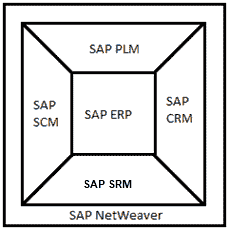 

SAP CRM 嵌入在 SAP Business Suite 的业务环境中。

## 典型的 SAP CRM 工作流程

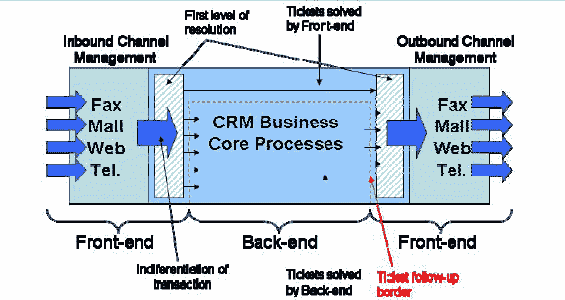

客户可以通过传真，电子邮件，电话等任何方式向供应商提出问题。如果前端客户代表不能立即提供解决方案，则他们可以在 SAP-CRM 中提出问题，这在技术上可以解决。 装备精良的人员。 然后将解决方案转发给客户。

## SAP CRM 的功能

*   它是 SAP Business Suite 的一部分，用于管理客户关系。
*   它支持所有以客户为中心的业务领域，例如市场营销，销售和服务。
*   它针对不同的客户交互渠道实施，例如交互中心，Internet 和[移动](/mobile-testing.html)客户端（如笔记本电脑，移动设备等手持设备）。
*   CRM Analytics 是 SAP CRM 的组成部分，使您的组织可以收集有关各种关键因素（例如客户）的所有相关信息，并分析该知识库，以将见解纳入运营流程和战略决策中。

## SAP CRM 营销

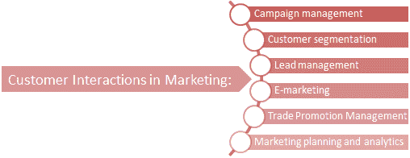 

*   SAP CRM 提供了广泛的营销功能
*   它可以自动执行营销计划，活动执行以及营销工作的&度量。
*   SAP CRM 在用户友好和可配置的界面上整合了以下与营销相关的关键功能：
    *   营销策划
    *   广告活动管理
    *   潜在客户管理
    *   电子营销
    *   市场分析
    *   客户细分。

## SAP CRM 销售

*   SAP CRM 专为随时随地处理客户联系而开发。
*   公司可以选择以下一个或多个 SAP CRM Sales 实施：
    *   电话销售
    *   企业销售，
    *   电子销售和
    *   现场销售。
*   SAP CRM 销售支持您的业务销售人员高效地进行工作，以节省时间&。
*   它提供了可引导人们深入了解行动的信息，&则专注于生产活动。
*   因此，SAP CRM Sales 帮助您的业务销售人员保护客户，然后发展并保持与客户的有益关系。

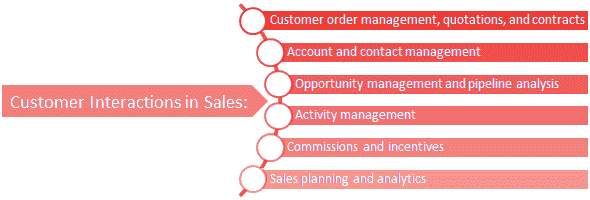 

*   SAP CRM 还提供了销售预测和分析方面，可帮助您的企业收集历史&预测信息。
*   它包括区域和客户管理，可用于优化&以提高销售组织的效率。
*   它还包括机会和流水线管理流程，这些流程和流程管理流程可最大程度地了解潜在的销售，销售流程和&方法，这些方法可导致公司特定最佳实践的标准化。
*   它还提供无缝的订单到现金流程，使您的销售组织可以最有效地管理客户需求。

因此，SAP CRM Sales 具有许多功能，例如专用交互，无缝集成，有见地的信息，始终可访问且易于使用。

## SAP CRM 服务

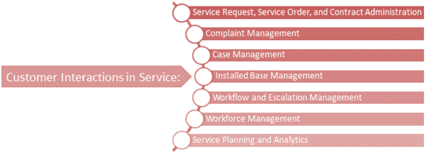

*   与 SAP CRM 服务支持的服务订单处理有关的所有方面都始于响应客户的初始查询，直到确认提供给客户的服务的&开票。
*   SAP CRM 服务还为您的组织提供报价创建&处理，服务订单的创建以及对现场服务代表的分配。

## SAP CRM 渠道

SAP CRM 为您企业中的不同渠道（例如 Internet，电话，现场销售和合作伙伴）提供了实现，从而实现了客户交互的优化。 对于所支持的所有不同渠道，SAP CRM 为您的员工提供了一个直观且用户友好的界面来执行他们的日常工作。

SAP CRM 使客户能够实施不同的特定于客户的需求和特定于行业的流程。 为了与这些实现进行交互，客户具有 SAP CRM 提供的不同交互渠道：

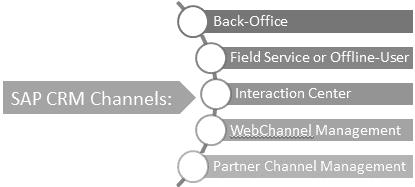 

*   **后台**：这是基于角色的 Web 访问。 对于服务，销售和市场营销中的每个相关任务，它代表单个入口点。 所有相关系统都分配给业务角色，而业务角色又分配给员工。 因此，员工可以将所有相关系统集成到一个 UI 中。
*   **现场服务或脱机用户**：SAP CRM 为现场服务代表提供了多个现场应用程序，它们可以随时随地访问。 这些应用程序是为手持设备开发的。
*   **交互中心**：SAP CRM 为客户服务员工提供了一个界面，该界面与电话和电子邮件等不同的通信渠道全面集成。 此外，它还包括各种功能，员工可以在与客户沟通时使用这些功能来做笔记或处理交易本身。
*   **WebChannel 管理**：通过此 SAP CRM，可以启用电子服务，电子商务和电子营销平台。 这些平台将为目标客户提供 24x7x365 的个性化，可靠和便捷的服务。 这使最终客户可以随时随地访问&研究数据，并根据需要购买研究服务或产品。
*   **PCM –合作伙伴渠道管理**：提供此接口来支持与代理商，经销商，代理商等的协作。它将 Web 渠道管理与常规 CRM 结合在一起，以提供用于合作伙伴管理的完整解决方案。

## SAP CRM 体系结构概述

SAP CRM 解决方案将 CRM 组件与 SAP ERP，SAP SCM 和 SAP BI 组件结合在一起。 SAP CRM 包含一个中央 CRM 系统，可以通过各种渠道进行访问并连接到其他系统。

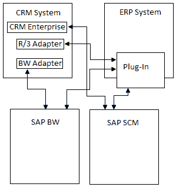 

以下是 **SAP CRM 解决方案**提供的完全集成的连接：

*   **SAP CRM 系统**，它提供 SAP CRM 解决方案的相应软件组件作为中央 CRM 服务器。
*   **SAP ERP 系统**提供了所有 ERP 功能，可以与 SAP CRM 系统集成为后端系统。 这些连接的系统之间的数据交换可以借助 CRM 中间件进行配置和实施。
*   **SAP BI** 提供用于详细统计和分析功能的功能。 可以将其与 SAP CRM 集成在一起，以便将其功能用于 SAP CRM 报告和分析功能。
*   对于需求计划解决方案和全球可承诺额（ATP）检查，可以将 SAP CRM 系统与 SAP SCM 系统集成。 例如：
    *   对于通过任何已实现的 UI 输入的销售订单，需要执行交货检查。
    *   为此，在连接的 SAP SCM 系统上实施了可承诺量（ATP）检查。
    *   在运行时，CRM 系统连接到 SAP SCM 以验证是否可以按时交付所请求的项目。
*   SAP NetWeaver Portal 提供对所有系统的集成访问。

## 渠道架构

SAP CRM 渠道架构包括：

*   互联网应用：
    *   互联网销售
    *   互联网客户自助服务
    *   互联网定价配置器
*   移动应用程序：
    *   互动中心
    *   移动销售
    *   流动服务

 

## 互联网应用

*   SAP CRM 解决方案的 Internet 软件组件基于 J2EE 技术​​（开放的非 SAP 平台）。 这些与随附的标准模板一起提供，可以作为现成的解决方案提供。 此外，可以进一步调整这些应用程序以满足客户的特定要求。 对于这些 Internet 应用程序，需要在 CRM 系统中维护和设置必要的 CRM 数据。
*   SAP CRM 解决方案提供了 Internet Sales 软件组件，该组件向最终用户提供已发布的目录，最终用户可以使用它们来配置和购买产品。
*   它还提供了 Internet 自助服务软件组件，最终用户可以在其中请求特定服务。
*   Internet 定价&配置器（IPC）组件是另一个基于 J2EE 的 Web 应用程序，用于产品配置和定价数据。

## 互动中心

*   与最终客户进行交流时，Interaction Center 提供了所需的工具和功能。
*   交互中心支持各种通信渠道，例如传真，电子邮件，电话和 Internet 协议语音（VoIP）。
*   交互中心与 CRM WebClient 链接，因此与客户联系的员工可以做笔记，触发电子邮件，创建活动以及处理诸如服务订单之类的业务交易。
*   Interaction Center 使用通信管理系统连接到不同的通信渠道，该系统可以是 SAP Business Communication Manager（BCM）或第三方产品。
*   为了增强交互中心中的 IC WebClient 多通道选项，使用了集成通信接口（ICI）。

## 移动应用

*   SAP CRM 移动销售和移动服务组件可帮助公司的移动现场销售和服务代表。
*   根据职责范围，用户可以访问其设备中的所有相关数据。
*   这些设备短暂连接到中央 CRM 服务器以进行数据同步。 此数据传输通过 SAP CRM 中间件进行。
*   可以使用 SAP Mobile Applicat ion Studio 来定制这些移动应用程序。

## CRM WebClient 用户界面简介

SAP CRM 用户界面始于 SAPGUI，它的发展催生了 SAP CRM Web 客户端用户界面。 CRM Web Client 用户界面是 IC Web Client UI 的增强版本。 此外，它是基于业务角色的 UI； 因此，对登录用户可见的内容取决于分配给用户的业务角色。 这为用户提供了一个更简单的 UI，该用户将只能访问和处理与他或她相关的那些任务。 这样，与营销过程无关的销售代表将只能根据分配的权限访问和处理与销售相关的过程。

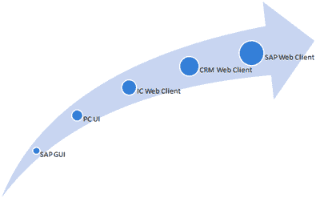 

CRM Web 客户端 UI 是基于组件的软件，它以 L 型向用户展示 CRM UI。 它在第一行包含标题，在左侧包含导航栏，这构成了 L 形。 CRM Web UI 页面上的剩余空间称为工作区。 标头区域包含预定义的系统链接，例如注销超链接。

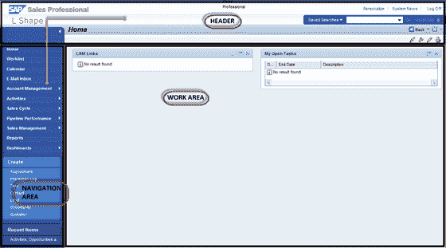 

以下是页眉区域的组成部分：

1.  系统连结
2.  保存的搜索
3.  工作区标题
4.  历史

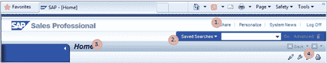 

页眉区域的位置是固定的，不能更改。 导航栏包含指向分配给已登录用户的各种应用程序的链接。 用户在标题区域，导航栏或工作区域本身中可用的链接上，通过用户操作来更新工作区域的内容。 这些视图在 CRM Web UI 中显示为“分配块”。 有单独的页面作为 SAP CRM Web UI 的实现提供：

*   主页
*   工作清单页面
*   日历
*   电子邮件收件箱
*   工作中心
*   进阶搜寻页面
*   概述页面
*   分配块

用户可以使用导航栏，工作中心中可用的链接或搜索页面，应用程序或业务交易中可用的超链接在这些页面之间导航。

*   用户登录后，便可以看到“主页”。
*   可以通过导航栏或工作中心中的导航链接来完成对其他页面或特定应用程序的进一步导航。
*   例如，用户可以从导航栏中的可用链接访问下面的帐户管理工作中心：

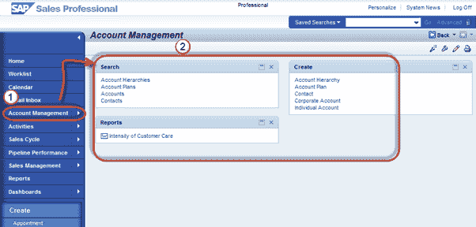 

*   用户可以使用工作中心中的链接或使用第二级导航栏中的“帐户搜索”链接导航到下面的“帐户搜索”：

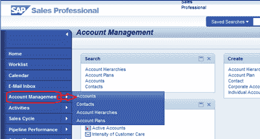 

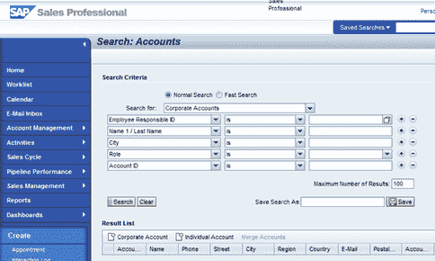