# SAP CRM 销售流程，管理，报价&产品确定

> 原文： [https://www.guru99.com/sap-crm-sales-cycle.html](https://www.guru99.com/sap-crm-sales-cycle.html)

SAP CRM 支持根据客户特定要求实施完整的销售周期，从而最大程度地提高销售人员的生产力，确保客户满意度并因此快速增加收入。

借助 SAP CRM Sales，可以跨不同的销售渠道（即直接销售，渠道销售，电话销售和电子销售）管理整个销售周期。

## SAP CRM 销售业务角色

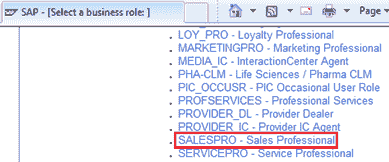

SAP CRM 为组织的销售代表
提供了预定义的业务角色[Sales Professional-SALESPRO]

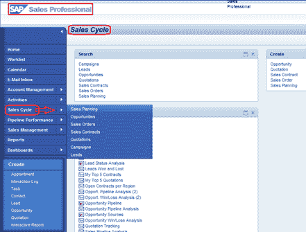

担任此角色后，销售代表可以执行与客户管理，活动，销售周期，管道管理和销售管理相关的 SAP 标准功能。

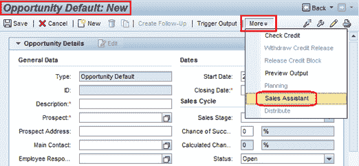

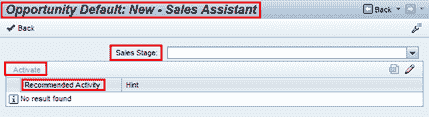

SAP CRM 销售还提供了销售助理，销售代表可以使用它来计划销售周期过程中的销售活动，以及销售方法元素（如采购中心，竞争对手分析，项目目标等）可以被机会使用。 销售代表，同时为客户准备价值主张。

## 一般销售周期步骤

*   销售代表会收到合格的销售线索（热销）。
*   当销售代表接受此热销线索时，系统将创建机会。
*   在 SAP CRM 中，实际销售流程始于机会。 使用 Lead 来创建机会不是强制性的。
*   然后，销售代表联系客户，并使用更多数据更新机会。
*   还可以选择激活销售助理中可用的活动或创建新活动。 可以为机会的不同阶段配置这些活动。

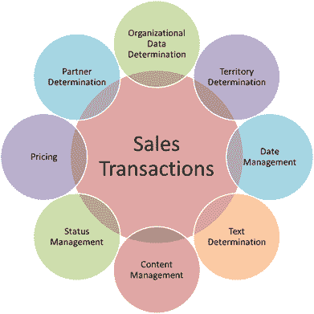 

*   需要由销售代表以正面或负面的决定来评估机会。
*   机会以创建报价或拒绝客户为结束。
*   从机会中获得的解决方案将呈现给客户，而销售代表将创建报价。
*   一旦销售代表根据报价书获得协议，就可以创建销售订单。
    *   交付不是 SAP CRM 的一部分，因此交付与后端 SAP ERP 系统集成在一起。
*   可以在 SAP CRM 中执行销售订单的开票。
*   SAP CRM 还提供 SAP BI，以便根据机会的结果分析整个销售项目。

## 机会管理

*   机会代表出售服务或产品的可能性。
*   投标邀请，销售交易或交易会都会带来机会。
*   还可以使用“热销”创建机会，这是“营销”过程中的业务交易。
*   SAP CRM 提供“商机”作为业务交易文档，其中介绍了销售前景（客户）的各个方面，例如他们所要求的产品和服务，他们的预算，预期的销售量以及估计销售可能性的选项。

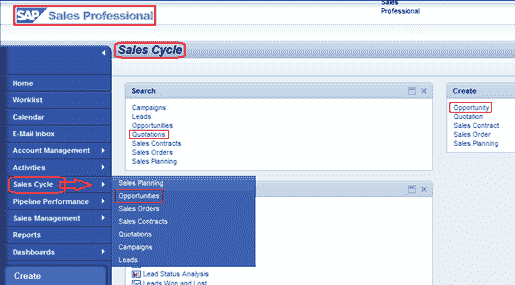 

借助 SAP CRM 的机会管理，组织可以在不同阶段维护和跟踪销售项目。 因此，它为分析和优化特定于客户的业务流程提供了一个选项。

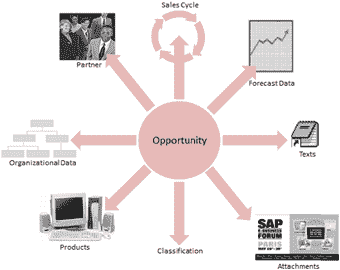 

*   对于销售周期，可以根据客户特定的业务流程在自定义中配置各个销售阶段。
*   每个销售阶段都可以具有计划的活动，销售人员可以使用销售助理来激活这些计划的活动。

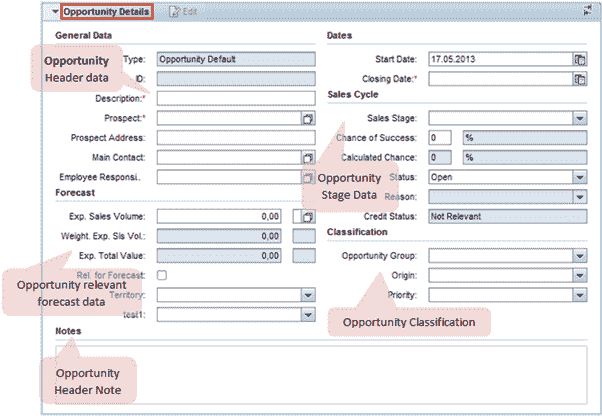 

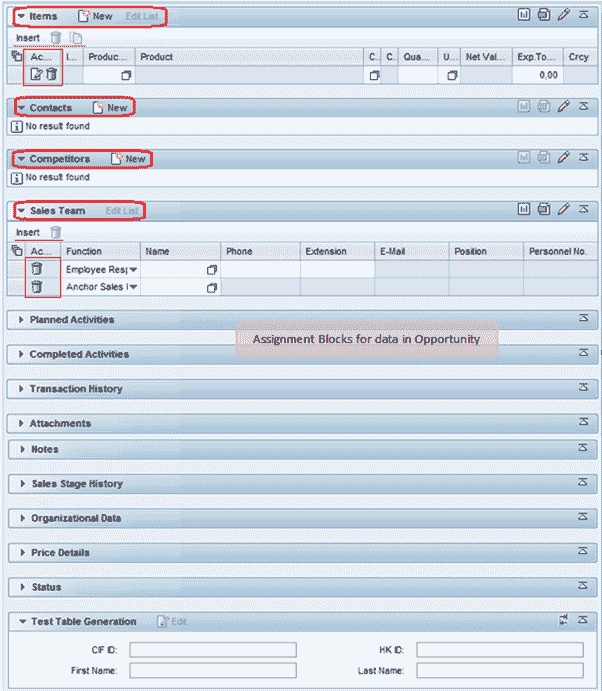 

**上面 2 张图像在机会的“创建”页面中显示分配块**

SAP CRM 中的机会文档主要包含与销售周期，预测数据，机会分类，产品数据相关的数据（已维护） **项目**分配框中的内容），以及与活动，竞争对手产品，销售团队，附件等有关的信息。

*   机会的销售阶段更改会导致预测数据的计算，因此销售阶段的完成确定了销售的可能性。
*   预测数据包含按产品数量和产品价值计算的预期销售量。

机会可以根据机会组（例如现有客户或新客户），来源（例如交易会）及其优先级进行分类。

*   这些数据可用于分析公司中的机会管理。

在产品数据中（在项目分配块中维护），可以在每个项目级别维护预期的产品数量和产品价值。

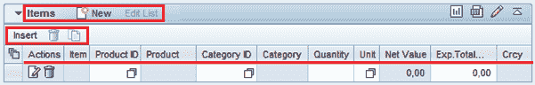 

*   这也作为完整的文件反映在预测数据中机会的期望值中。
*   可能会保存带有错误产品 ID 或描述的商机。 在销售周期的早期阶段产品信息不清楚时，这很有用。

CRM 还提供了在机会文档中搜索和维护竞争对手产品的功能。 产品之间的这种关系需要在 CRM 产品主数据中维护。

如以上创建页面图像中所示，SAP CRM Sales 提供了销售阶段历史记录，该历史记录提供了与每个销售阶段相关的数据，这些数据已为机会完成。 同时，SAP CRM 还与 SAP BI 集成在一起，用于分析不同销售阶段的机会管理数据以及来自预测数据的信息。

## 报价管理

报价是您公司与客户之间具有法律约束力的协议，可以在指定的时间范围内以预定的价格交付特定产品。

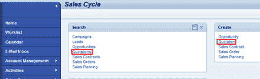 

*   在 SAP CRM 中，将销售报价创建为机会的后续文档。
*   可以复制报价或将报价转换为销售订单。
*   也可以参考查询创建报价。
*   对于报价，将保留确认期，客户可以在该确认期内下订单或修改订单，也可以取消订单。

报价管理包括以下过程：

*   在系统中创建报价
*   创建报价项目
*   您可以添加客户要求的产品
*   您可以为报价中的每个项目执行产品的 ATP 检查
*   确定单个项目的定价
*   将报价发送给客户
*   您可以将活动创建为报价单文档的一部分

报价文档中维护的数据还包括订单概率，有效性，替代项目，操作和可用性检查。

## 产品提案

SAP CRM 在报价文档中提供产品建议的功能。 这样，您可以在输入报价时提出客户可能感兴趣的产品。
产品提案功能可以通过以下方式实现：

*   客户的交易历史记录，包括客户以前的销售订单。
*   客户参与的营销项目。
*   对于这些建议的产品，可以执行 ATP 检查和价格计算。

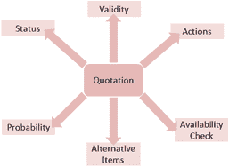 

*   您可以具有以下类型的产品建议：
    *   交叉销售
    *   向上销售
    *   卖空
    *   配饰
    *   前 N 个产品清单

## 销售订单管理

SAP CRM 销售订单处理用于创建和处理销售订单，并在集成的后端 SAP ERP 系统中触发物流处理。 以下是在 CRM 中创建销售订单的可能来源：

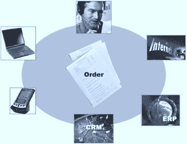 

*   SAP 企业资源计划
*   直接在 CRM 中
*   IC Web 客户端
*   移动销售
*   互联网销售应用程序（电子商务）
*   掌上电脑

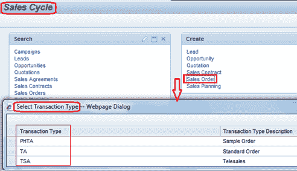 

可以将销售订单创建为现有报价或多个现有报价的后续单据。

*   为了从多个现有报价创建销售订单，所有这些报价的组织数据必须匹配。
*   标题数据的其余部分从选择的第一个报价中复制。

SAP CRM 中的销售订单处理包括以下步骤：

*   使用所需产品创建销售订单
*   进行 ATP 检查
*   维护并确定定价条件
*   集成的 ERP 系统有助于执行信用检查
*   系统将其复制到 SAP ERP 并从 SAP ERP 接收
*   订单确认已发送给客户

集成 SAP ERP 系统中进行了诸如提货，包装，运输和发货之类的外向交货活动。

SAP CRM 中提供的开票流程可用于创建客户发票。

*   可以根据自定义设置参考销售订单，交货或合同创建开票凭证。

在销售订单抬头级别输入的常规数据包括交易类型，要求的交货日期，负责的员工，联系人，卖方方和运送方。

*   在项目级别输入所需的产品和数量。

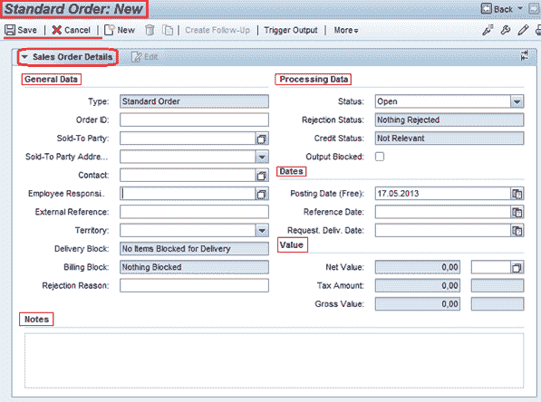

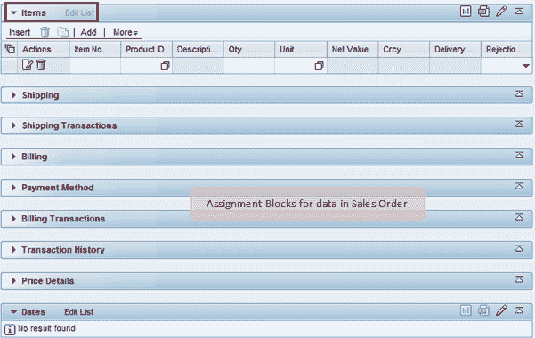 

SAP CRM 提供了用于将产品配置为 Internet 定价和配置器（IPC）应用程序的一部分的功能。

*   该应用程序可以与 SAP CRM Sales 应用程序集成在一起，以便用户可以配置产品并将其销售订单放置在同一位置。
*   可配置产品具有可以具有多个值的特征。
*   因此，客户可以根据要求设置特性值。
*   配置完成后，客户可以订购此配置产品。

为了分析报价和销售订单处理，SAP BI 提供了标准报告。 例如：

*   **0CRM_QUTO_Q0001** -监视前 5 个报价
*   **0CSAL_C03_Q0001** -监视传入的销售订单

SAP CRM 提供确定销售订单定价信息的功能。

*   系统会自动计算在特定时间适用于您的客户的总价，折扣，附加费。
*   SAP CRM 使用定价条件技术来维护和确定定价。
*   可以将条件组分配给业务伙伴，产品或客户层次结构。

## 报价和销售订单管理中的其他功能

在 SAP CRM Sales 处理中，某些功能是 SAP 很好的特色。 其中一些是产品确定，清单和排除，免费商品和可用性检查。 这些功能用于 SAP CRM Sales 中销售处理的不同阶段。

## 产品确定

在销售单据处理期间，系统可以自动确定和替代产品。

*   借助条件技术，可以配置产品确定过程。
*   然后可以将该产品确定过程分配给交易类型。
*   当为此交易类型创建销售单据并输入产品时，这将触发产品确定过程。
*   当需要在销售单据中进行产品替换时，使用此配置。
*   产品确定不用于代替其他可用产品无法提供的产品。

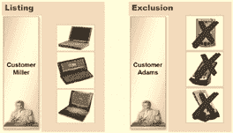 

*   为此，可以在 SAP APO 中使用基于规则的 ATP 检查。
*   CRM [Mobile](/mobile-testing.html) Sales 或 IC WebClient 支持产品确定功能。

## 列出和排除

特定帐户的列出和排除表示特定帐户在特定业务交易的特定时间范围内允许或不允许使用哪些产品。

*   有两种方法可以实现此目的：
    *   PPR-合作伙伴/产品范围（无条件技术）
    *   使用条件技术的新方法

如果是 PPR，则需要分配业务合作伙伴，产品和时间表。 PPR 的必要设置在自定义中完成。

在较新的方法中，清单确定产品有效还是无效。 此清单由标题和项目组成。 标头包含条件技术，项目包含 PPR 信息。

 

使用免费商品，您可以实行数量折扣。 也就是说，当订购了一定数量的产品时，您可以免费向客户提供产品。 此功能也可以使用条件技术来实现。 它可以通过两种方式实现：

*   包容性免费商品：购买一定数量的产品时将享受折扣。
*   独家免费商品：购买某些预定义数量的产品后，免费提供一定数量的产品。

## 合同管理

通过不同的 SAP CRM 渠道，SAP CRM Sales 提供合同管理，该合同管理已嵌入到销售周期中。 合同是根据与价格，目标值或目标数量相关的约定条件与您的客户达成的协议。 它使您的公司可以根据这些条件发布产品或服务。 它可以根据负责的销售员工赢得的机会来创建。 除此机会外，负责销售的员工和客户都同意有利条件，然后根据此条件创建销售订单。 客户需要接受此合同，然后销售经理下达此合同。 然后，客户可以根据此已发布的合同订购产品。 在合同完成日期前后，销售代表可以联系客户以续订合同。

创建的销售订单作为后续文档链接到合同，因此它记录了所有创建的销售订单中所有必需信息的记录。

SAP CRM 提供两种合同类型：

*   **数量合同**是与客户达成的协议，即他或她将在指定的时间内购买一定数量的特殊货物。
*   而**价值合同**是与客户达成的一项协议，即他或她将在指定的时间范围内购买特定的特定价值。

合同管理包括以下与其相关的销售订单相关的功能：

 

以下是 CRM 销售合同的相关状态值：

*   开放-在创建合同时默认设置。
*   处理中-您可以在与客户协商合同时设置此状态。
*   已下达-当合同中的某个项目准备就绪时，可以设置此状态，该状态可用于下达产品并为其创建销售订单。
*   已完成-为有效期已过或目标值或数量已完全释放的物料设置此状态。 它可以自动或手动设置。 合同中的某个项目一旦处于此状态，就无法针对该项目发布产品。

为了根据合同创建订单，您可以打开合同并将订单创建为后续文档。 另外，您可以创建订单并使用合同确定来获取可能的合同，然后选择合适的合同。 订单维护下达订单清单，并根据约定的最大数量和价值进行检查。