# SAP CRM SERVICEPRO：服务协议，合同，计划，订单管理

> 原文： [https://www.guru99.com/sap-crm-service.html](https://www.guru99.com/sap-crm-service.html)

SAP CRM 为您公司的服务专业人员提供了预定义的业务角色–服务专业人员（SERVICEPRO）。

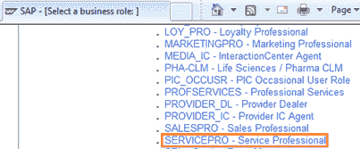 

通过此角色，服务专业人员可以执行与服务协议，服务合同，服务计划和服务订单管理等相关的 SAP 标准功能。

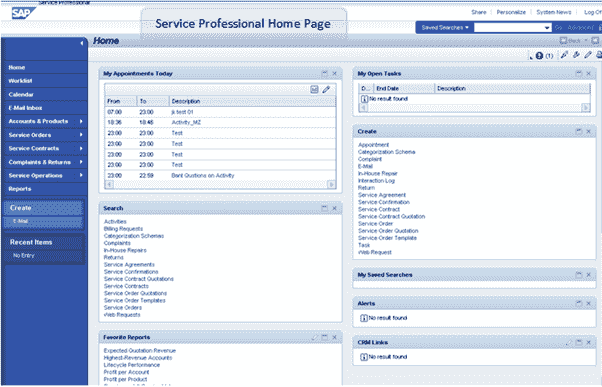 

可从 SAP CRM 的不同渠道访问 SAP CRM 服务。 以下是可以从 WebClient UI 执行的服务功能：

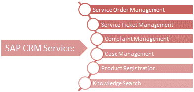 

*   通过服务订单管理和服务单管理，它可以维护和跟踪正在进行的服务流程，并分析贵公司执行的完整销售流程。
*   同样，投诉管理使您可以跟踪和分析对公司提供的产品或服务的投诉。
*   产品注册使您的服务员工可以搜索，创建和维护已安装的基础或对象。
*   借助知识搜索，可以快速搜索已知问题的解决方案。

提供了 SAP CRM [移动](/mobile-testing.html)服务应用程序，以满足现场服务代表的要求。 这些应用程序以脱机模式运行，并且可以与 CRM 服务器同步。

Internet 客户自助服务（ICSS），它是一个基于 Web 的应用程序，可供 Internet 用户用于 CRM 服务。 与 WebClient 相似，它提供以下服务功能：

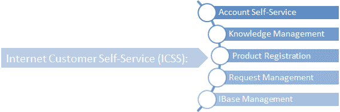 

## 已安装的基础管理和对象

*   贵公司将产品出售给客户。 这些产品在客户现场的安装由 SAP CRM 服务中已安装的基本管理代表。
*   它还支持您自己组织内对象的管理。
*   组织销售产品并提供服务，对象是这些产品或服务的全球唯一有形或无形实例。
*   您可以在 CRM 系统中进行自定义设置，以具有特定于客户的对象系列。
*   已安装基础的结构借助其组件得以维护。
*   WebBase UI，IC WebClient，移动服务和 ICSS 等不同渠道都支持 IBase 管理。
*   借助 IBase 管理，可以管理从客户安装到安装的整个产品生命周期，直到产品安装完毕为止。

作为 IBase 管理的一部分，您还维护已安装基础及其组件的常规数据：

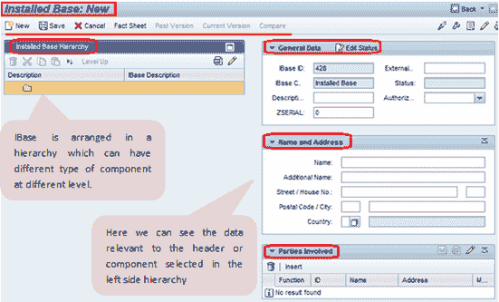 
屏幕，用于创建新的安装基础

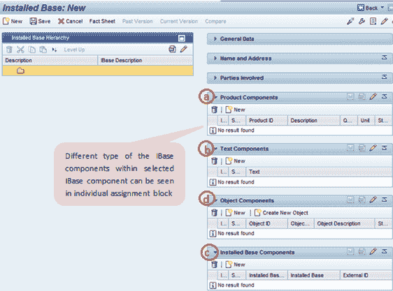 
屏幕，用于创建新的安装基础

IBase 管理与服务交易（如服务合同和服务请求）集成在一起。 在服务合同中，它代表贵公司已同意为其提供服务的对象。

IBase 以树结构维护，该树结构具有将 IBase 和组件表示为不同子节点的标头节点。 IBase 管理提供以下 IBase 组件。

*   **产品组件** – CRM 产品主数据中的现有产品可以作为组件分配给 IBase。
*   文字成分
*   **IBase 组件** –可以将另一个 IBase 中的 IBase 组件用作其组件
*   **对象** –作为 IBase 管理的一部分创建的对象可以分配给 IBase。 一个对象只能分配给一个 IBase，即不能复制。
*   **客户特定的组件类型** –也可以创建客户特定的组件并将其用于 IBase。

也可以为 IBase 维护相关信息。 这包括诸如相关业务伙伴或服务文档之类的信息。 以下是为 IBase 标头维护的详细信息：

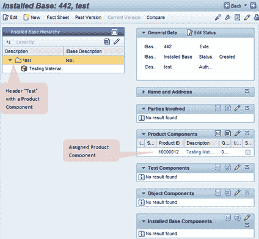 
IBase 标头

*   常规数据：
    *   IBase ID
    *   外部 ID
    *   iBase 类别
    *   状态
    *   描述
    *   授权组
*   姓名和地址
*   参与方
*   服务合同–使用此 IBase 的服务合同。
*   附件
*   资格要求–用于维护要求分配的现场服务人员的资格。
*   服务交易–使用此 IBase 的服务交易。
*   服务级别–这可以是服务配置文件或响应配置文件，并且用作服务管理的一部分。
*   组件–显示此 IBase 组成部分的组件列表

以下是为 IBase 组件维护的详细信息：

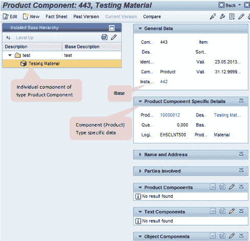 
IBase 组件

*   常规数据：
    *   组件 ID
    *   描述
    *   身份证明
    *   组件类型
    *   装机量
*   姓名和地址
*   参与方
*   服务合同–使用此 IBase 的服务合同。
*   附件
*   服务交易-使用此 IBase 的服务交易。
*   资格要求–用于维护要求分配的现场服务人员的资格。
*   计数器–计数器可以分配给 IBase 组件或对象。 它是对物体使用或磨损的度量。 当达到预定义的计数器读数时，系统可以触发维护订单。 它还有助于记录服务历史记录或产品使用情况。
*   组件–显示此 IBase 组成部分的组件列表

## 服务协议，服务合同和服务计划

服务协议是一项 CRM 服务交易。 类型为“团体合同”。 这是与特定业务伙伴或一组业务伙伴的长期协议。 它可以包括与客户达成的有关价格，账单，SLA 和服务的协议的详细信息。 它不包括目标值或目标数量。 使用服务协议可以直接链接到服务订单，也可以具有服务合同，并据此创建服务订单。 在服务订单处理期间，如果系统找到服务合同，则将不会进行服务协议确定的处理。

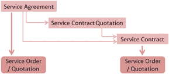 

服务合同定义了与客户的协议，该协议定义了在指定时间范围内具有预定义条件的服务范围。 它指定了客户获得服务级别的权利，并包括产品列表，其中包含服务和涵盖的服务部件。 合同中还维护了服务和零件的价格协议。 因此，服务合同代表服务数据，对象清单，产品清单，发布清单定价协议和开票计划。

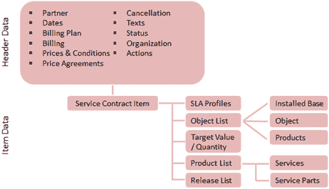 

服务配置文件和响应配置文件定义 CRM 服务中的服务级别。 服务配置文件指示条件，这些条件定义了何时可以执行服务合同中定义的服务。 响应配置文件定义了服务应在何时开始以及服务应何时完成。 这些配置文件在 CRM 定制中维护。 可以在定制中配置

服务合同确定。 可以手动输入合同，或系统自动确定合同。 在为服务流程定制中创建事务处理类型时，将完成此设置。

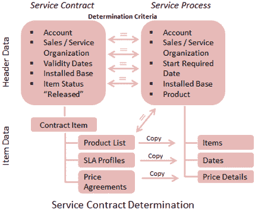 

CRM 服务计划使您可以为循环服务建模，并执行该计划，以便您可以在对象的整个生命周期中以计划的方式为对象提供服务。 它支持在指定时间创建后续服务交易，例如报价，服务订单，活动等。 在服务间隔中，您可以定义规则，这些规则为特定对象指定何时，何地需要计划，提供或执行服务。

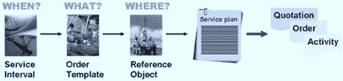

## 服务订单管理

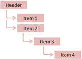 

可以通过不同的渠道（例如 IC WebClient 用户界面，Web 渠道（ICSS）和移动设备）创建 SAP CRM 中的服务订单。 可以创建服务订单作为服务协议或服务合同的后续单据。 它由标题和项目部分组成。 服务订单中的项目可以采用树状结构构成项目层次结构。

资源计划人员使用资源计划应用程序将服务订单分派给服务技术人员。 它还支持管理和分析与服务代表员工（服务技术人员）有关的数据。

可以将参考对象，IBase（组件），对象或产品的形式输入标题或项目级别的服务中。 根据在服务订单中输入的主要参考对象，将为订单项目显示相关产品的列表。 此功能称为产品建议。 对于定价，可以使用 CRM 定价程序，该程序根据为特定项目进行的折扣和附加费计算所维持的条件来计算价格。

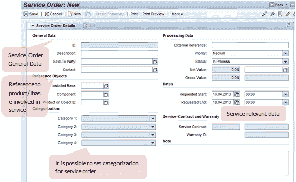 

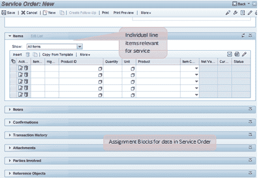 
服务订单创建页面

以下可以用作服务项目的行项目：

*   **服务项目**：服务订单项目还包含[会计](/accounting.html)指示符信息，它代表将作为结算成本接收方的帐户。 服务产品项描述了要执行的服务。 该服务产品项目的产品类型是服务。 服务的条件和计划的工期相关信息包含在此服务产品项中。 可以将服务产品项目分配给现有服务合同。 在 CRM 中，服务处理可以由包含服务产品的项目触发。 因此，服务产品项描述了要执行的服务。 服务订单的对象列表可以包含 IBase 组件，对象和产品。

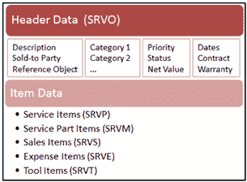 

*   **服务零件项目**：服务订单中的服务零件项目是类型物料的产品。 它支持计划，控制和记录所需的服务部件组件。 可以将其分配给服务合同。
*   **销售项目**：服务订单中的销售产品项目是物料类型的产品。 在维修过程中，所需零件可以使用它出售。 这也支持在销售过程中要交付的产品的 ATP 检查。
*   **费用项目**：服务订单中的费用项目也是物料类型的产品，它表示服务代表在服务过程中的额外费用。
*   **工具项**：工具项在承载服务时使用，但其本身并未消耗。 材料类型或对象的产品可用作工具项。

可以在合同确定过程中使用服务订单中包含的客户以及参考对象，从而可以在特定时间为相关客户和参考对象显示可用合同。 它还可以确定服务水平协议（SLA）的日期。

对于在服务订单中输入的参考对象，系统可以自动执行保修检查，即检查参考对象是否存在保修。 如果存在，参考对象的保修数据将显示在服务订单抬头或项目的详细信息中。

执行服务后，服务技术人员可以通过执行服务确认过程来确认。 服务确认文档是作为服务订单的后续文档创建的，其结构与服务订单的结构相似，即服务订单中的抬头数据和项目数据。 它包含与执行的服务相关的数据，例如实际执行的工作，消耗的材料，时间表（可能包括旅行时间和加班时间以及工作时间等）。可以为单个服务订单创建多个确认。 它还会更新服务确认中涉及的 IBase（如果有）。