# SAP CRM Marketing：计划，活动管理&自动化细分

> 原文： [https://www.guru99.com/sap-crm-marketing.html](https://www.guru99.com/sap-crm-marketing.html)

## 介绍

营销是 SAP CRM 提供的除销售和服务之外的主要模块。

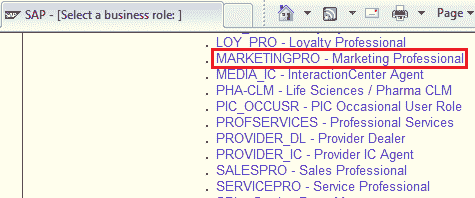

SAP CRM 提供了不同的功能，可以使用这些功能来实现各种与营销相关的业务流程。

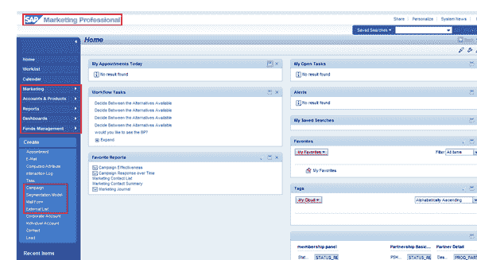 

*   可以轻松定制这些营销功能，以与客户特定的业务流程相匹配。
*   与其他 CRM 模块类似，营销功能也可以与其他 CRM 模块功能和外部系统集成。
*   考虑到客户互动的重要性，所有 SAP CRM 营销功能都已与各种入站和出站渠道很好地集成在一起：

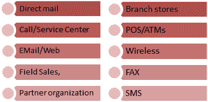 

*   SAP CRM Marketing 分析提供：
    *   围绕客户和产品的强大分析集
    *   从基本报告到高级分析
    *   预测模型/分数
    *   优化能力
*   Following are the major SAP CRM Marketing capabilities:

    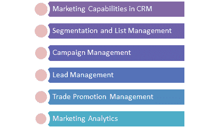

*   细分和列表管理功能通过易于使用的图形交互工具集成在一起。
*   借助该工具，SAP CRM Marketing 提供了导入外部数据（如租赁或购买清单）并创建新客户属性的功能
*   SAP CRM Marketing 的自定义设置已集成到事务 SPRO 中，可以通过 SAP GUI 访问

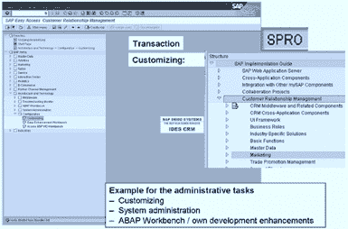 

## 营销计划和活动管理

*   借助 SAP CRM，您可以从三个不同的角度查看营销项目：
    1.  营销日历：在特定时间范围内，它提供了所有营销项目的概述
    2.  营销计划：提供分层视图
    3.  广告活动自动化：它提供 [Java](/java-tutorial.html) 基于 applet 的过程视图

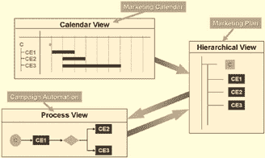 

*   作为 SAP CRM Marketing 项目的一部分，我们在战略规划级别和操作任务/级别具有营销元素。
*   在战略计划级别，它提供营销计划。
*   营销计划用于规划具体的营销概念。
*   在营销计划中，可以定义战略目标，例如目标市场份额，预算等。
*   营销要素的数量用于以层次结构的形式构建营销计划。
*   营销计划是对品牌，地区等的自上而下的分配。
*   可以为每个营销计划分配一个或多个活动。

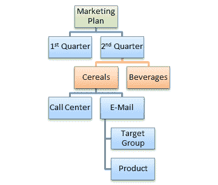 

*   作为操作任务，它包括活动/促销。
*   竞选活动应着眼于行动。
*   在广告系列中，您可以定义：
    *   事件特征，例如日期，目标，策略等。
    *   执行参数，例如产品，价格等。
    *   目标受众是目标群体或客户群。
*   最后，它包括战役执行。
*   对于营销计划或/和活动，在常规数据中，我们具有相关的类型。
*   此类型充当营销中的控制元素。
*   它有助于定义适当的目标和策略以及默认属性，例如操作配置文件或状态配置文件。
*   为了控制这一点，可以在 SAP CRM Marketing 定制中定义类型，目标和策略之间的关系。
*   CRM Marketing 的默认状态：
    *   已建立
    *   已批准
    *   已锁定
    *   已发行
*   在定制中，它允许定义用户状态并将这些用户状态分配给特定类型（广告系列类型）。
*   当前营销要素状态（或所有状态的组合）决定了可以为营销要素执行的业务交易。

营销元素具有其自身的生命周期，该生命周期始于创建时的生命周期，以其结束或取消而结束。

*   在此生命周期中，营销元素会经历几种系统状态。
*   在营销计划明细和活动明细的常规数据中分配了营销组织。

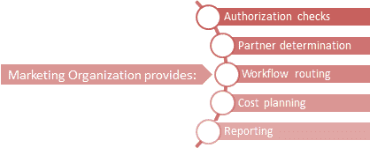 

*   在特定的时间范围内，Integrated Marketing Calendar 概述了已计划和正在运行的所有营销活动。
*   它是基于 Adobe Flex 技术的营销活动的中心入口点。
*   它提供创建新营销项目和/或重新安排现有项目的功能。
*   它支持某些功能的拖放功能，例如更改日期。
*   SAP CRM Marketing 支持在一个步骤中将产品，产品组或产品层次结构大规模分配给营销项目。
*   可以通过针对产品分配，产品组分配和产品组分配/分配产品层次结构的自定义设置进行配置
*   可以使用定价概念根据产品和合作伙伴配置折扣：

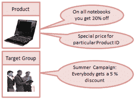 

*   合作伙伴确定过程可用于与营销对象中的合作伙伴一起工作。
*   在活动的情况下，可以使伙伴确定程序取决于活动类型。
*   SAP CRM 定制中维护合作伙伴确定过程及其对营销元素的分配。
*   对于参与活动的业务伙伴，“参与方”是 Web UI 中可用的分配区。
*   在广告系列中，我们还可以维护代表该特定广告系列使用的通信媒体的通信渠道
*   可以在定制中维护通信介质的可能列表。
*   可以基于用户的首选通信方法（电子邮件，电话等）执行活动执行。
*   为此，必须使用首选的通信方法更新 BP 主数据。
*   如果不保留首选方法，则可以设置基于优先级的备份方法； 例如，先打电话，然后是电子邮件，信件，传真等。
*   在执行电子邮件活动之前必须满足的条件：
    *   广告活动必须存在
    *   目标组必须存在
    *   电子邮件表单必须存在
    *   发件人的地址是发送电子邮件所必需的

## 分割

*   细分包括以下与营销相关的主要流程：
    *   为业务合作伙伴细分创建属性
    *   维护数据源以进行细分

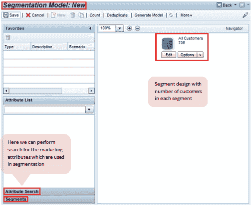 

*   图形建模器：用法，数据流，集成
*   创建细分基础并执行重复数据删除

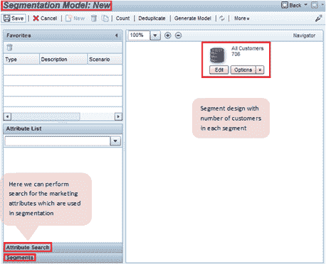 

*   您可以创建营销属性以表征业务合作伙伴。
*   细分和目标群体的不同数据源

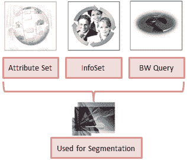 

*   也可以定义数据源以构建目标组。
*   然后可以将目标群体与营销活动一起使用，以解决特定的客户群或潜在客户。
*   属性可以是相同的地区隶属关系，相同的嗜好，在过去几个月中花费的相同金钱，等等。
*   业务合作伙伴细分流程：

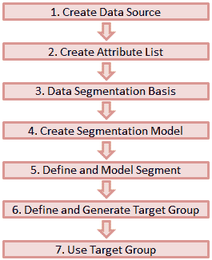

*   目标组是使用细分创建的。
*   细分构建器用于细分。
*   细分模型：
    *   不必分配目标组或细分
    *   它可以包含子集
*   细分：
    *   一个细分仅分配给一个细分模型
    *   目标组未分配给它
    *   要将细分分配给其他细分模型，必须通过复制来重新创建细分

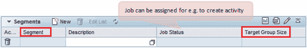 

*   目标组：
    *   只能分配一次
    *   Marketing Planner 只能使用活动目标组

## 个性化邮件

*   个性化邮件可用于向目标群体成员发送量身定制的营销信息。
*   表单构建器应用程序可以通过以下交互渠道用于个性化通信：
    *   电子邮件（纯文本或 HTML）
    *   短信
    *   传真
*   使用邮件表单生成器工具，可以：
    *   个性化目标列表成员的消息传递
    *   将邮件表单分配给广告系列目标列表
    *   将链接（URL）嵌入到生成的电子邮件中的网站
    *   根据条件插入主题行

**邮件表格**：

*   用于定义信息的布局和内容
*   可用于直接营销活动
*   集成编辑器可用于输入文本或 HTML 源代码
*   支持控制邮件格式
*   允许插入图形和附件
*   您可以设置需要使用的通信渠道
*   可以设置默认值
*   它支持布局模式和源代码模式
*   可以设置属性上下文以邮件形式动态填充数据
*   它支持条件文本块，即生成的最终内容可以从多个文本块输出

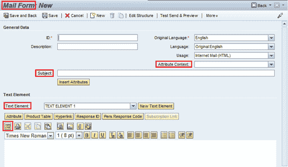 

## 广告活动自动化

*   此过程用于根据预定义的标准创建广告系列，从而无需任何手动操作即可执行。
*   预定条件可以基于时间框架，客户答案，其他广告系列关系等。
*   广告系列自动化可用于：
    *   跨多个渠道自动执行多波营销活动
    *   模拟循环活动流程
    *   自动进行广告活动，无需手动操作

**广告系列流程建模的元素**：

*   *广告系列*
    *   描述活动过程的开始节点
    *   一个广告系列流程仅包含一个广告系列
*   *广告系列元素*
    *   活动过程中的各个步骤
    *   可以在流程建模内创建
    *   描述活动过程中的动作点

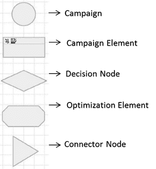 

*   *决策节点*
    *   控制从客户或潜在客户收到响应时执行的后续步骤
*   *优化元素*
    *   考虑到业务限制，优化活动的可能性
*   *连接器节点*
    *   用于跳入另一个“事件触发”广告系列