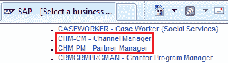
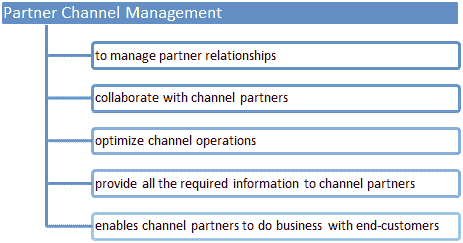
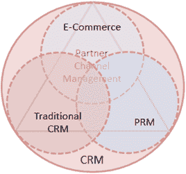
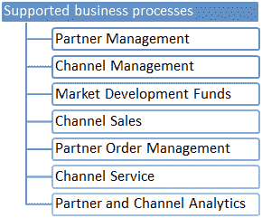
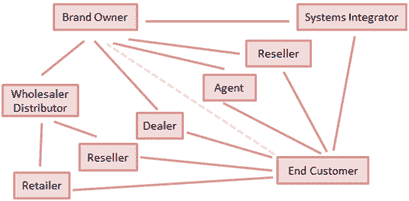
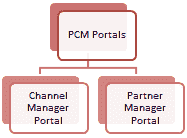
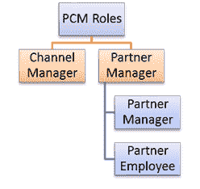
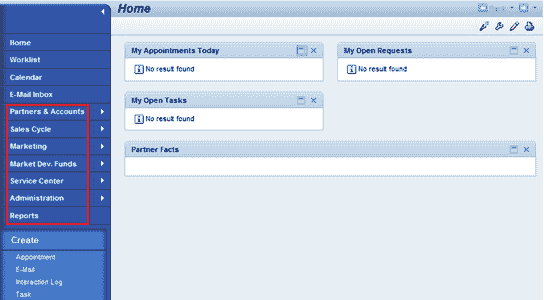
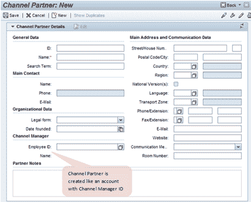
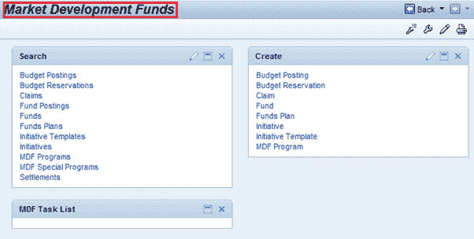

# SAP 合作伙伴渠道管理（PCM）

> 原文： [https://www.guru99.com/sap-crm-partner-channel-management.html](https://www.guru99.com/sap-crm-partner-channel-management.html)

## 总览

SAP CRM 提供合作伙伴渠道管理（PCM）。 这是组织通过间接渠道广泛进行产品销售或服务的组织所使用的。

 

**为什么使用合作伙伴渠道管理？**

 

为了提供完整的通道解决方案，PCM 功能充分利用了以下核心 SAP CRM 的核心优势：

*   网络频道
*   网络渠道功能已扩展至合作伙伴
*   传统客户关系管理
    *   CRM 模块（即销售，服务和营销）功能扩展到合作伙伴，同时与直接流程紧密集成
*   PRM
    *   启用关系管理
    *   支持品牌所有者及其渠道合作伙伴之间的协作

*   对于许多组织而言，间接合作伙伴在推动或影响收入百分比的增长中发挥着关键作用。
*   渠道合作伙伴网络在细分市场和地理位置方面具有更大的影响力
*   公司可以出售给合作伙伴或与合作伙伴合作。
*   通过利用渠道合作伙伴，公司可以大大降低其销售和服务成本。
*   因此，简化间接渠道运营并与合作伙伴进行有效互动变得越来越重要。

**涉及的 PCM 功能**：

*   合作伙伴管理
*   协同陈列室
    *   开放目录界面：将数据传输到合作伙伴商店
    *   在协作陈列室中产生潜在客户
*   访问控制规则

**SAP PCM 分为以下主要业务领域**：

 

**间接通道的结构**：

 

## SAP CRM PCM 中的门户和角色

*   PCM 提供以下门户：

*   PCM 包括以下角色：

 

*   渠道管理器门户使您的组织能够：
    *   管理合作伙伴关系
    *   与渠道合作伙伴合作
    *   优化渠道运营
*   频道管理员角色：
    *   品牌所有者员工使用的
    *   有权访问频道管理器门户
    *   用于管理渠道合作伙伴关系&渠道合作伙伴
    *   建立潜在客户
    *   与渠道合作伙伴合作
    *   优化渠道运营
    *   监控和分析渠道销售，服务和营销
    *   向合作伙伴派遣线索
*   频道管理员：

 
频道管理器的首页

 
渠道合作伙伴创建页面

*   合作伙伴经理门户使您的组织能够：
    *   进行有效的销售
    *   有效的最终客户互动
*   合作伙伴经理：
    *   有权访问合作伙伴门户
    *   负责更有效地销售
    *   可以执行最终客户互动
    *   接受并限定潜在客户
    *   开始按订单生产流程
*   通常，有两组员工访问合作伙伴门户：
    *   合作伙伴经理
    *   合伙人员工
*   合作伙伴经理负责合作伙伴公司品牌所有者产品和服务的营销，销售和服务。
*   合作伙伴经理的职责包括：
    *   品牌所有者产品的营销，销售和服务
    *   合作伙伴公司的服务
    *   管理线索和订单
    *   有权访问最新信息和分析
    *   与品牌所有者一起管理客户关系
*   合作伙伴员工的职责包括：
    *   向合作伙伴经理报告
    *   专注于日常业务流程
    *   合格线索
    *   接受客户的补货订单
    *   向客户提供订单状态
    *   查找客户遇到的解决方案或记录服务需求问题

## 营销发展基金

*   为了产生客户需求，在间接销售模型中使用了市场开发资金（MDF）。
*   这些是您提供给渠道合作伙伴以营销品牌和产品的资源。

 
上图显示了与市场开发基金相关的可用功能

*   MDF 集成到：
    *   SAP CRM 营销
    *   SAP CRM 合作伙伴渠道管理
    *   SAP CRM 资金管理
    *   SAP CRM 索赔管理
    *   SAP CRM 帐单
    *   SAP 商务智能
    *   SAP ERP（FI / CO）

*   因此，通过有效地将市场开发预算分配给渠道合作伙伴及其营销属性，它使您作为品牌所有者可以提高渠道营销支出的有效性。