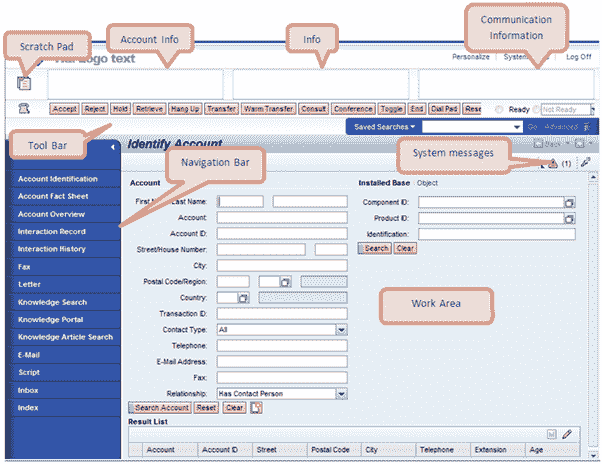
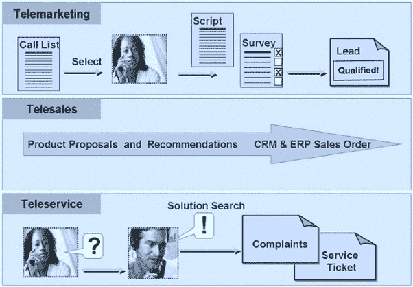
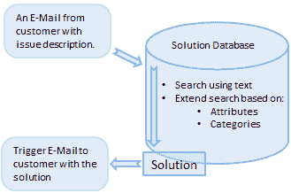
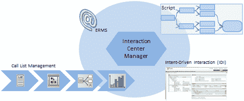
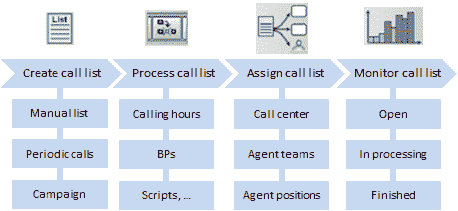

# SAP CRM 互动中心

> 原文： [https://www.guru99.com/sap-crm-interaction-center.html](https://www.guru99.com/sap-crm-interaction-center.html)

## 交互中心代理功能

*   IC Agent 收到网上商店客户关于所购买产品问题的来电。
*   IC 代理可以访问知识搜索，从而可以为客户提出解决方案。
*   根据与客户的呼叫，IC 代理还可以创建服务凭单，并可以安排与服务代表的约会。
*   IC 代理商还可以访问作为营销活动一部分的电话清单。

## 互动中心的布局

*   为了与最终客户进行沟通，交互中心与不同的沟通渠道很好地集成在一起。
*   此外，IC 代理商还需要在与最终客户进行通信的同时访问不同的应用程序和业务交易。
*   因此，IC 代理还可以访问不同的应用程序和 CRM 业务交易。

以下是 IC 代理可以访问的与最终客户进行通信的交互中心的组件：

*   便笺
    *   座席可以用它写下笔记。
    *   这些注释可以随时包含在业务文档中。
*   帐户信息
    *   对于当前交互，该区域显示最相关的信息。
    *   例如，客户名称和地址。

 
互动中心的布局

*   警报
    *   这些是建模者为登录的代理生成的警报。
    *   例如建议或提醒
*   通讯信息
    *   来自通信管理软件的信息，例如自动号码识别，队列状态，通话时间和座席状态，都显示在此区域中。
*   工具列
    *   这些按钮用于支持电话功能
*   导航栏
    *   IC 代理可以使用导航栏中的链接访问业务交易和应用程序
    *   该 IC 代理程序与最终客户进行通信所需的所有数据。
*   工作区域
    *   IC 代理还可以访问业务交易数据或应用程序数据
    *   此区域用于此目的
    *   IC 代理可以在此区域启动呼叫列表和交互式脚本
    *   也可以在客户的交互历史中搜索交易

## 互动中心整合

*   交互中心支持所有 CRM 策略：
    *   *销售*：
        *   处理机会，销售交易，产品建议
    *   *服务*：
        *   解决方案数据库，电子邮件处理和工作流，服务交易
    *   *市场营销*：
        *   电话清单，广告系列，产品建议
*   交互中心支持通过多种通信渠道进行通信：
    *   *电话*：
        *   路由
        *   CTI（计算机电话集成）连接
        *   来电和去电
    *   电子邮件
    *   传真
    *   短信

## 电话销售，电话销售和电话服务

*   IC 支持电话销售，电话销售和电话服务。

*   电话销售
    *   在电话推销的情况下，为了开展营销活动，IC 代理与代理和呼出拨号器协调呼叫列表和脚本。
    *   通过业务伙伴与脚本和调查的交互来指导代理。
    *   它还支持排位赛线索。
*   电话销售
    *   包括进货和去货订单的处理。
    *   它还包括交叉销售和 Top-n 产品等产品建议。
*   远程服务
    *   这是为了使 IC 代理能够管理客户服务&支持情况的投诉和案件。
    *   IT 代理可以执行知识搜索以找到解决方案。
    *   他们可以通过电子邮件，聊天或电话将解决方案转发给客户。
*   知识搜寻

*   客户可以通过电话，传真，电子邮件或聊天给出问题描述。
*   知识搜索使用问题描述来找到合适的解决方案。
*   然后将解决方案传递给客户。
*   可以访问 Internet 自助服务的用户可以直接使用知识搜索来寻找解决方案。
*   知识搜索可以使用电子邮件的整个文本。
*   IT Agent 可以将文本缩小到相关部分并优化搜索。
*   语音搜索也包括在文本搜索中。
*   将解决方案分配给数据库中确定的问题。

## 互动中心管理

*   交互中心管理包括指导 IC 代理的任务。

 

为此，它与不同的组件集成在一起：

*   交互式脚本：

 

*   使用此工具，管理人员可以设计逐步脚本。
*   只要 IC 代理商在与客户互动时需要指导，他们就可以执行这些脚本。
*   代理因此可以使用这些脚本来指导客户完成每个步骤。
*   客户的响应决定了下一步显示哪个脚本。

*   企业资源管理系统
    *   使用此工具可以管理大量传入电子邮件。
    *   它提供了自动处理和组织传入电子邮件的服务。
    *   该工具中的一些自动化活动大大降低了效率和处理精度。
    *   它还支持 IC 代理以更少的时间处理电子邮件。
*   意图驱动的交互（IDI）
    *   它用于支持基于规则的座席指导
    *   使用基于规则的警报，导航，交互式脚本等，可确保企业标准客户互动
*   通话清单

 

*   为了在交互中心中使用，创建的呼叫需要处于活动状态
*   在清单管理中，还需要将呼叫清单分配给座席组
*   可以将脚本分配给呼叫列表
*   可以相互分配单独的通话清单
*   为了进行处理，将呼叫清单分配给组织单位，职位或个人用户