# SAP CRM 业务合作伙伴：分组，角色，关系

> 原文： [https://www.guru99.com/account-management-in-sap-crm.html](https://www.guru99.com/account-management-in-sap-crm.html)

## 总览

*   组织中几乎所有业务交易都涉及某些利益相关者，例如员工，联系人，组织单位等。
*   在 SAP CRM 中，与业务交易有关的这些参与者被维护为 CRM 业务伙伴。 以下可以作为业务合作伙伴参与业务交易：

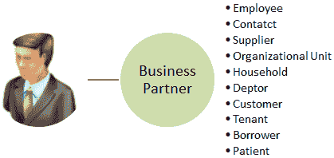 
商业伙伴
的示例

*   在 SAP CRM 中，集中创建业务合作伙伴。 此外，还可以集中维护业务伙伴扮演的角色，例如卖方方和船舶方
*   因此，在 SAP CRM 中创建的业务伙伴可以以不同的模块（例如销售，市场营销和服务）参与任何业务交易。 业务伙伴在业务交易中的参与程度取决于分配给业务伙伴的角色以及业务交易中涉及的伙伴功能
*   CRM Web UI 的“帐户管理”应用程序中包含在 SAP CRM 中创建和维护业务伙伴的信息。 为了与业务伙伴合作，用户需要有权访问 Web UI 中的“帐户”管理：

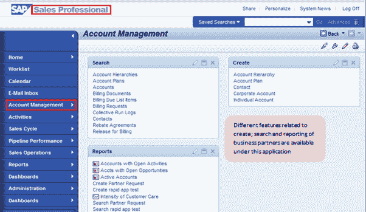 
帐户管理，可以选择维护业务合作伙伴

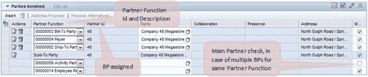 
商业伙伴参与了业务交易

对于特定的业务交易，可以在“参与方”分配框中找到参与的业务伙伴：

*   在 SAP GUI 中，业务伙伴维护可通过事务代码 BP 获得。 SAP 现在已停止支持 CRM 交易的 GUI，因此 Web UI 用于业务伙伴的创建和维护
*   CRM Web UI 中的帐户管理提供了业务伙伴数据的 360 0 视图，这表示它代表了业务伙伴的完整数据，包括：
    *   业务伙伴的标题详细信息
    *   与业务流程中其他业务伙伴的关系
    *   业务伙伴的帐户生命周期
    *   业务伙伴参与的业务交易
    *   更改业务伙伴数据的历史记录
*   使用 CRM 中间件，可以使用 SAP ERP 中维护的数据在 SAP CRM 中填充业务合作伙伴。 此外，可以通过 CRM 中间件同步任何这些系统（ERP 或 CRM）中业务伙伴数据的更新。
*   以下是用于业务合作伙伴自定义的 SPRO 路径。 为特定业务交易实现的合作伙伴处理还取决于为业务合作伙伴实现的定制设置。 因此，在 SPRO 中实现了 CRM 中业务合作伙伴的自定义设置，一旦完成，CRM Web UI 将用于创建和维护业务合作伙伴

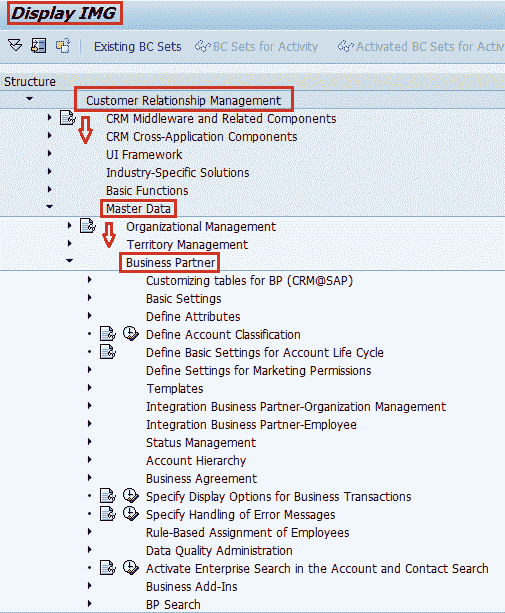 
SPRO 维护与业务合作伙伴相关的自定义

## 业务合作伙伴类别

*   SAP CRM 支持三种可能的类别：
    *   个人或个人
    *   组
    *   组织
*   业务伙伴可以属于以下任一类别。 可以将帐户进一步细分如下：
    *   帐户：帐户是与您的组织有业务关系的公司，团体或个人。
        *   帐户进一步分为：
            *   公司帐户（组织或公司）
            *   个人账户（个人）
            *   团体（家庭等团体）
    *   联系
        *   与您有业务关系的人
        *   主要分配给公司帐户
    *   雇员
        *   您组织的成员
        *   参与组织与供应商，潜在客户，客户和其他各方之间的互动

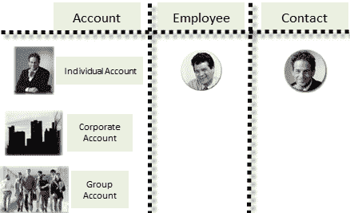 
商业伙伴类别

*   不能修改这些类别或创建新类别。
*   在 SAP CRM 中创建业务伙伴后，将为其分配类别。 业务伙伴类别只能在创建业务伙伴时分配一次，并且不能在业务伙伴生命周期的后期进行修改。 因此，在创建业务伙伴时，您需要选择类别作为第一步。 此外，可以根据帐户类别过滤帐户搜索，以实现更快的结果：

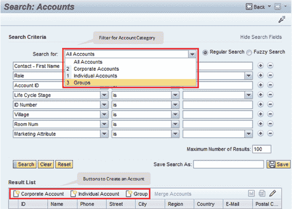 
在 Web UI
中搜索帐户的页面

*   此业务伙伴类别也用于帐户显示，创建和修改页面的标题中：

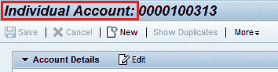 
帐户的页面标题提到帐户类型“个人帐户”

## 业务合作伙伴分组

*   创建业务伙伴时，将为其分配一个称为“业务伙伴编号”的编号。可以在 SPRO 定制中配置该编号，以便在创建业务伙伴时自动生成该编号。
*   为此，使用业务伙伴分组和编号范围
*   我们使用开始和结束值定义数字范围（在 SAP CRM 中，这被称为“数字范围”并具有标识符）：

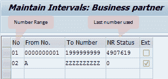 
SPRO 设置中的编号范围

*   例如，从上面的屏幕截图中，编号范围为 01 的业务伙伴将被分配一个数字“ 4907620”，而编号范围为 02 的业务伙伴将被分配一个数字“ A”
*   号码范围可以是内部或外部
*   内部编号范围
    *   基于自定义设置，这是在 CRM 系统中生成的
    *   这是相关编号范围内的序列号
*   外部号码范围
    *   在这种情况下，用户可以在创建记录时分配编号
    *   或者该数字可以从外部系统得出
    *   在这两种情况下，使用的数字都必须在相应的数字范围内
*   然后将此数字范围分配给一个分组
*   SPRO 路径，将“号码范围”分配给组：
    *   IMG->跨应用程序组件-> SAP 业务合作伙伴->业务合作伙伴->数字范围和分组->定义分组并分配数字范围
*   商业伙伴分组基本上是可以分配给商业伙伴的不同数字范围。因此，可以将分组视为保存数字范围设置的容器
*   创建 BP 时，用户选择分组
*   选择的分组标识要生成的号码
*   如果分组使用内部号码范围，则在保存业务伙伴时将自动分配业务伙伴号码
*   对于与外部号码范围相对应的分组
    *   可以启用 ID 字段，以便用户提供业务伙伴编号或
    *   BP 编号可以从外部系统（例如连接的 ERP）中获取

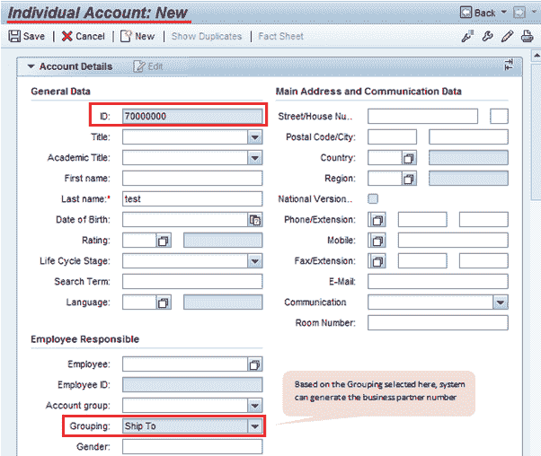 
为个人帐户创建页面

## 业务合作伙伴角色

*   分配给业务伙伴的 BP（业务伙伴）角色反映了该伙伴的功能以及该伙伴可能参与的业务交易。
*   可以为一个业务伙伴分配多个业务伙伴角色
    *   这意味着业务伙伴可以以不同的角色参与不同的业务交易
    *   但是业务伙伴的常规信息（例如姓名，地址等）仅输入一次
*   可以根据业务需求创建自定义 BP 角色

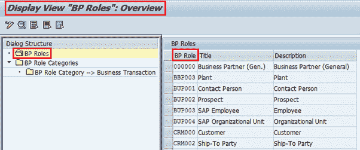 
SPRO 中的业务角色设置– I

*   将业务伙伴角色分配给业务伙伴角色类别

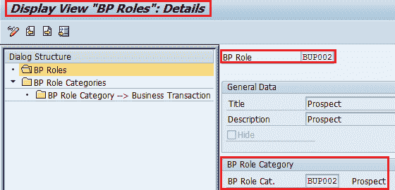 
SPRO – II 中的业务角色设置

*   BP 角色类别控制 BP 角色的属性：

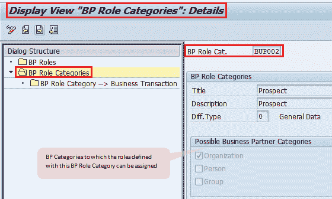 
SPRO – III 中的业务角色设置

*   BP 角色的客户概览中有一个单独的分配块。 下拉列表显示可以分配给帐户的可用角色。 使用“插入”按钮可以将新角色分配给业务伙伴：

Web UI 中的 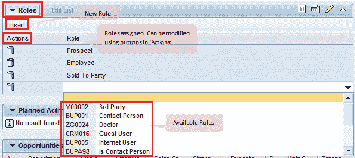 
业务角色分配块

## BP 关系

*   一个业务伙伴可以与另一个业务伙伴建立关系。
*   使用“业务伙伴关系”在两个业务伙伴之间形成连接。
*   在 SAP CRM 中，业务伙伴之间的关系用业务伙伴关系类别来描述：

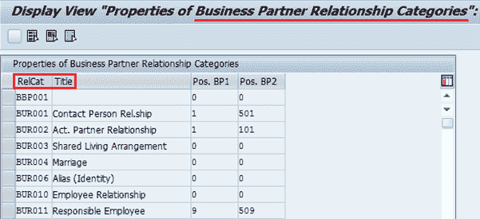 
SPRO – I 中的业务伙伴关系设置

*   这些 BP 关系类别定义了业务伙伴关系的属性：

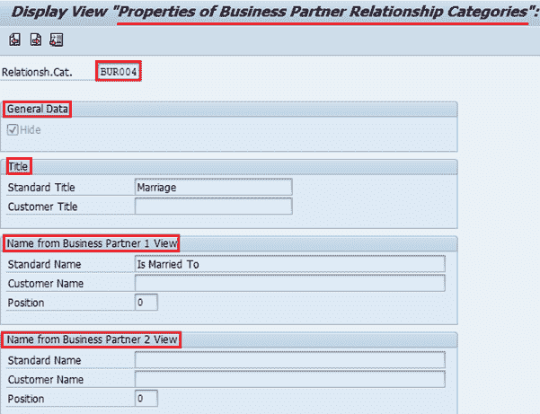 
SPRO – II 中的业务伙伴关系设置

*   BP 关系可以是单向或双向的
*   可以在“关系”分配块中的 Web UI 中将 BP 关系分配给业务伙伴：
    *   这将更新关系中涉及的所有业务伙伴
    *   可以使用“操作”按钮修改现有关系

Web UI 中的 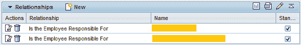 
业务伙伴关系分配块

*   关系可能与时间有关。 因此，该关系将在创建此关系时在指定的时间范围内有效
*   使用上面的屏幕截图中的“新建”按钮，可以创建新的关系：

## 账户分类

*   SAP CRM 提供了帐户分类功能，您可以使用该功能根据任何条件对帐户进行分类。 当大型企业需要根据不同的标准对不同的业务领域进行分类时，这特别有用
*   可以根据这些分类标准执行帐户搜索
*   还可以在“帐户”页面上将帐户分类作为单独的分配块使用：

Web UI 中的 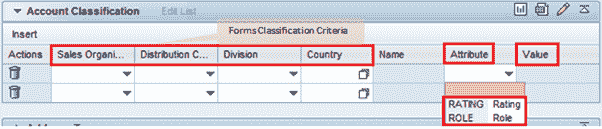 
帐户分类分配块

*   此分配块中的角色与业务合作伙伴角色不同。 您可以定义任意数量的条件和属性
*   根据需求科目条件，可以合并以创建分类类别。 每个分类类别最多可以包含 5 个条件，并且根据要求可以具有任意数量的属性
*   在 SPRO 定制中定义科目分类的组成部分
*   在 Web UI 中，与值帮助的每个条件和属性相关的帮助器类为下拉列表
*   条件定义：

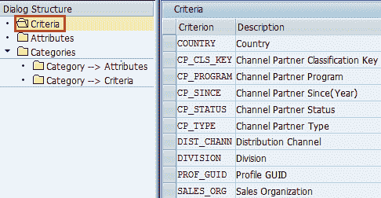 
SPRO – II 中的帐户分类设置

*   属性定义：

SPRO – III 中的 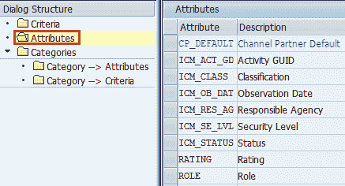 
帐户分类设置

*   属性分配：

SPRO – IV 中的  
帐户分类设置

*   分配条件：

SPRO – V 中的 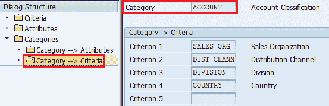 
帐户分类设置

## 360 0 业务合作伙伴视图

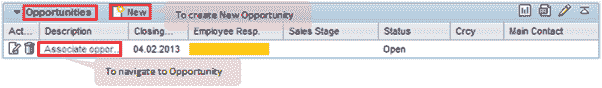 
Web UI

中各个分配块内的链接文档

SAP CRM 提供业务伙伴的 360 0 视图。 这意味着可以在一个地方检查与业务伙伴有关的所有数据。 在标题数据中，可以维护和显示适用于所有场景的数据，例如名字，姓氏，BP 号等。数据有单独的分配块，例如 BP Role，BP Relationship 等。 可以查找涉及业务伙伴的所有业务交易。 例如，存在一个分配块“机会”，其中显示了涉及业务伙伴的所有机会业务交易

*   可以从这些分配块数据导航到相应的业务交易单据。 另外，我们可以通过这些分配块创建新的业务交易。 也就是说，使用“商机”块上的新按钮，可以导航到“商机”页面并为业务合作伙伴创建商机
*   因此，SAP CRM 支持在单个位置维护整个业务合作伙伴生命周期，这使最终用户使用起来很方便，并有助于实现报告目的。