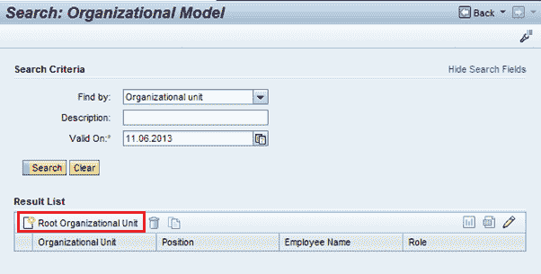
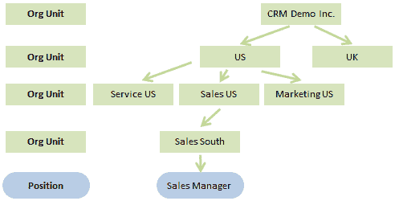
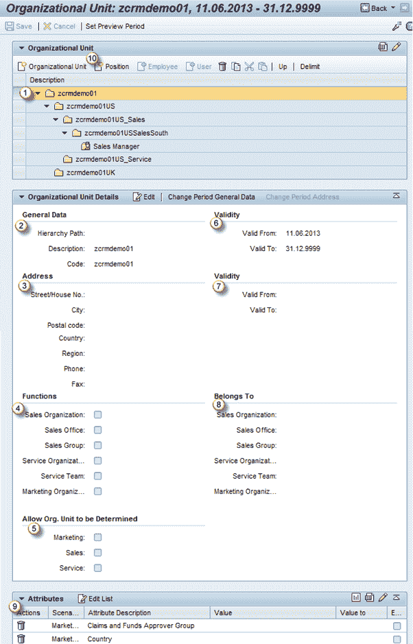
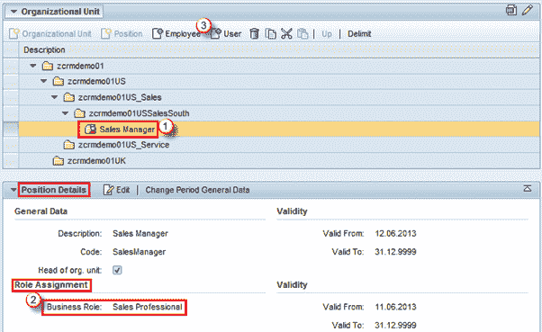
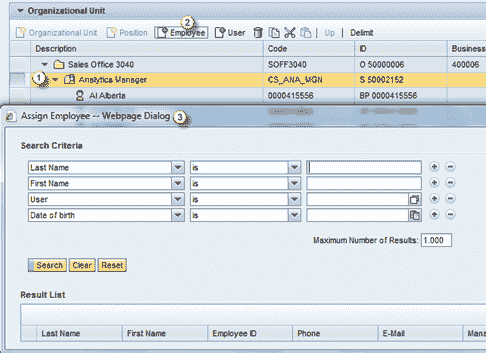
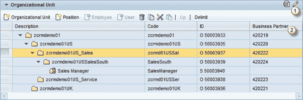

# SAP CRM 组织管理

> 原文： [https://www.guru99.com/organizational-management-in-sap-crm-2.html](https://www.guru99.com/organizational-management-in-sap-crm-2.html)

## SAP CRM 中的组织模型

*   组织管理用于在 CRM 组织模型中映射公司的组织结构
*   这使您能够：
    *   在 CRM 组织模型中映射您的销售，服务和营销结构
    *   通过组织和一般属性来表征您的组织单位
    *   定义规则以确定负责的组织单位
*   在业务交易中使用组织结构可以自动指定组织数据
*   它也参与伙伴的确定，例如 它支持确定在特定业务交易中负责的员工
*   使用组织管理来：
    *   建立&维护公司的组织结构
    *   根据公司的结构保持职位&的员工分配
    *   为组织单位分配特定属性
*   以下是使用组织管理的 CRM 应用程序领域：
    *   业务交易：系统可以根据交易凭证中的数据自动确定负责的组织单位
    *   合作伙伴处理：用于确定参与方的合作伙伴确定程序可以基于业务交易中涉及的组织单位
    *   支付卡处理：也可以用于自动确定负责清算的组织单位
    *   税务处理：税务处理期间的营业地点确定可以基于组织管理
*   可以通过各种角色（例如 SALESPRO，SERVICEPRO 等）找到此应用程序。
*   以下是组织模型搜索的视图：

Web UI 中的  
组织模型搜索

*   “根组织单位”按钮可用于创建组织模型
*   例如，以下是组织层次结构：

 
具有组织单位和职位的组织模型

## 组织单元

Web UI 中的  
组织单位视图

在这里，我们可以看到与所选组织单位/位置相关的数据：

1.  已选择行（组织单位或位置）
2.  常规数据：
    *   层次结构路径：
        *   显示当前组织单位/位置的路径
        *   如果是根组织单位，则为空白
    *   描述：
        *   组织单位/职位的简短说明
    *   码：
        *   可以将其视为所选组织单位/位置的键

3.  地址：这是所选组织单位/位置的主要地址
4.  功能：此块代表组织结构中组织单位/职位的功能，因此被视为销售组织或服务组织或市场营销组织
5.  允许组织。 要确定的单位：此检查使当前组织单位可用于组织确定
6.  有效性：此区域显示当前组织单位的有效性
7.  有效性：在此区域中保持位置的有效性以及上面块中相应组织单位的有效性
8.  属于：
    *   该数据基于组织单位以上的水平
    *   使用来自上级组织单位的数据，此块显示了当前组织单位所属的功能
9.  属性
    *   在此分配块中，我们为某些预定义属性分配值
    *   这些属性分为销售，服务&市场营销属性
10.  在组织单位下，我们可以创建更多组织单位，也可以创建职位

## 位置

我们在这些组织单位下维护与职位相关的数据

Web UI 中的  
位置视图

1.  选择组织单位下的职位
2.  在“位置详细信息”分配框中，我们可以分配业务角色
    *   这与我们首次登录 CRM Web UI 时看到的角色相同
    *   因此，分配给该特定职位的所有用户或雇员都将从分配给该职位的角色继承角色（上述情况下为 Sales Professional）
3.  我们可以将用户或员工分配到组织模型中创建的职位

 
Web UI 中的位置详细信息

为职位保留的其他数据：

1.  我们可以保持该职位的有效性
2.  它也继承了组织单位的有效性
3.  如上面的屏幕快照中突出显示的那样，为组织单位维护的功能分配还定义了可以使用此流程的业务流程（销售，服务或营销）。 此功能分配数据是从上级组织单位继承的，可以为职位进一步维护

## 用户或员工

*   对于在组织模型中创建的职位，我们可以分配用户或员工
    1.  选择职位以将更多用户或雇员添加到该职位
    2.  要将员工分配到所选职位，请单击员工按钮
    3.  弹出搜索窗口，根据各种条件寻找员工

 
搜索员工的步骤

## 组织模型中的业务合作伙伴

使用组织单位分配块中的个性化按钮，我们可以在视图
中获得更多列

1.  使用个性化按钮更改显示的列
2.  更新后的视图在分配区中显示了业务伙伴

 
更改个性化设置以查看业务伙伴编号

*   这样我们就可以在组织模型中看到分配给组织单位的业务伙伴编号
*   作为业务合作伙伴，我们可以让这些组织单位参与业务交易
*   我们可以看到以下组织参与了业务交易：

 
与参与方分配块中显示的业务交易有关的业务伙伴

*   它将作为业务合作伙伴参与。 这样我们就可以在参与的各方中找到参与的组织