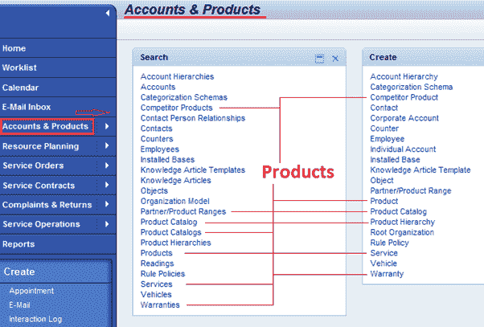
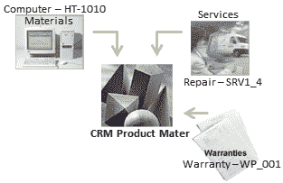
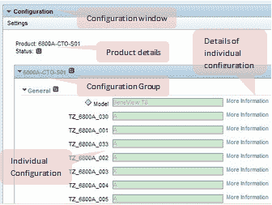
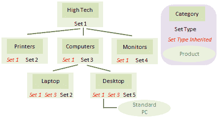
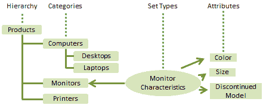
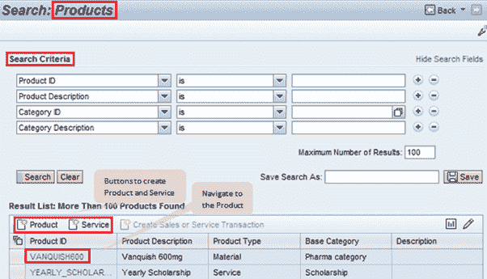
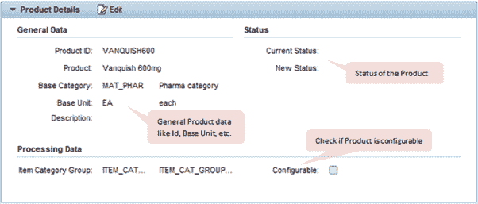
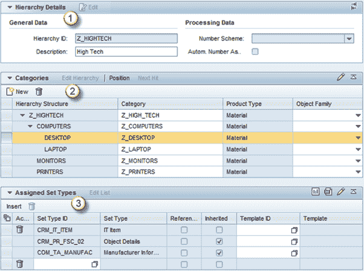
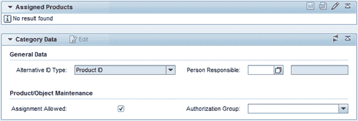
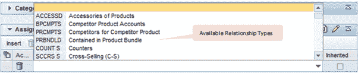

# SAP CRM Product Master：层次结构，类别，集合类型&属性

> 原文： [https://www.guru99.com/product-master-in-sap-crm.html](https://www.guru99.com/product-master-in-sap-crm.html)

## CRM 产品大师的概念

*   SAP CRM 提供产品主数据，用于管理组织中不同业务流程的产品部分
*   就 SAP CRM 而言，产品是贵公司业务活动的对象。 产品可以是有形的（例如 PC），也可以是无形的（例如服务如 PC 维护）
*   SAP CRM 产品主数据可用于维护和检索您组织购买或出售的产品的所有信息

 
产品的工作中心页面

*   在 SAP CRM 三个模块（即销售，服务和营销）中涉及的所有流程中，它的工作原理相同
*   选择用于访问 CRM UI 中产品主数据的角色确定了当前用户可以维护的产品类型
*   SAP CRM 支持多达六种不同类型的产品

 
产品类型

*   以下是 SAP 标准产品类型：
    *   材料
    *   服务
    *   质保
    *   理财
    *   知识产权
*   在这些产品类型中，知识产权和融资特定于行业
*   产品示例：

 
根据产品类型的示例

*   SAP CRM 支持将 ERP 物料主数据与 CRM 产品主数据同步
    *   ERP 物料主数据包含各种数据和视图。 其中某些视图无法在 CRM 中进行处理。 通常，只能将常规数据，基本数据和特定于销售的数据传输到 CRM 系统
    *   此外，如果将产品数据从 ERP 传输到 CRM，则可以在 CRM 内进行最少的更改
*   SAP CRM 提供了维护产品之间关系的功能。 例如，对于可用的产品，我们可以提供服务部件，配件或服务等。这些关系可以在产品投标功能中使用
*   在产品投标中，系统读取产品数据并使用某些属性（如维护的关系），建议可在业务交易中使用的其他产品
*   以下是可以在 CRM 系统中维护的可用关系类型的示例：
    *   组件
    *   服务
    *   服务零件
    *   竞争者
    *   配饰
*   SAP CRM 还提供了将产品维护为可配置的功能

IPC 应用程序中的  
产品配置窗口

*   在这种情况下，产品包含可以保存在产品配置期间分配的值的变量（可以视为变量）。 例如，对于产品“显示器”，我们可以使用“屏幕尺寸”的变体，在产品配置过程中，我们可以为屏幕尺寸分配值
*   与产品配置相关的自定义设置在 SPRO 设置中保留
*   SAP CRM 中的产品配置应用程序具有基于 [Java](/java-tutorial.html) 的前端。 此应用程序称为 Internet 定价和配置器。 它还涉及在 SA​​P CRM 系统中配置产品的定价
*   SAP CRM 提供了将该 IPC 应用程序与产品主目录链接的功能。 因此，对于可配置产品，我们可以从 CRM Web UI 调用 IPC 应用程序
*   也可以使用以下事务通过 SAP GUI 维护产品主数据：
    *   COMMPR01 –产品主
    *   COMM_HIERARCHY –维护层次结构和类别
    *   COMM_SETTYPE –维护集类型和属性

## 层次结构，类别，集合类型和属性

*   SAP CRM 借助在 SAP CRM 产品主数据中维护的类别和层次结构来实现产品的结构化
*   SAP CRM 系统中有 3 个主要的预定义层次结构
    *   R3MATCLASS
    *   R3PRODHERE
    *   R3PRODSTYP
*   还可以根据业务场景中的需求在 SAP CRM 中创建自定义层次结构。 同样，我们可以为产品主数据创建自定义类别
*   类别可以树状排列，以便一个类别包含其他类别
*   为了维护属性，类别中使用了“设置类型”
*   在“类别”树中，一个“类别”从更高级别的类别继承“设置类型”
*   可以在一个层次结构中为集合类型分配多个类别，但只能在同一层次结构中。 即，不能将集合类型分配给不同的产品层次结构
*   因此，在 SAP CRM 中，将创建或创建集合类型的集合以维护与产品相关的特定数据。 除此之外，我们还可以在类别中维护关系类型
*   SAP 为业务交易所需的数据提供标准集合类型
*   同样，可以根据业务场景中的需求创建自定义集合类型。 这些集合类型被分配了实际上存储值的属性
*   以下是属性的定义：
    *   属性类型
    *   属性长度
    *   范围值
*   因此，“设置类型”是属性的集合，可以在产品主数据中分配给类别和层次结构。
*   无法更改分配给产品类别的集合类型的描述。 此外，CRM 系统不允许删除分配给产品类别的设置类型。 类别或层次结构包含由分配给它的并从更高级别继承的 Set Types 集合表示的属性。 例如，以下是类别和集合类型的示例：

 
产品层次结构，类别和集合类型

 
产品层次结构，类别，集合类型和属性

*   在这种情况下，最高级别类别保持为“高科技”，而“设置 1”被分配为设置类型
*   下一级别类别将继承此 Set Type（集合 1），并且还可以为其他数据分配自己的 Set Type。
*   产品可以分配给这些类别中的任何一个。 分配给类别的产品从可用的集合类型中获取属性，即当前类别及其更高级别类别的集合类型
*   因此，在上图中，以下是产品“标准 PC”可用的设置类型：
    *   套装 1
    *   套装 3
    *   套装 5

## Web UI 中的产品

*   SAP CRM 中的产品主数据与 CRM Web UI 集成在一起。 因此，根据用于登录 CRM 应用程序的角色，用户可以在 CRM Web UI 中对 Product Master 执行创建，修改和删除操作
*   Following figure shows the Search page for the Products

     
    产品搜索页面

*   在产品详细信息分配块中，我们可以看到为产品维护的常规数据
*   主要包括：
    *   产品的基本单位
    *   产品状态
    *   基本类别
    *   复选框，指示产品是否可配置

 
产品详细信息分配块

*   有一个单独的分配框来维护与产品相关的类别：
*   还有一些通用的分配块，例如附件可用于产品

产品概述页面中的  
分配块

我们还可以在 CRM Web UI 中维护类别和层次结构：

*   层次结构详细信息：
    *   在此分配块中，维护与层次结构相关的标题详细信息
*   分类：
    *   在此分配块中可以看到分配给层次结构的类别
    *   正如我们在上一节中所看到的，这以树结构维护
    *   对于分配的每种类型，我们可以定义产品类型
    *   我们还可以维护每个类别的对象族
        *   对象是组织可以为其销售或提供服务的全局唯一对象
        *   它可以是有形的或无形的对象
        *   对象族是对产品进行分组的另一个条件
*   分配的集合类型：
    *   在此分配块中，可以分配设置类型
    *   上一级类别中的集合类型将自动继承
    *   在此分配块中禁用了继承的集类型

 
分配了类别和集合类型的产品层次结构

对于所选类别，例如上面的屏幕快照中的“桌面”，“层次结构概述”页面中还有其他分配块，如下所示。我们还可以维护所选类别的关系类型：

产品层次结构概述页面中的  
分配块（用于所选类别）

 
分配模块，用于维护“产品层次结构概述”页面中的关系类型（针对所选类别）