# SAP CRM 业务交易流程

> 原文： [https://www.guru99.com/business-transaction-processing-in-sap-crm.html](https://www.guru99.com/business-transaction-processing-in-sap-crm.html)

## 什么是商业交易？

*   SAP CRM 中的业务流程：

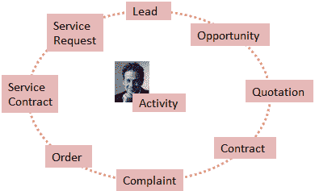

*   对于公司的各种流程，业务交易提供了业务结构和可以使用的功能。 因此，SAP CRM 中的业务交易代表您的组织与各种业务伙伴的业务交互
*   它允许在整个业务流程中使用相同的界面和处理概念
*   可以重复使用业务交易的各个组成部分
*   在一个交易项目中，可以从不同的业务环境中输入
*   与业务交易类型无关，SAP CRM 中不同业务交易的外观始终相似

## 交易结构

*   通过 SAP CRM 中的业务交易，可以灵活地控制和管理任何公司特定的业务流程。
*   SPRO 路径-> *客户关系管理->交易->基本设置*

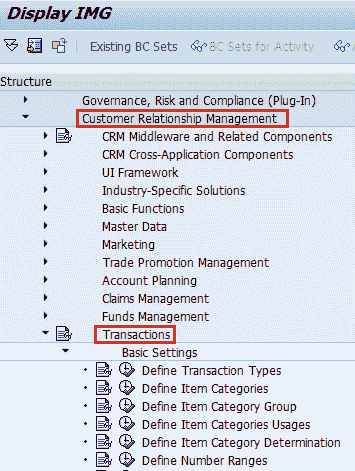

业务交易配置的 SPRO 路径

*   SAP CRM 中的业务交易由主要业务交易类别组成。
*   CRM 业务交易的结构取决于主要业务交易类别。
*   CRM 业务交易包括标头级别和项目级别（图 2 &图 3）。

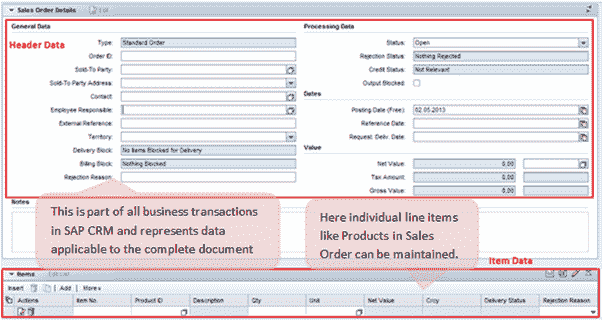

业务事务中的标题（常规）和物料数据表示

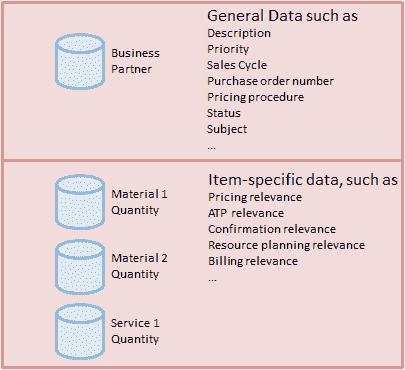

Header (General) and Item Data representation in a Business Transaction

## 交易类型项目类别和类别描述

*   交易类型结构：

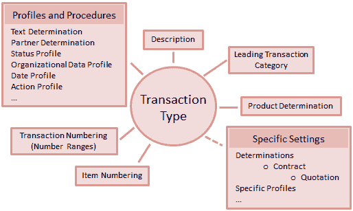

*   事务类型定义：
    *   属性
    *   特点
    *   控制属性
*   在 SAP CRM 业务中，交易处理由交易类型控制
*   交易类型中的主要业务交易类别控制：
    *   可以在较低级别上应用的特定设置
    *   可以分配给它的其他业务交易类别
    *   交易的详细控制
*   商业交易项目的属性和属性由项目类别指定。
*   物料类别控制物料的处理方式。

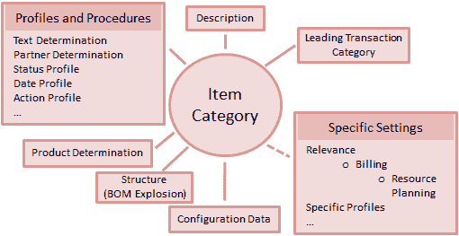

*   首先，需要将项目类别分配给定义用于使用项目类别的业务环境的项目对象类型。

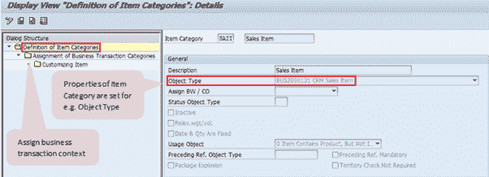

*   与交易类型类似，项目类别可以分配给一个或多个业务交易类别。
*   应用于较低级别项目类别的特定设置取决于前导项目类别（对象类型）。
*   在 SAP CRM 中，为了处理业务交易，需要为每个业务交易类别和项目类别组定义默认项目类别。
*   同样，可以定义替代项目类别，可以为系统默认值手动输入这些类别。

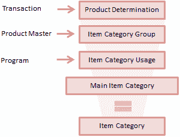

*   项目类别的确定取决于：
    *   交易类型
    *   项目类别组
    *   项目类别用法
    *   主要项目类别
*   物料类别组是产品主数据中的一个字段。
*   项目类别用法来自编程逻辑。

## 复制交易或跟进交易

*   后续交易代表当前业务流程中的下一个业务交易
    *   例如，可以从下达的销售合同中创建销售订单。
    *   因此，在这种情况下，销售订单被视为销售合同的后续文件
*   同样，可以复制一个业务交易以创建另一个具有相同业务交易类型的交易
    *   例如，可以复制一个销售订单以创建另一个销售订单
*   从现有的业务交易中，可以创建副本或创建后续交易。
*   万一业务交易被复制：
    *   交易类型相同
    *   标题和项目数据已复制
    *   交易记录未更新
    *   与源交易无关
*   如果是从业务交易中创建后续交易：
    *   可以为后续交易配置交易类型
    *   标头数据已复制
    *   您可以选择项目
    *   交易记录已更新
    *   为此复制控制设置应保持
    *   可以在“交易历史记录”分配块中看到此流程

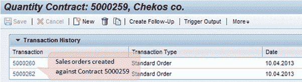

商业交易的交易历史分配块[

*   以下是复制控制设置中的必需设置：
    *   交易类型的复制控制
    *   项目类别的复制控制
    *   维护目标交易类型的设置
    *   复制期间确定项目类别（可选）
    *   CRM_COPY_BADI 的实现（可选）
*   在 SAP CRM BAdI 定义中，提供了 CRM_COPY_BADI 以便实施以编写您自己的数据传输例程。
*   您可以通过交易历史记录数据访问抬头和项目级别的业务交易之间的互连链接。
*   SAP CRM 还提供选项“后续引用”，您可以在其中将活动创建时链接到现有活动。
*   这将使新事务成为现有事务的后续操作（图 4）。

## 商业交易的基本功能

*   业务交易中的基本功能：
    *   文字确定
    *   日期管理
    *   状态管理
    *   不完整检查
    *   合作伙伴处理
    *   动作处理
    *   价钱
*   对于 SAP CRM 中的每个业务交易，可以维护不同的注释。

*   根据要求，可以在文本确定过程中组合多种文本类型。

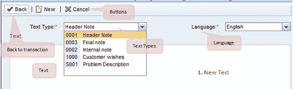

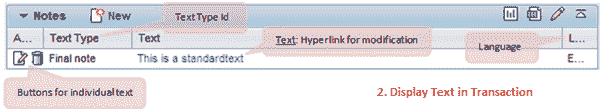

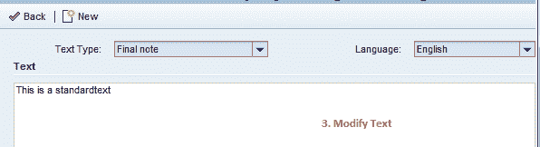

*   文本确定过程在业务交易中用于交易中不同的相关文本。
*   CRM Web UI 提供了分配块
    *   创建具有特定文本类型的新文本。
    *   显示业务交易中的文本
    *   修改特定文字
*   使用日期管理，可以处理与业务交易相关的日期。
*   它包括：
    *   日期类型
    *   日期规则
    *   持续时间
    *   日期资料

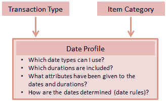

*   该日期管理系统还支持将保存的日期转换为用户时区，并在业务交易中考虑工厂日历。

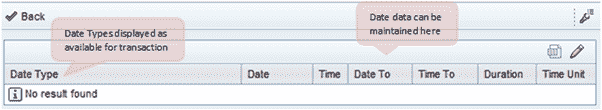

*   可以手动输入业务交易中的日期，也可以由系统使用日期规则来计算日期。

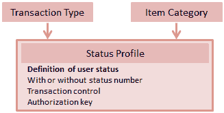

*   状态管理允许在状态配置文件中维护业务交易的用户状态。
*   它由分配给业务交易的状态配置文件组成。
*   如果状态配置文件未分配给业务交易类型/项目类别，则系统状态将显示在应用程序中。

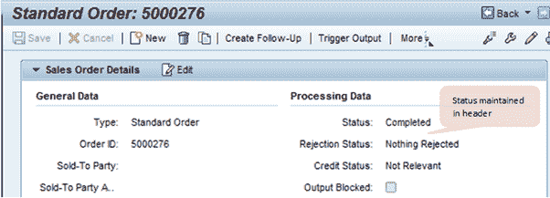

*   可以在状态配置文件中定义以下内容：
    *   用户状态的激活顺序
    *   初始状态/开始状态
    *   设置交易状态和用户状态

## 活动管理

*   活动管理是 SAP CRM 中业务交易的一个示例。
*   活动表示组织中员工执行的活动
*   它还涵盖了员工与业务交易中涉及的特定业务合作伙伴进行交互的情况
*   活动可以作为后续文档链接到各种业务交易（如销售订单，服务订单等），作为差异 CRM 模块（如销售，市场营销和服务）的一部分提供
*   技术上-
    *   **业务活动**中包含有关在特定日期与业务伙伴互动的信息。
    *   **任务**包含有关一个或多个员工必须在特定日期完成的活动的信息。
*   SAP CRM 提供不同类型的活动，以涵盖与业务交易中涉及的业务伙伴的不同沟通渠道
*   活动类型：

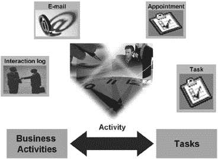

*   与其他业务交易类型相似，活动包含与所涉及业务流程的处理有关的数据，例如与业务交易中涉及的业务伙伴的交互
*   活动结构：

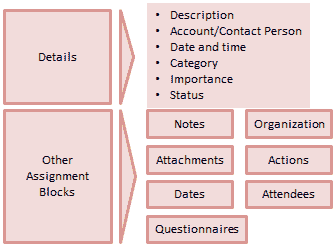