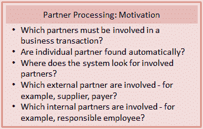
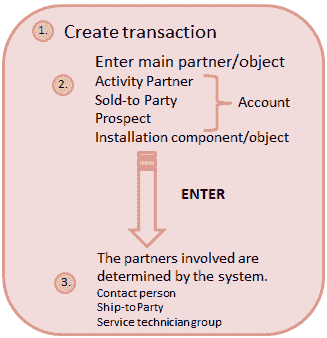
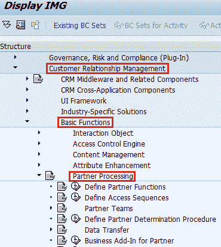
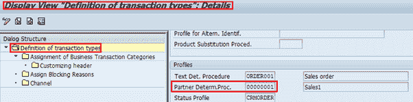
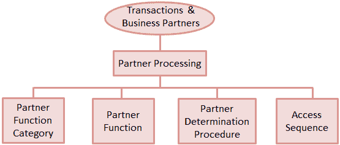
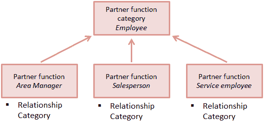
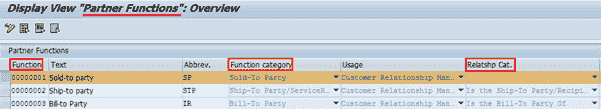
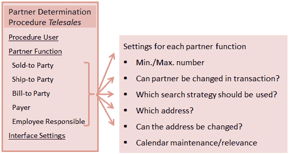
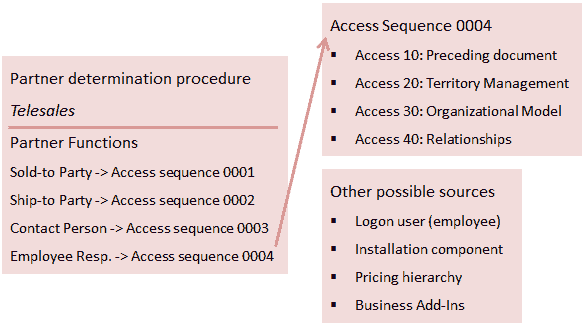
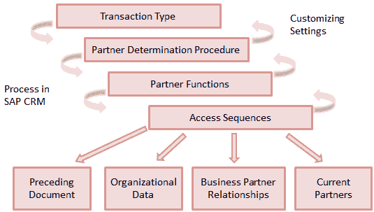

# SAP CRM 合作伙伴处理：类别，功能，顺序，确定

> 原文： [https://www.guru99.com/partner-processing-in-sap-crm.html](https://www.guru99.com/partner-processing-in-sap-crm.html)

## 合作伙伴处理概述

在所有可能的业务场景中，业务伙伴在业务交易中都很重要。 SAP CRM 提供了一种全面的解决方案，可以在其中配置设置以维护业务伙伴并在业务交易中使用它们。 通过 SAP CRM 合作伙伴处理，可以设置与业务交易中涉及的不同业务伙伴相关的属性。

*   使用合作伙伴处理，可以控制系统如何与业务合作伙伴一起工作。
*   使用合作伙伴处理，可以使特定业务合作伙伴成为必选。
*   此外，系统可以自动确定参与业务交易的业务伙伴。
*   以下是合作伙伴处理功能&的功能：

 

伙伴确定是所使用的过程，以便系统自动查找并输入业务交易中涉及的伙伴。 因此，使用各种信息源，合作伙伴确定过程可以找到业务交易中涉及的不同合作伙伴。 业务伙伴主数据和组织数据是两个最重要的信息源。

在业务交易处理中，业务伙伴处理由伙伴确定控制。 使用合作伙伴处理，您可以根据公司的术语在 CRM 系统中定义合作伙伴。 另外，您可以指定在业务交易中如何正确处理合作伙伴。 合作伙伴处理使您可以定义如何在 SAP CRM 和 SAP ERP 之间交换合作伙伴处理数据。

 
商业交易中的合作伙伴处理分配块

*   可以将以下内容配置为应用程序中合作伙伴处理配置的一部分：
    *   强制性伴侣
    *   自动伙伴搜索。 请参阅以下示例-

 

*   手动更改/替代
*   还在项目级别确定合作伙伴

*   可以在抬头级别以及项目级别确定合作伙伴。
*   合作伙伴决心还可以控制：
    *   必须参与业务交易的合作伙伴。
    *   是否自动确定合作伙伴。
    *   合作伙伴可以手动更改。

## 定制合作伙伴处理

合作伙伴处理在 SAP CRM 定制中配置。 *SAP 实施指南？ 客户关系管理？ 基本功能 合作伙伴处理*

 

然后，将伙伴处理的伙伴确定过程分配给定制中定义的业务交易类型。 在 SAP CRM 业务交易类型定义的“配置文件”部分中分配了合作伙伴确定过程。

以下是 SAP CRM 定制中对“标准订单”（TA）业务交易类型的合作伙伴确定过程分配：

 
设置特定业务交易的合作伙伴确定程序

以下是在自定义中由业务交易和业务伙伴定义的合作伙伴处理元素：

 

## 合作伙伴职能类别

*   它是职责的分类，在合作伙伴处理中用作系统键，以识别合作伙伴职能和承担这些责任的业务合作伙伴。
*   合作伙伴功能类别是在 SAP CRM 系统中预定义的，因此无法创建或更改。

 

*   有时，一个伙伴函数和为其分配的类别具有相同的名称，但并非总是如此，它们可以具有不同的名称。
*   伙伴功能类别通常对应于业务伙伴关系类别。

## 合作伙伴职能

*   使用合作伙伴功能描述与您开展业务的人员。
*   这些是 SAP CRM 中的配置，您可以用来描述您在组织中使用的合作伙伴。
*   可以根据您的组织自由命名合作伙伴职能。
*   定义合作伙伴功能时，可以分配业务合作伙伴关系类别。
*   以下是一些来自 SAP CRM 定制的 SAP 标准（预定义）合作伙伴功能的示例：

SPRO 中的  
合作伙伴功能定义

*   伙伴确定过程将分配给交易类型和项目类别。

## 伙伴确定程序

*   合作伙伴确定过程定义了在合作伙伴处理期间与业务合作伙伴之间的系统行为。
*   以下伙伴确定过程示例显示了可以执行的一些任务：

伙伴确定过程是结合伙伴功能和访问顺序，并包含其他信息。

## 访问顺序

*   它描述了用于确定系统用来确定伙伴的数据源的搜索策略。 它还包含使用源的顺序。
*   访问序列用作搜索策略。
*   它的定义是为业务合作伙伴搜索提供数据源
*   它还定义了系统在伙伴处理期间检查定义的源的顺序。
*   可以为伙伴确定过程中定义的每个伙伴功能分配访问顺序。 在业务伙伴处理中使用访问顺序的示例：

 

如果在伙伴确定过程中未为伙伴功能定义访问顺序，则可以手动输入伙伴。

SAP CRM 合作伙伴处理摘要以及 SAP CRM 自定义中的必需设置：

 

此图显示合作伙伴确定过程已分配给业务交易定义。 合作伙伴确定过程由合作伙伴功能及其属性（如访问顺序）组成。 访问顺序是一种搜索策略，用于确定所涉及的业务伙伴。