# SAP CRM 操作配置文件：完整教程

> 原文： [https://www.guru99.com/all-about-actions-in-transactions-sap-crm.html](https://www.guru99.com/all-about-actions-in-transactions-sap-crm.html)

## 介绍

*   在 SAP CRM 中，操作是指后处理框架（PPF）基本组件
*   动作可以自动触发输出，后续活动或工作流程
*   SAP CRM 中的不同应用程序可以使用动作处理，例如事务处理（CRMD_ORDER），开票（BILLING），案例管理（CRM_CASE）等。
*   行动取代 SAP ERP 系统的输出确定
*   可以在标头级别确定整个交易（交易类型）的动作，也可以确定单个项目（项目类别）的动作

 
此图提供了 SAP CRM

中的动作配置路线图

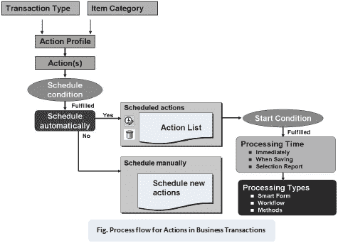

*   通过操作，可以在 SAP CRM 事务处理中实现预定义的流程。

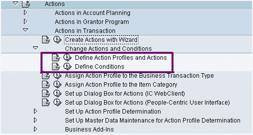 
SPRO 路径，用于定义操作，操作配置文件和条件

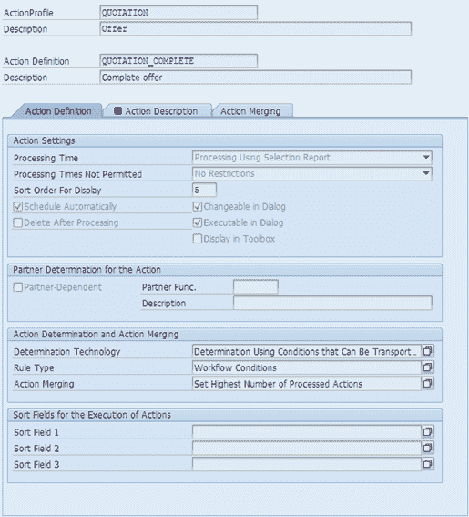 
SPRO
中的操作配置文件定义

*   对于特定的“动作”，可以定义“计划条件”。
    *   在使此操作可用于执行之前，请检查此计划条件。
*   在执行时，这些过程将根据用户定义的条件进行调度，这些条件定义了事务处理中的特定情况。
*   动作是计划的活动，或者任务和计划条件是要执行此动作的情况。
*   对于计划的操作，可能有不同的处理类型：
    *   处理类型定义动作的执行方式。
    *   通过此处理类型，可以触发 SAP WorkFlow，BAdI 方法调用，SmartForm 或警报。
*   可以在操作定义（t 代码 SPPFC 或 SPPFCADM）中指定处理时间，该定义指定在事务处理执行中将在何处执行该操作。
*   动作可以取决于伙伴功能。
*   可以在“动作定义”中分配合作伙伴功能。
*   操作通过操作配置文件链接到 SAP CRM 事务。
*   一个动作配置文件可以具有多个动作定义。
*   基于操作定义和相应条件（计划条件和开始条件）的配置和实施，这些操作针对相应的 SAP CRM 事务执行。
*   对于支持操作的事务，可以使用事务 CRMD_ORDER 在 GUI 中分析操作日志，如果提供了对相应分配块的访问权限，则可以在 Web UI 中分析操作日志。

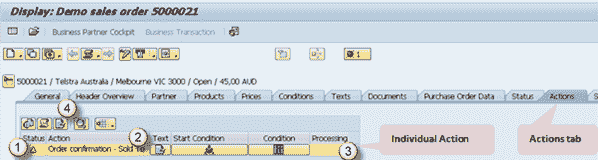 
CRMD_ORDER

中事务的操作详细信息

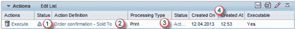 
CRMD_ORDER
中的交易操作明细

*   您可以显示为事务计划和执行的操作的列表，其中包含以下有关单个操作的信息，如图 3 和 4 所示：
    *   状态（已安排操作，已处理操作）
    *   说明（行动目的）
    *   加工类型
    *   创作者，创作日期
*   示例：合同到期前一个月，负责任的销售员工会在收件箱中收到一个带有“电子邮件”类别的活动，以提醒他写信给客户并了解他们是否希望续签合同。

## 条件

*   在执行操作之前，要检查两个条件：
    *   计划条件：仅在满足为此动作定义的计划条件的情况下，才计划执行该动作。 在 SAP 标准 BAdI EVAL_SCHEDCOND_PPF 的实现中也可以评估计划条件。
    *   开始条件：对于计划的操作，在执行开始条件之前先对其进行检查。 因此，一旦满足启动条件，便执行计划的动作。
*   这些动作条件是在 T 代码 SPPFCADM 中配置时定义的。
*   使用日期和日期规则，条件可能取决于时间。
*   可以使用业务对象或类和常量的容器属性上的表达式来实现条件。
*   可以检查条件以获取正确的语法并进行测试。
*   有两种定义条件的模式：
    *   鼠标导向的 PC 模式
    *   直接文字输入模式（繁体）

创建参数条件：

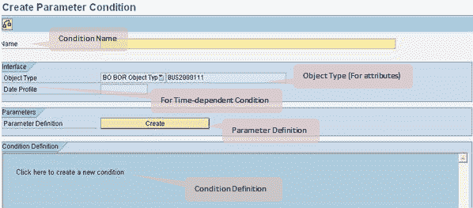 

设置参数条件：

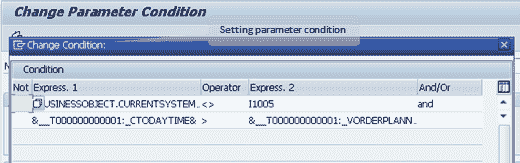 

更改参数条件值：

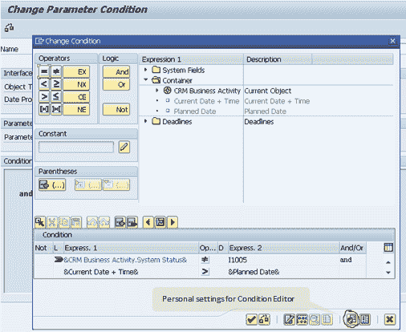 

条件编辑器的个人设置：

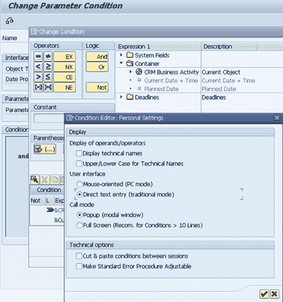

## 处理时间

处理时间定义在事务处理中何时执行满足开始条件的动作。 因此，一旦满足计划动作的开始条件，它就可以根据维护的处理时间执行。 以下是处理时间的可能选项：

*   使用选择报告进行处理：
    *   在这种情况下，将在选择报告执行后执行操作。 此处理类型对于用于期限监视（例如监视 SLA）的操作特别有用。
*   立即处理：
    *   满足启动条件后立即开始操作。
*   保存文档时的处理：
    *   保存交易后，操作开始。 因此，即使满足操作的开始条件，也仅在事务保存期间触发操作的执行。

在动作定义中设置处理时间：

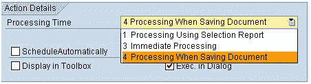 

## 加工类型

在动作定义中，指定处理类型。 处理类型指定在处理时间如何处理动作。 有不同的处理类型可用：

*   智能表格
*   工作流程
*   方法

方法是 SAP 标准 BAdI EXEC_METHODCALL_PPF 的 BAdI 实现。 SAP 提供了许多用于标准事务中的标准实现，例如：

*   COPY_DOCUMENT（创建后续文档）
*   COMPLETE-DOCUMENT（在文档中完成设置状态）
*   CREDIT_MEMO（创建贷项凭证项目）
*   1O_EVENT_CREATE（创建工作流程事件）

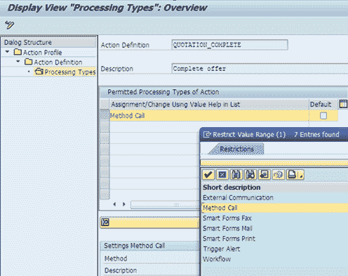

## 交易 SPPFCADM

此事务用于 PPF 定制：

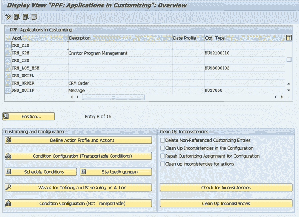 

它可用于定义操作配置文件和操作定义。 同样，可以配置“操作配置文件”中定义的“操作”。 可在“操作概要”中定义的操作可用于配置，以便可以使用 SAP 提供的向导和屏幕来维护条件。

其他有用的交易代码：

*   CRMC_ACTION_CONF-操作配置
*   CRMC_ACTION_DEF-动作定义
*   CRMC_ACTION_WIZARD-通过向导进行的定义操作

## 动作监控器

负责动作监视的程序 *RSPPFPROCESS* 源自后处理框架（PPF），可用于检查动作的处理。 因此，动作监控器可用于监控和触发几个事务的动作处理。

操作监视器的事务代码为 CRMC_ACTION_JOB。

使用动作监视器，可以列出使用选择报告处理时间设置为*处理的动作，并开始处理这些动作。 因此，这对于用于期限监视的操作（例如 SLA）特别有用。

当保存*时，它也可以用于以处理时间*处理动作。 如果在一定时间后满足了与时间有关的条件，而无需更改交易的执行程序，则在这种情况下也将启动动作。 因此，出于测试目的或重复操作，此报告还可用于选择和处理处理时间为“立即”或“保存文档时”的操作。* 

 
操作监视器执行

## 动作设定档

使用“操作”配置文件为 CRM 事务配置了操作。 在操作配置文件中创建操作，可以将其分配给不同的 CRM 事务。 在操作配置文件中，可以使用排序顺序和状态（活动或不活动）定义多个操作。 可以计划活动操作，并按照自定义中维护的排序顺序执行计划的操作。 对于动作配置文件中的单个动作，可以维护动作定义和动作配置。

在事务处理过程中，使用操作配置文件标识了所有允许的操作。 为此，将考虑在操作配置文件中未标记为非活动的操作。 在“操作配置文件”中维护的排序顺序，用于识别单个操作的执行顺序。 这些动作的进一步处理基于所标识的单个动作的动作定义和动作配置来完成。

可以将操作配置文件直接分配给交易类型或项目类别。 还可以将条件技术（即，行动概况确定）定义为与定价相同。

在 SPRO 中转到“定义操作配置文件和操作”

1.  选择一个动作配置文件
2.  点击查看

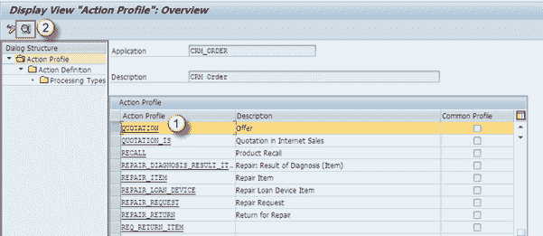 

您将看到操作配置文件
的属性

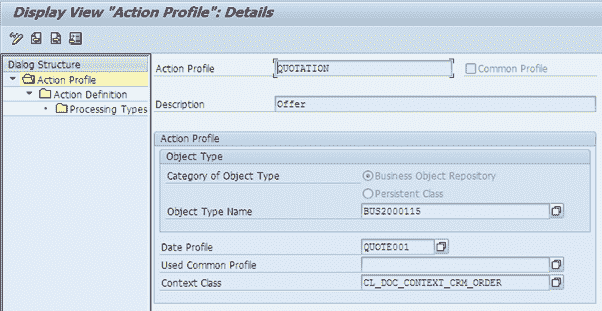 

1.  选择动作定义
2.  点击查看

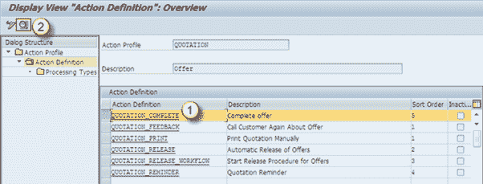