# SAP CRM 定价&计费：元素，过程，类型，Web UI

> 原文： [https://www.guru99.com/sap-crm-pricing-billing.html](https://www.guru99.com/sap-crm-pricing-billing.html)

## 总览

*   SAP CRM 中的定价功能由 **I** 互联网 **P** 定价和 **C** onfigurator（IPC）应用程序提供
*   IPC 是基于 [Java](/java-tutorial.html) 的应用程序
*   IPC 负责整个 SAP CRM 应用程序的定价
*   定价数据可以在 CRM 系统中维护，也可以从 ERP 下载
*   可能的情况：
    *   没有 ERP 集成的方案：

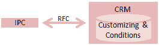 
CRM 中保留的定价

*   ERP 集成方案：

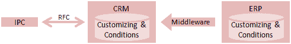 
ERP 中保留的定价

*   可以在 SAP CRM 的定制中维护与定价相关的设置：

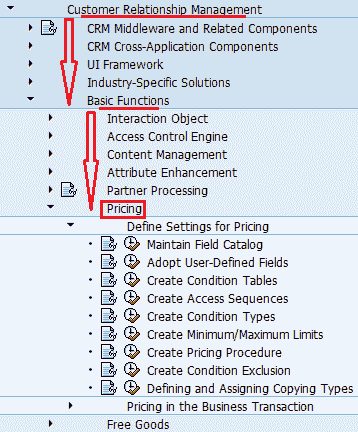 
与 SAP CRM
中的定价有关的 SPRO 设置

## CRM 定价要素

以下是 CRM 定价的要素：

 
CRM 定价要素

## 定价程序

*   SAP CRM 中的定价基于定价过程
*   CRM 中的定价过程有来源（CRM 或 ERP）
*   定价程序定义：
    *   有效条件类型
    *   交易中条件类型的计算顺序
    *   在定价屏幕上创建并显示的小计
    *   所有手动处理定价是可能的
    *   为了满足特定条件类型而要满足的要求
*   定价过程在自定义中定义：
    *   SPRO->客户关系管理->基本功能->定价->定义定价设置->创建定价过程
*   您需要手动设置定价程序的确定

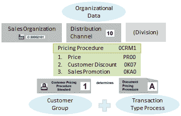 
可能影响定价的交易元素

*   定价过程的确定受以下因素影响：
    *   销售组织
    *   分销渠道
    *   单据定价程序（分配给交易类型）
    *   客户定价程序（在销售区域数据中作为开票数据分配给业务伙伴）
    *   除（可选）

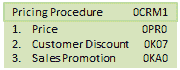 
定价程序

*   可以在以下定制路径中确定定价过程：
    *   SPRO->客户关系管理->基本功能->定价->商业交易中的定价->确定定价程序

## 条件类型

*   条件类型定义条件的特征和属性
*   您可以为业务交易中出现的每种价格，附加费或折扣类型定义条件类型
*   条件类型确定：
    *   条件类别
    *   如何使用
    *   计算类型
    *   基本楼梯
*   可以将条件类型设置为自动附加费或自动折扣

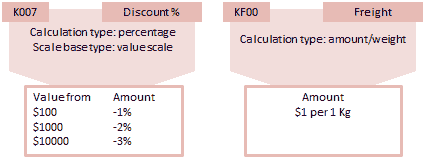 
定价过程中的条件类型

*   条件类型在定制中定义：
    *   SPRO->客户关系管理->基本功能->定价->定义定价设置->创建条件类型
*   CRM 中的条件类型具有源系统：
    *   本地= CRM
    *   其他系统（例如 R / 3）
*   通过 CRM 中间件，可以将 SAP ERP 条件类型加载到 SAP CRM 系统中。 无法将 SAP CRM 条件类型加载到 ERP 系统中
*   另外，某些 ERP 条件类型不能在 SAP CRM 系统中使用
*   在应用程序中，条件类型称为**定价元素**

## 访问顺序

*   条件类型中的访问序列定义了一种搜索策略，CRM 系统使用该搜索策略来搜索特定条件类型中的有效数据。 它包含一个或多个访问
*   这些访问均由条件表定义
*   访问顺序控制各个条件记录的优先级
*   这些访问告诉系统在有效条件记录后从哪里开始搜索
*   访问顺序在“自定义”中定义：
    *   SPRO->客户关系管理->基本功能->定价->定义定价设置->创建访问顺序
*   标识单个条件记录的字段（键）的组合由条件表定义
*   因此，条件表定义了单个条件记录所包含的字段的组合
*   条件表由搜索字段和结果字段组成
*   在定制中定义条件表的路径：
    *   SPRO->客户关系管理->基本功能->定价->定义定价设置->创建条件表
*   以下是为条件表定义的名称范围：

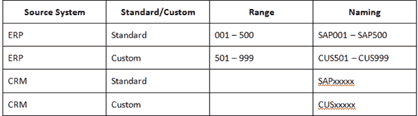 

## 例

*   一旦在自定义中定义并分配给交易类型后，定价程序将用于计算交易中相关对象的定价
*   例如，下面是一个场景：

SAP CRM
中定价程序的执行 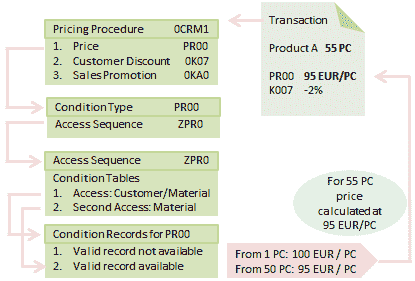 

*   在这里，交易有一个产品，找到的定价过程为 0CRM1
*   系统现在将运行此特定定价过程中的所有条件类型
*   因此，它将以第一个条件类型（即 PR00）开始，在这种情况下，它正在计算价格
*   PR00 条件类型参考了访问序列 ZPR0
*   因此，价格遵循访问顺序 ZPR0
*   该访问序列调用两个条件记录
*   发现这些条件类型之一对于事务中的此特定数据不可用
*   它正在根据另一个条件记录计算价格
*   以类似的方式，处理有关定价过程中的所有条件类型
*   在此示例中，为客户折扣执行 0K07，为促销折扣执行 0KA0
*   根据所有条件类型执行，发现价格的不同部分
*   因此，使用所有这些数据，它可以计算当前交易中产品的净价
*   客户可以看到最终价格

## CRM Web UI 中的定价

*   可以在 CRM Web UI 中维护价格要素
*   它被添加到 CRM Web UI 中的各种角色中。 例如，具有 Sales Professional 角色的用户可以在 Sales Operations 中找到价格：

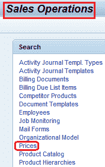 
在销售运营工作中心页面内搜索价格

*   以下是价格元素的搜索页面
*   用户还可以使用“新建”按钮创建新的价格元素

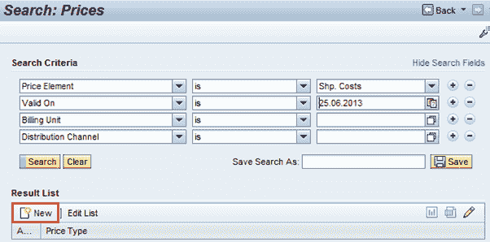 
搜索页面的价格

*   CRM Web UI 中的后续屏幕有助于使用所需和相关数据（如销售组织等）创建新的价格元素。

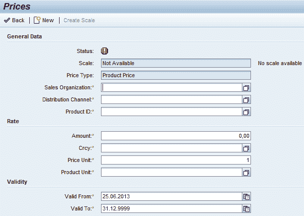 
创建价格页面

## CRM 帐单

*   CRM 帐单可用于与 SAP CRM 中的交易相关的发票
*   一般情况下，CRM 系统连接到 ERP 系统以进行与计费相关的处理
*   但是 SAP CRM 还以 CRM Billing 的形式提供与计费流程相关的功能
*   CRM 中的计费处理包括以下步骤：
    *   输入处理
    *   开票
    *   输出处理
*   作为输入处理的一部分，CRM 开票接管来自不同业务交易的与开票相关的项目。 这些项目存储为应付帐款清单项目
*   在开票过程中，CRM 开票可以将来自不同 CRM 交易的相关开票到期清单项目分组到联合开票文档中
    *   计费到期清单可以处理到期清单项目
    *   它可以将到期清单项目作为单个帐单的一部分进行处理
    *   此外，它可以处理到期清单项目，作为总帐单的一部分
*   输出处理包括：
    *   发票输出
    *   转移到 SAP 财务
    *   在 SAP BI 中检索
*   使用 SAP SmartForms 执行开票输出

## CRM Web UI 中的 CRM 开单凭证

*   CRM 帐单文档针对 SAP CRM Web UI 中的各种业务角色（例如 SALESPRO）
*   可以在销售运营工作中心找到开票凭证

销售操作中的 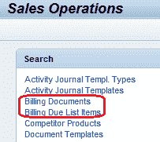 
开票凭证

*   以下是 CRM Web UI 中“开票凭证”的搜索页面

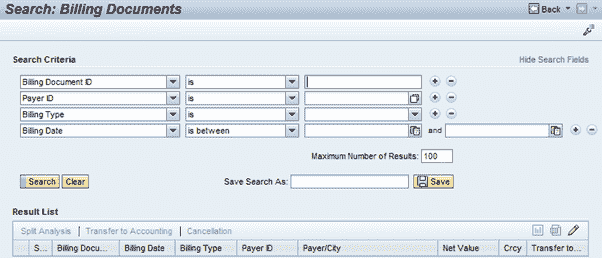 
CRM Web UI
中的开票凭证搜索

*   在“开票凭证概览”页面的不同分配块中可以看到与开票凭证相关的不同数据：

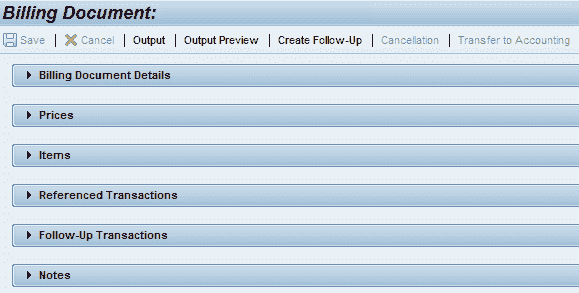 
CRM Web Ui 中的开票凭证分配块

如下面的屏幕快照所示，各个分配块的详细信息

*   开票凭证明细：显示与开票凭证有关的一般数据，例如付款人明细和相关日期
*   价格：此分配块显示不同的价格值以及与此开票凭证相关的数量
*   项目：这些是本计费文件中考虑的定价项目

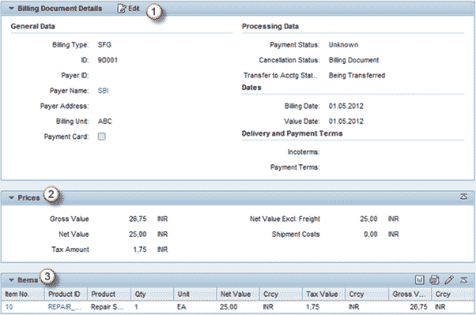 
开票凭证– I 的分配块数据

*   其他分配块（下面的屏幕截图）：
    *   交易：与此开票凭证相关的 CRM 交易
    *   后续交易：作为此开票凭证的后续交易而创建的交易
    *   注意：与开票凭证有关的不同类型的文本

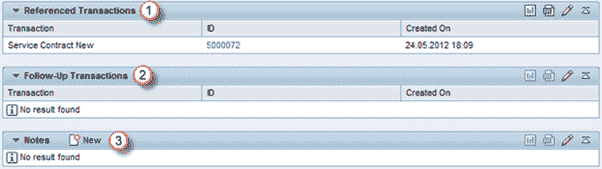 
开票凭证的分配块数据– II