# SAP CRM WebUI 教程

> 原文： [https://www.guru99.com/ultimade-guide-to-webclient-ui-sap-crm.html](https://www.guru99.com/ultimade-guide-to-webclient-ui-sap-crm.html)

## 总览

*   CRM WebClient UI 是用于 SAP CRM 中涵盖的模块的基于 Web 的应用程序。
*   随着 SAP 为 SAP CRM 提供的不同用户界面的继承，该框架已经发展了一段时间。

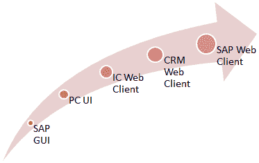 
Web UI 历史记录

*   它是一个基于业务角色的应用程序：
    *   这意味着，通过该界面，用户将只能访问他/她具有其权限的那些应用程序。
    *   如果为用户分配了单个角色，则无需在登录时选择该角色。
    *   但是，如果为用户分配了多个角色，则他/她将必须选择可用角色之一才能登录到 CRM Web UI

在 SAP CRM Web UI 的第一页中选择 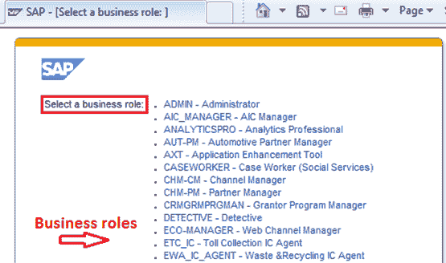 
业务角色

*   不论选择哪个角色，CRM Web UI 的屏幕都以 **L 型显示。**
*   但是用户可以在 CRM Web UI 中访问的应用程序和功能取决于所选择的角色。

## L 形

*   登录后，用户可以在 L-Shape 中看到 Web UI 屏幕。

SAP CRM Web UI 中的 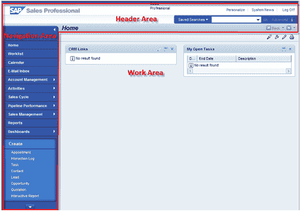 
L 形显示

*   它由以下组件组成：
    *   标头区域
    *   导航区
    *   工作区域
*   L 形的所有组件的位置都是固定的，无法更改。
*   管理员可以根据公司的特定要求更改 Web 客户端的外观和徽标。
*   提供标头区域以访问独立于应用程序的 URL 和功能。
*   使用导航栏，用户可以访问其具有授权的不同应用程序。
*   根据用户在导航栏上执行的操作来更新工作区。
    *   标题区域上的一些操作也将更新。

## 标头区域

*   标头区域是静态的，其位置是固定的。
*   可以在 CRM 定制中设置其高度，但是其位置是固定的。
*   标题区域包含以下组件

1.  系统连结
2.  保存的搜索
3.  工作区标题
4.  历史

SAP CRM Web UI 标头
中的 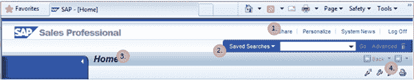 
组件

## 导航栏

*   使用导航栏，用户可以访问他/她获得授权的应用程序。
*   它还没有用于通用页面的链接，例如：
    *   家
    *   工作清单
    *   电子邮件收件箱
    *   日历
*   导航栏中可用的其他链接是特定于应用程序的，并且从一个业务角色到另一个业务角色都不同。 这些链接分为以下几部分：
    *   申请链接
    *   快速创建链接
    *   最近的项目

SAP CRM Web UI 中的 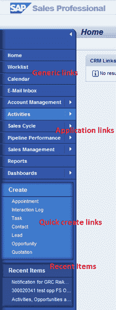 
导航栏

*   可以在两个级别上配置应用程序链接。
*   使用第一级应用程序链接，用户可以访问特定应用程序的搜索，创建和报告链接。

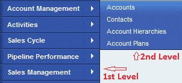 
通过导航栏
的导航级别

*   第二级应用程序链接直接将用户带到特定搜索页面。
*   快速创建链接用于直接访问特定业务流程文档的创建页面。

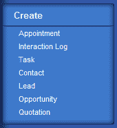 
在导航栏中快速创建块

*   导航栏中的最新项目代表一种历史，并维护用户最近访问的业务文档或应用程序。

## 工作区域

*   工作区是用户工作的地方！
*   它会随着用户在导航栏上执行的操作而更新。
*   可以包含
    *   日历，
    *   电子邮件收件箱，
    *   工作中心小组，
    *   搜索结果页面，
    *   概述页面，
    *   子概述页面
*   以下是一些可用的常规页面：

**主页**：

*   根据业务需求，可以将主页的内容配置为标准（我的未完成任务）或自定义功能（CRM 链接）。
*   从主页导航将取决于其内容。

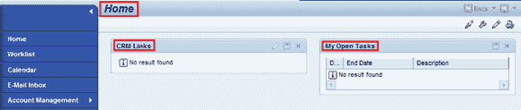 
主页

**工作列表页面**：

*   它显示警报，工作流任务和业务交易，这些事件当前正在等待登录用户或已分配给登录用户。
*   可以从工作清单页面导航到其他应用程序或业务交易。

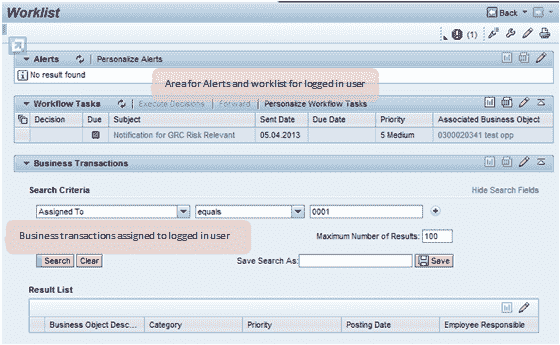 
工作清单页面

**电子邮件收件箱和日历**

*   可以将该页面配置为与用户邮箱同步
*   为此，使用 CRM 中间件设置，以便用户可以访问 Web UI 中的邮箱。
*   日历页面中可能有不同的视图–单日，周，月视图

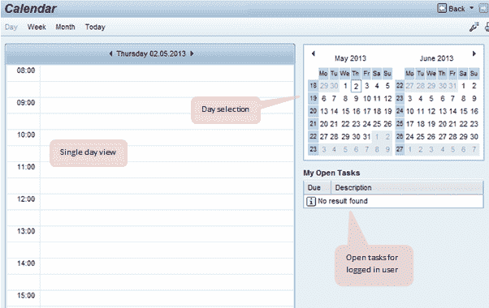 
日历视图

*   同样，用户可以看到与 Lotus Notes 服务器或 Outlook 同步的电子邮件收件箱。

## Work Area

*   在工作区中访问分配给已登录用户的应用程序
*   单击导航栏中的应用程序后，工作区将显示工作中心，其中包含由相关链接组成的工作区组，这些链接用于创建，搜索和报告。

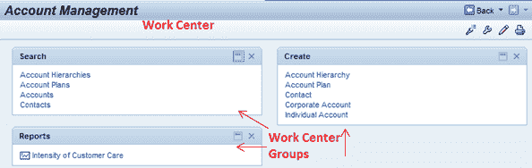 
工作区域及工作中心组

*   从工作中心，用户可以导航到“创建”页面，“搜索”页面或“报告”页面。
*   如上所述，在诸如主页，工作列表页面等通用页面的情况下，工作区具有不同的布局和内容。
*   但是对于导航栏中的应用程序，工作区域的结构和布局在整个应用程序中是相同的。
*   要实现“工作区”，需要 Web UI 编程和 CRM 定制方面的知识。

## 搜索页面

*   搜索页面分为搜索条件，结果表和保存的搜索区域。

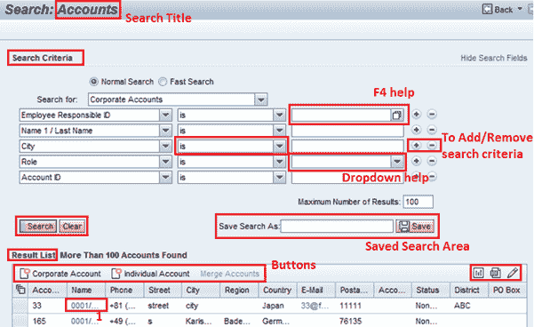 
高级搜索页

*   在搜索条件内，用户可以设置条件以查找元素。
*   使用搜索条件字段旁边的可用按钮可以添加或删除搜索条件。
*   可以使用 F4 帮助或下拉帮助来实现搜索条件字段。
*   可以为每个搜索条件配置多个运算符。
*   搜索结果显示从搜索获得的结果。
*   执行搜索后，结果表将显示找到的记录数（如果有）。
*   在结果表标题的顶部可以有一些按钮，以提供一些业务流程。 例如，上图中有用于创建不同类型帐户的按钮。
*   通常，用于创建新记录的按钮显示在搜索结果表标题上。
*   在右侧，搜索结果表还包含使用户能够将记录导出到 Excel 工作表的按钮以及用于个性化搜索结果表的按钮。
*   在搜索结果中找到的记录还可以在列中包含超链接。
*   使用这些超链接，可以导航到“概述”页面中显示的单个记录。

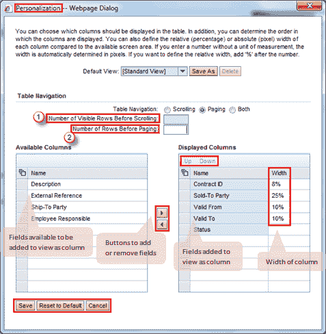 
个性化设置弹出视图

*   使用搜索结果表标题上的个性化按钮，用户可以针对显示的列和显示顺序对视图进行个性化。
*   如上所示：
    *   用户可以在其后看到滚动条的行数的值。
    *   用户也可以设置单页记录数的值。

## 概述页面

*   概述页面可用于处理与单个记录相关的完整数据。
*   它用于显示，更新和创建新数据，例如业务伙伴，销售订单等。
*   来自单个应用程序或业务交易的数据被组织到分配块中。
*   第一个分配块显示标题或主要详细信息，其他数据根据需要分组到不同的分配块中。
*   分配块中的可能视图：
    *   表格检视
    *   表格检视
    *   树视图
*   Overview 页面的标题显示了打开的对象的标题及其描述。
*   标题还包括标题按钮，用户可以使用它们在概述页面上执行不同的任务。
*   标题的另一个组件是“历史记录”按钮，用户可以使用它们在工作区域中前后导航。

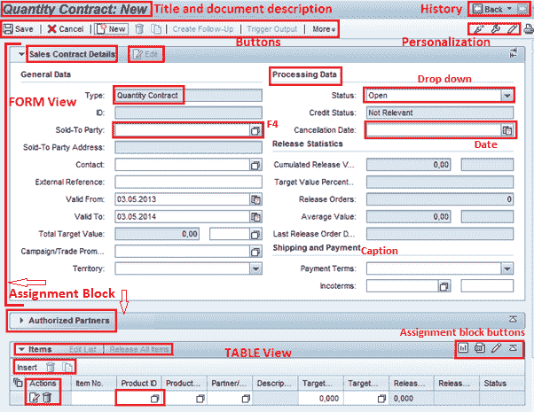 
概述页搜索页–表单和表格视图

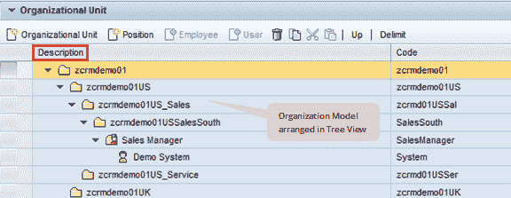 
树视图

*   与搜索结果表类似，概述页面包含一个个性化按钮，用户可以使用该按钮选择页面中用户可以看到的分配块。
*   默认情况下，可以以扩展或惰性模式加载分配块。 这有助于提高应用程序的性能。
*   分配块中的所有类型的视图，即表单视图，表格视图和树形视图，都可以包含具有 F4 输入帮助或下拉输入帮助的输入字段。

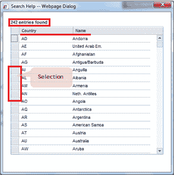 
值帮助使用 F4 弹出窗口

*   视图中的日期字段在日期帮助下显示。
*   在表单视图中，我们可以使用标题对数据进行分组。
*   各个分配块也可以在标题上包含按钮。

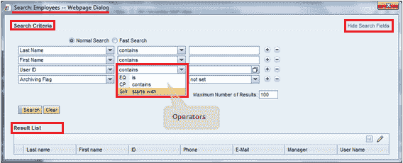 
搜索帮助弹出窗口

*   表格视图和树视图可以包含标题，标题也可以具有按钮。
*   同样，可以在表格视图的第一列中包含按钮。
*   在所有这些类型的视图中可能都有超链接。
*   使用这些超链接，可以从一个应用程序或业务交易导航到另一个。 例如，从销售订单转至售达方。
*   根据要求，可以在“概述”页面中具有附件分配块。

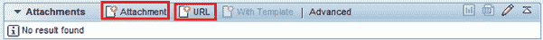 
附件的分配块

*   在此块中，可以附加文档或 URL。
*   可以从内容管理或本地硬盘附加文档：

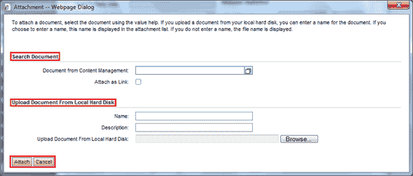 
弹出以添加附件

*   附加后，您可以查看文档属性，将其打开或删除。

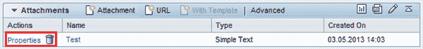 
附件的分配块

*   标头区域中还有一个错误消息区域：

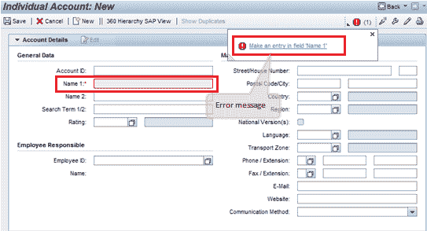 

## 个性化

*   有一个用于 CRM Web UI 个性化的选项。
*   在这里可以设置适用于登录用户的应用程序中的设置。
*   用户还可以在此处更改应用程序的外观。
*   用户可以在“个性化我的数据”部分中为日期格式等设置设置值。
*   在布局部分，用户可以设置应用程序的外观。

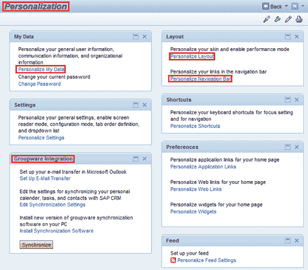 
个性化选项

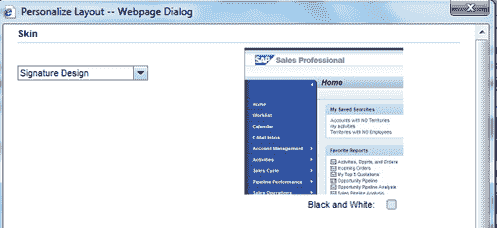 
设置个性化皮肤

*   有一个单独的块用于与群件集成相关的设置。
*   在此块中，用户可以维护将 CRM 与电子邮件和日历页面的用户邮箱集成所需的设置。