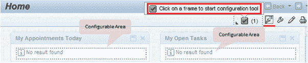
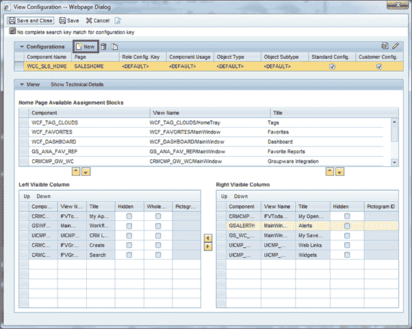
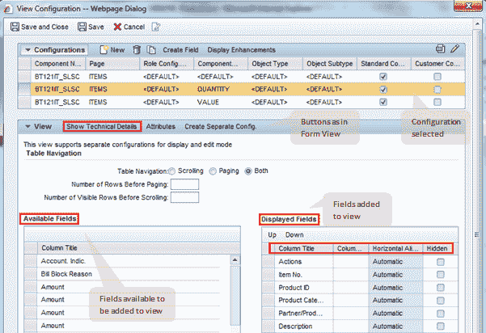
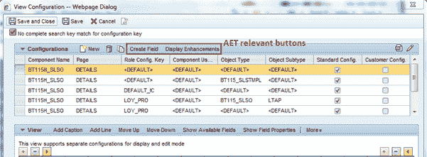
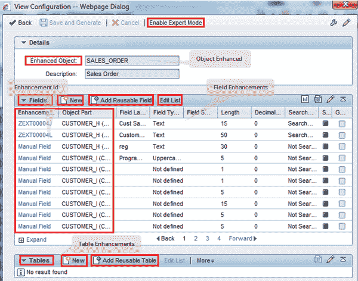
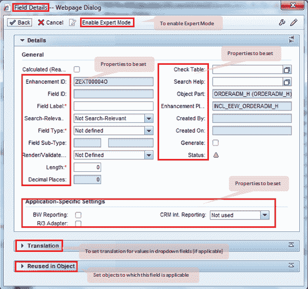
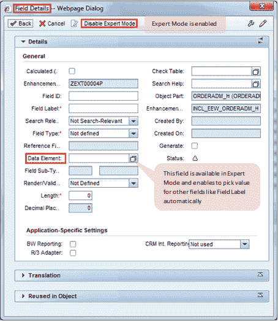
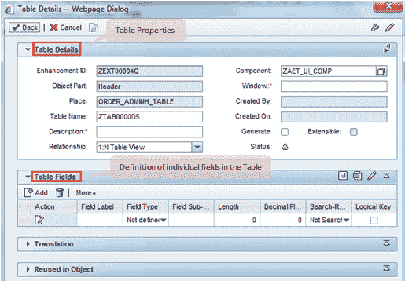

# SAP CRM Web UI：配置，应用程序&增强工具

> 原文： [https://www.guru99.com/all-about-web-ui-configuration-application-enhancement-tools.html](https://www.guru99.com/all-about-web-ui-configuration-application-enhancement-tools.html)

## 总览

*   SAP CRM 具有许多定义的标准角色（例如，用于 Sales Professional）以及这些角色中的应用程序（例如，用于帐户管理）
*   在一般情况下，公司不会按原样使用标准应用程序，而会进行次要或主要的增强
*   考虑到这一点，SAP CRM 已使用用于增强 SAP 标准应用程序的工具实施。 使用这些工具，可以在现有应用程序中更改视图，添加字段，添加表等。
*   这些工具主要包括：
    *   Web UI 配置工具
    *   应用程序增强工具（AET）

## Web UI 配置工具

*   在 SAP CRM 中为任何视图显示的布局将保留为 Web UI 配置
*   使用 4 个参数值识别这些配置
*   因此，您可以使用不同的参数值使用新的布局来增强 Web UI 配置
*   Web UI 中显示的字段来自数据字典中定义的数据库结构
    *   根据要求，并非所有字段都显示在所有屏幕中
    *   可以使用 Web UI 配置工具修改屏幕
    *   使用此工具，可以从屏幕上删除一些字段
    *   它还允许在屏幕上添加数据字典结构中可用的字段
*   在 CRM Web UI 的所有页面上，都有一个转到“ Web UI 工具”的按钮。
    *   要使此按钮可用，需要预先定义的角色
    *   因此，为了查看此按钮并在此工具中进行修改，用户必须具有足够的授权

Web UI 页面上的按钮让我们在下面进行研究

1.  可配置区域  ：突出显示屏幕中可配置的区域
2.  配置页面  ：这将打开弹出窗口以配置当前页面：

 

 
工作中心的配置视图页面

1.  个性化设置 
    1.  这样，用户可以设置自己的视图布局
    2.  这会影响单个用户，并且不适用于整个应用程序

1.  打印页面  ：从当前页面中取出打印

*   为了创建新的布局，可以使用“新建”按钮来创建空白表格
    *   您也可以使用复制现有配置，然后根据需要进行修改
*   Web UI 配置工具支持拖放功能，以将字段添加到布局中
*   它还提供设置字段不同属性的能力
*   在少数情况下，这些增强的实现还包括 Web UI 组件中的 ABAP 编程。

 
概述页面– I
中表单视图的配置视图

可用配置（上面的屏幕截图）

*   通过以下字段的唯一组合来标识配置：
    *   角色配置密钥
    *   组件用法
    *   对象类型
    *   对象子类型
*   根据不同的组合，可以为视图提供多种配置
*   在此分配块中选择一行将更新“当前配置设计”，以显示在所选配置下设计的布局

*   用于配置的按钮（请参见上面的屏幕截图）：这些按钮可以修改“可用配置”中所选配置的“当前配置设计”
    1.  添加标题：使用按钮可以在概述页面的“表单”视图上添加标题
    2.  添加行：此按钮在“当前配置设计”区域中添加一行
    3.  上移：此按钮用于将所选字段移动到其当前行的上方一行
    4.  下移：此按钮用于将所选字段下移到其当前行下一行
    5.  Show Available Fields ：（图 3）显示了所有可添加到布局中的字段，以便在应用程序上可见
    6.  显示字段属性：（图 3）它显示您可以查看和设置在布局上选择的字段的属性
    7.  在编辑模式下，可以修改其中一些属性

 
概述页面– II 中的表单视图的配置视图

*   此工具支持从视图布局添加或删除字段（在数据字典中可用）
*   使用此工具无法将字段添加到数据字典结构和表中，以使其反映在您的 CRM 中。
*   表格视图的配置屏幕具有不同的布局，用户需要在其中设置可用列和这些列的属性

 
表格视图的配置视图

## 安全问题

*   最终用户不应有权在配置工具中执行这些设置。 仅向超级用户或开发人员提供这些角色
*   所做的任何更改对访问该应用程序的所有用户都是可见的
*   除了在“ UI 配置”工具中实现的更改之外，最终用户还可以进行设置以个性化视图。 个性化设置适用于单个用户，而不在最终用户之间共享
*   根据要求，可以在定制设置中控制个性化设置
    *   这意味着存在自定义设置，开发人员可以使用这些自定义设置来限制用户对视图进行个性化设置
    *   应用此设置后，个性化按钮将对最终用户不可用

## 应用程序增强工具（AET）

*   应用程序增强工具是用于增强 SAP 标准应用程序的综合工具，这样，直到由工具本身实现数据库级别的修改，几乎就无需进行编码。
*   该工具还与 Web UI 配置工具集成在一起。

 
单击
按钮时突出显示的配置区域

*   与 UI 配置工具类似，首先需要从应用程序中选择可配置区域（以蓝色突出显示）

*   This will open UI Configuration tool in the same window as shown below

     
    用于 AET 的 UI 配置工具

我们需要为 AET 增强功能选择一个相关按钮（上面已突出显示）

*   显示增强功能：使您可以查看现有的增强功能。 可以选择增强功能并对其进行修改
*   “创建字段”按钮可用于在选择视图中创建新字段

以下是现有字段和表增强的显示：

 
显示增强视图

该视图在相应的分配块中具有用于视图&表增强的按钮：

*   新增：使用此按钮可以创建新字段以及创建表
*   使用第一列（增强 ID）中的超链接，可以编辑现有的增强功能

## 增强视野

*   为了在单击“新建”按钮（如上面的 scrrenshot 所示）后增强视图，您需要选择需要添加新字段或新表的业务对象部分：

 
选择业务对象部分

*   根据所选对象，将选择数据库表和结构。
*   创建字段时，需要设置字段的属性：

 
设置新字段
的属性

*   根据所选的属性，将生成该字段，并将为新字段增强不同的层
*   可以使用“启用导出模式”按钮，以便框架从字段定义中使用的数据元素中选择属性。
    *   在专家模式下，我们需要为数据元素字段设置值
    *   在数据元素定义中，可以设置标签（描述）之类的属性
    *   因此，将使用数据字典中的数据元素定义自动设置字段的不同属性。

 
设置新字段的属性–启用了专家模式

*   同样，我们可以使用 AET 创建表字段
*   对于表格，我们需要指定整个表格的详细信息，以及要为表格生成的各个字段

 
使用 AET 创建表视图

*   使用 AET 生成字段或表后，应用程序将重新启动，然后用户可以使用新的字段或表
*   这些字段和表还将更新所需的数据库表
*   这意味着当您为这些字段输入值并执行保存时，该值将被存储在数据库中