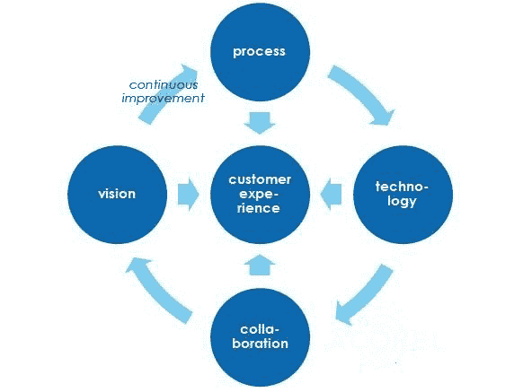

# SAP CRM 面试的前 25 个问题&答案

> 原文： [https://www.guru99.com/sap-crm-interview-questions.html](https://www.guru99.com/sap-crm-interview-questions.html)

[下载 PDF](https://www.guru99.com/pdf/sap-crm-interview-questions.pdf)

**1）什么是 SAP CRM？**

SAP CRM（客户关系管理）是 SAP 提供的用于支持端到端客户相关支持的软件工具。 它处理各种活动，如开票，交货，决策，应收账款等。

**2）提及 SAP CRM 中的主数据是什么？**

在 SAP CRM 中，主数据是有关客户的基本数据，可以在不同模块之间共享。

**3）解释什么是活动日志？**

您可以在“活动日志”中记录和更新来自客户访问或电话的信息。

**4）提及报价的标准交易类型是什么？**

报价的标准交易类型为 AG，物料类别为 AGN。

**5）说明什么是 SAP CRM 中的合作伙伴功能？**

顾名思义，合作伙伴功能描述了开展业务的组织和人员，其中包括任何类型的业务交易。 合作伙伴功能包括以下信息

*   卖给派对
*   运送到派对
*   参加派对
*   工资

**6）解释什么是 SAP CRM 中的文本确定？**

在 CRM 中，文本可用于在客户，合作伙伴之间或用户之间交换信息。 可以为客户主数据，销售凭证抬头和物料，开票凭证抬头和物料等创建文本。

**7）解释什么是 SAP CRM 中的操作？**

SAP CRM 中的“操作”是一种向对象添加功能的方法。 例如，要将报价单中的报价发送给客户，可以使用“操作”。 动作的另一种用法是，例如，在后续文档中创建。

**8）列出销售的标准交易类型？**

销售的一些标准交易类型是

*   铅
*   AG 报价
*   机会选择
*   OPSM-销售方法
*   TA-电话销售等

**9）解释创造机会的先决条件是什么？**

铅是创造机会的前提。 一旦成为热门线索，就可以通过工作流程发送，然后创造机会。

**10）解释 CRM 线索和机会之间的区别是什么？**

*   潜在客户：这是一个帐户或联系信息很少的联系人。
*   机会：这是一个具有资格的联系人或帐户。

**11）解释什么是 SAP CRM 中的逻辑链接？**

SAP CRM 中的导航栏具有两级菜单结构。 顶层菜单称为工作中心，这些工作中心包含指向实际 CRM 应用程序的逻辑链接。 在两级菜单系统下面，有一组逻辑链接，这些链接使 CRM 用户可以直接创建 CRM 业务对象。 这些链接称为直接链接。 逻辑链接允许导航到不同页面。

**12）提及 CRM 如何分配业务角色？**

为了分配业务角色，SAP CRM 使用两种基本方法

*   间接分配业务角色 PPOMA_CRM
*   直接通过 SU01 中分配给用户主机的安全角色

**13）用于保存 OD 配置文件的软件包是什么？**

要保存 OD 配置文件，我们使用$ tmp。

**14）说明当用户未输入特定字段时如何在 Web UI 中显示错误消息？**

要在 Web UI 中显示错误消息，您甚至必须在 EH_onSave 中调用消息类。 消息类在 SE91 中创建。

**15）解释什么是适配器？**

CRM 中间件用于 CRM 系统和连接的 ERP 系统之间的数据交换。 它还用于分配数据并将其转换为各种格式，并与外部系统连接。

**16）解释 CRM 中的 BDOC 是什么？ BDOC 的类型或类别是什么？**

BDOC 或商业文档包含 CRM 中间件用来与移动客户端传输或交换数据的所有数据或信息。

BDOC 类或类型是

*   消息 BDocs
*   同步 BDocs
*   移动应用 BDocs

**17）在 SAP CRM 中，操作配置文件是什么？**

动作配置文件是后处理框架（PPF），它在给定条件下提供一些输出。

**18）CRM 如何处理来自客户的电子邮件？**

SAP CRM 提供了启用工作流的电子邮件处理功能。 它可以检索从您的客户发送的电子邮件，根据工作流规则自动将电子邮件路由到适当的用户，管理电子邮件中的多个附件，向您的客户发送自动答复等。

**19）CRM 和 ERP 之间有什么区别？**

CRM 结合了销售，联系，市场，管理和客户支持。 ERP 代表企业资源计划； 它标准化和简化了服务，销售，财务，人力资源管理等方面的业务流程。

**20）解释什么是 IPC？**

IPC 代表“ Internet 定价和配置器”。 IPC 带有一组引擎，可以在各种场景和 SAP 应用程序中执行定价和产品配置功能。

**21）IPC 的重要组成部分是什么？**

IPC 的重要组成部分是

*   销售定价引擎（SPE）
*   销售配置引擎（SCE）
*   免费商品引擎
*   清单
*   免费商品引擎

**22）实时向 SAP CRM 顾问提供什么？**

SAP CRM 顾问可以实时分析业务需求，然后配置 ERP。

**23）是否可以在组织模型功能内进行更改或组织属性？**

通过交易代码 00ATTRICUST，您可以更改交易代码。 该区域是 SAP 的核心配置屏幕，从此处无法恢复任何已删除的项目。

**24）如何删除业务伙伴？**

要删除业务伙伴，您可以使用 BUPA_DEL 和 BUPA_PRE_DA。

**25）提及在表中的何处可以找到存储的业务合作伙伴的 Internet 电子邮件地址？**

您可以在表 ADR6 中找到存储的业务合作伙伴的电子邮件地址。

*   [下一个](/sap-training-hub.html)