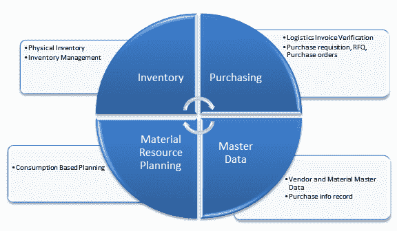

# SAP MM 模块概述

> 原文： [https://www.guru99.com/overview-of-sap-mm-module.html](https://www.guru99.com/overview-of-sap-mm-module.html)

SAP 中的物料管理模块由几个组件和子组件组成。 最突出和广泛使用的是主数据，采购和库存。

所有这些组件都有其子组件，这些子组件在特定业务流程中必不可少，并且所有流程都通过使用事务来执行。

交易（在 SAP 中）是指处理某些信息以完成业务流程要求。 例如，如果您购买了 10 个垃圾桶，则可以执行特定的交易代码（t-code），以反映 SAP 中的那些更改。 大多数业务流程涉及要完成的多个 SAP 事务，并且分布在一个，两个或多个模块中。

让我们简要地谈谈 SAP MM 中的各个子模块

## 主要的数据

SAP R / 3 中存储的数据分类为

1.  主数据和
2.  交易数据。

Master data is the core data that is used as a base for any transaction. If you are producing, transferring stock, selling, purchasing, doing a physical inventory, whatever your activity may be, it requires certain master data to be maintained.

主数据示例

*   物料主数据
*   客户主数据
*   供应商主数据
*   定价/条件主数据
*   仓库管理主数据（存储仓主数据）

在此处了解有关主数据[的更多信息](/introduction-to-master-data.html)

## 购买

采购是 SAP MM 模块的组成部分，其过程可大致如下图所示。

MRP（物料资源计划）创建采购建议，然后转换为采购申请。 下一步是为采购申请分配源，并下达采购申请。 PR 被转换为采购订单，在收货后，可以执行发票收据以完成购买过程。 此外，付款处理（在 FI 模块中）。

在上了解有关购买[的更多信息。](/introduction-to-purchasing-and-purhase-requisition.html)

## 库存管理

库存管理用于管理商品的库存。 它基于几个关键过程，例如

*   运动类型的定义
*   订座
*   货品问题
*   货物收据

库存管理流程中使用了许多功能和交易。

在此处了解有关库存管理[的更多信息](/overview-of-inventory-management.html)

## 定价程序

MM 模块中的定价过程是确定采购凭证中价格的一种方法。 它为我们提供了为不同需求分配不同计算类型的功能。 可以通过创建访问顺序并将其分配给条件类型来定义定价过程。 访问顺序告诉系统在哪里查找条件值。

在此处了解有关定价程序[的更多信息](/overview-of-pricing-procedure.html)