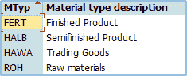
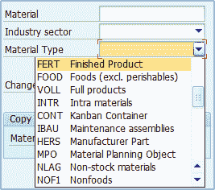
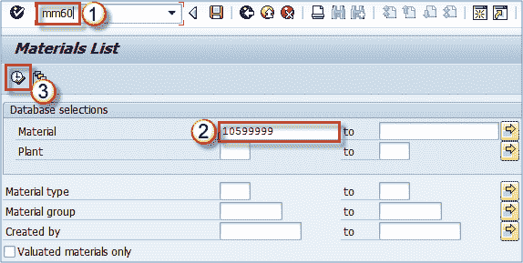
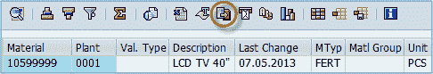
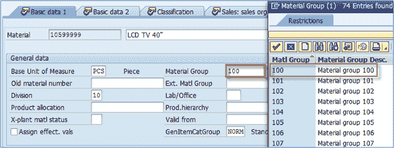
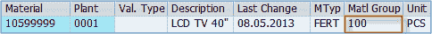

# SAP 主数据简介

> 原文： [https://www.guru99.com/introduction-to-master-data.html](https://www.guru99.com/introduction-to-master-data.html)

## 什么是主数据？

SAP R / 3 中存储的数据分类为

1.  主数据和
2.  交易数据。

主数据是用作任何交易基础的核心数据。 如果您正在生产，转移库存，销售，购买，进行实物库存，无论您从事何种活动，都需要维护某些主数据。

主数据示例

*   物料主数据
*   客户主数据
*   供应商主数据
*   定价/条件主数据
*   仓库管理主数据（存储仓主数据）

我们将在 MM 模块中重点关注的是物料主数据和采购信息记录。

### 材料大师：关于材料大师您应该了解什么？

SAP 中的物料是某些商品或服务的逻辑表示，是生产，销售，采购，库存管理等的对象。例如，它可以是汽车，汽车零件，汽油，运输服务或咨询服务。

InInIn 有关 SAP 中所有材料的潜在用途和特性的所有信息称为材料主数据。 这被认为是 SAP 中最重要的主数据（还有客户主数据，供应商主数据，条件/定价主数据等），并且物料的所有处理都受到物料主数据的影响。 这就是为什么拥有一个精确且维护良好的物料大师至关重要的原因。

为了对您的操作充满信心，您需要了解物料主数据视图及其对其他模块中的流程，业务交易的含义以及一些其他有用信息，例如用于存储物料主数据的表，用于批量物料维护的事务（用于更改某些特征） 一次处理大量材料）。

## 物料类型

在 SAP ERP 中，每种物料都有一个称为“ *物料类型”* 的特性，该特性在整个系统中用于各种目的。

### 为什么必须区分材料类型，并且该特性代表什么？

1.  它可以代表一种来源和用途，例如制成品（准备出售的制成品），半成品（用作制成品的一部分），贸易商品（用于转售），原材料（用于生产半成品） 和最终产品）等。这些是 SAP 中一些预定义的物料类型，例如食物，饮料，服务等。
2.  如果任何标准材料不能满足我们的需求，我们可以定义我们的自定义材料类型。

标准 SAP 安装中最常用的物料类型

### 可以在物料类型级别上配置什么（类型之间可能存在差异）？

1.  物料主视图：它定义与物料类型关联的视图。 例如，如果我们为材料产品 1000 分配了材料类型“ FERT” –我们不想为该材料提供基于采购的视图，因为我们不需要购买自己的产品–它是根据材料类型配置的 水平。
2.  默认价格控制：我们可以将此控制设置为标准价格或移动平均价格（稍后会详细介绍），但是可以在物料主数据中进行更改以覆盖默认设置。
3.  默认项目类别组：用于确定销售单据中的项目类别。 可以在物料主数据中更改它以覆盖默认设置。
4.  内部/外部采购订单，特殊物料类型指示器等。

MM01 事务中提供的物料类型

因此，将物料类型分配给具有与物料主视图，价格控制，物料类别组等基本设置相同的基本设置的物料。 可以在创建物料时以 t 代码 MM01 分配物料类型（稍后详细介绍）

### 在哪里可以找到具有各自材料类型的材料的完整列表？

为此有许多交易。 原始数据本身存储在 MARA 表中

（您可以使用事务代码的最新版本 SE16 或 SE16N 查看表内容），但是在某些系统中，标准用户不允许使用这些 t 代码。 在这种情况下，我们可以轻松获取带有 t 代码 MM60 的清单（物料清单）。 MM60 经常使用，因为它具有许多基本的材料特性。

选择屏幕–您只能输入物料编号：

MM60 交易的选择屏幕

我们可以看到工厂 AR01 中的物料 10410446 是 FERT 类型（成品）。

MM60 报告结果，突出显示了导出按钮

使用屏幕上突出显示的工具栏按钮，我们可以导出在屏幕上选择的材料列表。

## 物料组

SAP 物料在创建过程中分配的另一种特性是“ *物料组”，*，它可以根据某些标准表示物料组或子组。

### 哪些标准可用于创建物料组？

任何适合您报告目的的标准都适合您的系统。 您可以按生产原料的类型（生产过程中使用的不同种类的塑料）将物料分组，也可以将所有服务分为咨询服务（使用 SAP 咨询，IT 咨询，财务咨询等不同的物料） ，运输服务（内部运输，国际运输），您还可以按生产技术（通过焊接创建的材料，通过挤出创建的材料，通过注射创建的材料等）进行分组。 分组主要取决于管理层根据情况选择的方法，并且主要在实施过程中完成，很少在生产环境中进行更改。

物料主数据中分配的物料组

此外，还有一个物料层次结构（主要用于销售&分配）也可以用于分组，但是由于它用于定义销售条件（客户的标准折扣，附加折扣）时，几乎总是根据销售需求进行定义。 折扣，特价）。

另一方面，物料组主要用于 PP 和 MM 模块。

如果需要显示多种物料的物料组，则可以使用已经提到的 t 代码 MM60。 您只需要在选择标准中选择更多材料即可。

报表 MM60 中的物料组

物料组很容易通过事务 MM17 进行批量维护。 有关更多信息，请参见材料主数据编辑部分。