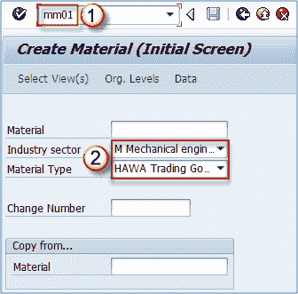
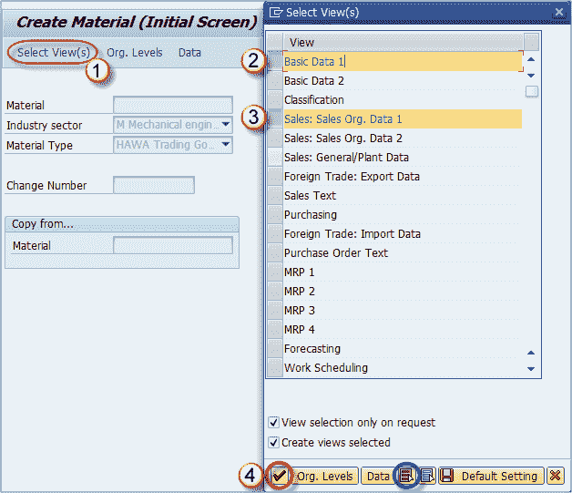
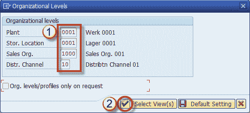

# 如何在 SAP 中创建物料主数据 MM01

> 原文： [https://www.guru99.com/how-to-create-material-master-data.html](https://www.guru99.com/how-to-create-material-master-data.html)

当我们想在 SAP 中使用新物料时，必须定义其特征，以便控制其在所有事务中的行为。 每种材料都是通过以下两种方式之一创建的：

1.  通过调用事务 MM01（通常在生产环境中使用）
2.  批量创建（在物料从以前的系统过渡到 SAP ERP 时仅使用一次）

我们现在将重点放在事务 **MM01** 和上，并将批量创建留给以后使用，因为它是高级工具。 您对材料主视图和组织级别有足够的了解后，我们将进行讨论。

**步骤 1）**如上所述，用于创建物料主记录的交易是 **MM01** 。 交易的执行将我们带到初始屏幕，该屏幕由几个字段组成，这些字段包含有关材料的基本信息。

1.  进入工业部门（最常用：M 机械工程）
2.  输入物料类型（可以是 FERT，ROH，HALB，HAWA-当前物料的适当物料类型）

**注意**：物料编号（SAP 系统中唯一标识物料的字母数字键）可以自动生成或手动分配-取决于物料类型。 例如，对于材料类型 HAWA，您可以进行手动编号分配，而对于 FERT，您可以进行自动编号分配。 这些设置应该由 MM 顾问在实施过程中进行自定义。

**步骤 2）**我们可以选择要创建的主数据。

1.  我们可以单击**选择视图**选择我们需要为材料创建的视图。
2.  选择基本数据 1
3.  选择销售组织数据 1.如果忘记选择所有需要的视图，则以后总是可以扩展物料主数据。
4.  选择复选标记。 您可以在下面的屏幕上看到一个蓝色的选项按钮，用于选择所有视图（在生产环境中很少使用）。

***注意**：可以为材料维护的视图的选择取决于材料类型。 在大多数系统中，某些物料类型的某些视图被禁用（例如，贸易商品可能禁用了 MRP 视图）。*

**步骤 3）**在下一个屏幕中

1.  输入我们在上一步中选择的视图的组织级别，例如工厂，存储位置，销售组织和分销渠道等。
2.  点击检查按钮

您可以在下面找到创建物料主视图所需的组织级别的完整参考。

| **物料主视图** | **组织级别** |
| 基本数据（1 & 2） | 没有 |
| 分类 | None |
| 销售组织数据（1 & 2） | 工厂，销售组织，分销渠道 |
| 一般销售 | 厂 |
| 外贸–出口数据 | Plant |
| 购买 | Plant |
| MRP 视图 | 工厂，存储位置，MRP 配置文件 |
| 预测 | 植物，预测概况 |
| 工作计划 | Plant |
| 常规工厂数据（存储 1 & 2） | 工厂，存放地点 |
| 仓库管理 1 | 工厂，仓库号 |
| 仓库管理 2 | 工厂，仓库编号，存储类型 |
| 质量管理 | Plant |
| 会计（1 & 2） | Plant |
| 成本核算（1 & 2） | Plant |

物料主视图表与组织级别的关系

***重要**：* 您需要在将要使用它们的所有组织级别中维护材料。 如果您有多个工厂，则您必须重复 MM01 事务以扩展两个工厂的物料。 如果您有多个销售组织/分销渠道组合，则还必须对所有组合重复 MM01 中的过程。