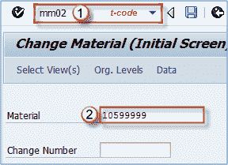
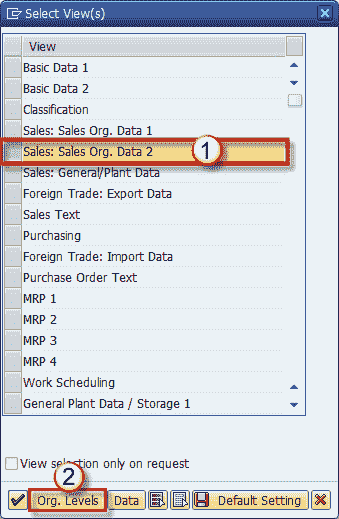
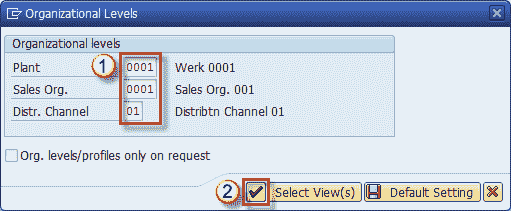
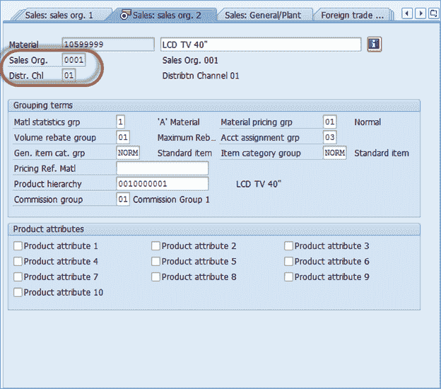
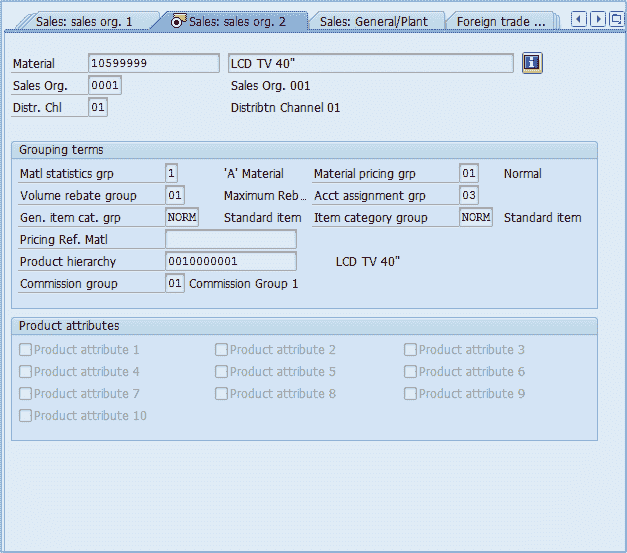

# 如何在 SAP 中更改物料主数据（MM02，MM03）

> 原文： [https://www.guru99.com/how-to-change-material-master.html](https://www.guru99.com/how-to-change-material-master.html)

可能需要更改我们的物料主数据中的某些选项（由于组织变更或过程变更）。 我们不能使用 MM01，因为那是仅用于创建某些材料不维护的视图的事务代码。 在这种情况下，我们需要使用 **MM02** 和 **MM03** 交易代码。

在 SAP 中，以 01 结尾的事务用于创建，以 02 结尾的事务用于编辑/更改，以 03 结尾的事务用于查看数据而无法更改。

## 更改物料主数据的过程

**步骤 1）**

1.  在命令提示符下输入事务代码 MM02
2.  Enter the material number whose material master data we want to change.

    

**步骤 2）**

1.  下一步是选择要更改其数据的视图。 例如，我们将选择销售组织数据 2 视图。 您可以选择一个或多个组织级别进行更改。
2.  Click on Organizational Levels

    

3.  Organizational level selection

**步骤 3）**

1.  进行所需的更改。
2.  Click the check button.

    

**步骤 4）**进行更改后，可以在相应的视图中检查更改

**步骤 5）**点击保存按钮，保存更改

**注意：**可以使用事务 MM03 显示物料主数据。 在 MM03 中，我们只能显示数据而无法更改它（字段显示为灰色）。

