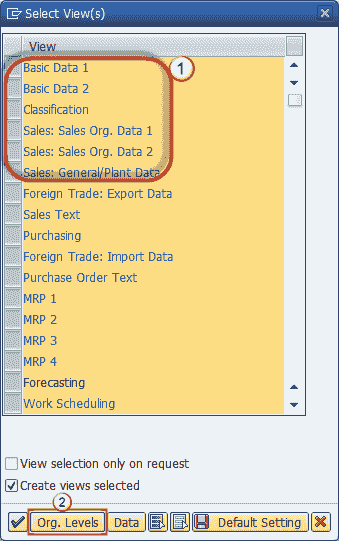
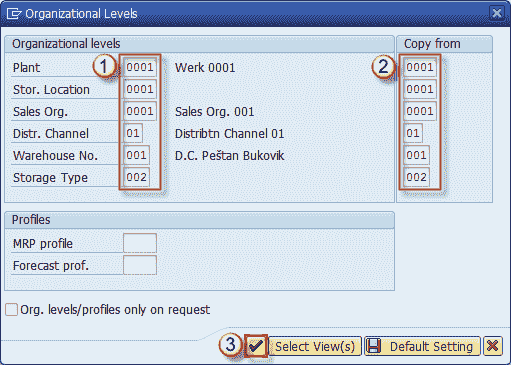
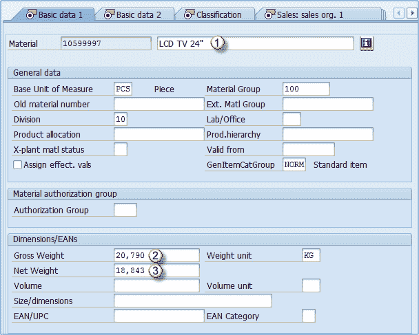

# 如何在 SAP 中复制物料主数据：MM01

> 原文： [https://www.guru99.com/how-to-copy-material-master.html](https://www.guru99.com/how-to-copy-material-master.html)

在本教程中，我们将完成将现有物料主数据复制到新物料中的过程

**步骤 1）**在事务 MM01 中

1.  输入您要创建的物料编号。
2.  输入我们要从中复制数据的现有材料。
3.  单击**选择视图**按钮。

**步骤 2）**

1.  选择您需要复制到新材料的视图
2.  点击组织级别

**步骤 3）**

1.  您可以选择将为我们的新材料创建的组织级别。
2.  并应从中复制参考材料主数据的组织级别。
3.  确认。

**步骤 4）**为您显示一个视图维护屏幕。 您可以选择任何视图并将数据更改为与参考材料不同的值，例如重量和描述。

1.  更改材料描述，因为这是我们的 24 英寸型号而不是 40 英寸型号。
2.  变化的毛重。
3.  改变净重。

您应该检查所有其他视图并更改材料特定的数据。您应该浏览其他数据（其他语言的描述，度量单位），因为这些数据对于我们的新材料应该有所不同。

**步骤 5）**单击保存按钮。 物料已创建

