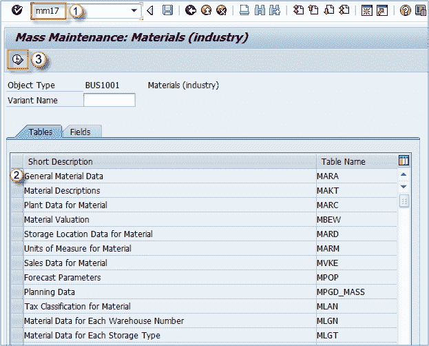
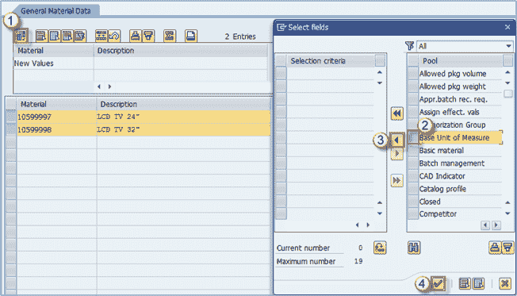
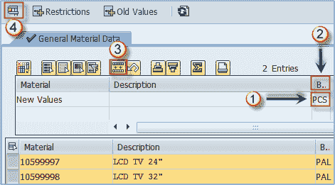

# MM17：SAP 中物料主数据的批量维护

> 原文： [https://www.guru99.com/mass-creation-of-material-master.html](https://www.guru99.com/mass-creation-of-material-master.html)

为了一次创建多种材料，您应该可以使用如下功能

1.  **eCatt 工具**
2.  **LSMW** （旧版系统迁移工作台）
3.  **BDC** （批处理数据通信）记录
4.  **BAPI** （业务应用程序编程接口）

在某些情况下，您还可以使用批量维护事务 **MM17** 创建视图。 但您必须记住，并非所有组织级别都应包含相同的数据（MM17 要求您选择的物料和组织级别的所有数据都应相同）。

批量创建从未被视为最终用户的责任。但是，作为模块专家，您可能需要研究 **MM17** 。 对于 LSMW，BDC 或 BAPI，它被认为是开发人员或顾问的工作。 因此，您不必详细了解，您只需要了解概念，即可进行海量数据维护。

您可以使用 MM17 进行物料主数据的批量更改（如果此事务无法完成某些操作，则可以使用 LSMW，BDC 或 BAPI 来完成）。

**步骤 1）**

1.  输入事务 MM17
2.  选择您需要更改的数据类型，例如，我们需要更改常规数据中的字段。
3.  执行。

**步骤 2）**

1.  输入我们要更改其数据的物料范围或清单
2.  执行

**步骤 3）**

1.  单击下面显示的按钮时–您将获得**选择字段**屏幕。
2.  检查适当的字段（我们正在更改两种材料的基本计量单位）。
3.  单击指向左侧的箭头，将所选字段添加到要更改的字段列表中。
4.  单击确定按钮。

**步骤 4）**现在显示下一个屏幕，我们可以在其中输入要传输的值。 假设我们将 PAL（货盘）作为 24 英寸和 32 英寸电视机的基本度量单位，我们需要将其更改为 PCS（件）。

1.  在框中输入要复制的值。
2.  单击列标题。
3.  选择按钮，用“ PCS”覆盖旧值。
4.  执行。

现在，您的设置已保存，物料主数据已更改。