# SAP 中的物料主视图：最终指南

> 原文： [https://www.guru99.com/material-master-views-ultimate-guide-2.html](https://www.guru99.com/material-master-views-ultimate-guide-2.html)

在本教程中，我们将涵盖所有 MM 视图，并包含对标准 SAP 系统中关键流程的暗示。 您将看到如何创建每个视图，其强制性数据，可选字段以及其创建如何反映系统。 本教程为 7000 字以上。 为便于参考，我们在下面创建了一个可点击的索引，它将带您进入教程的各个部分

*   [基本视图](#C2)
*   [分类视图](#C3)
*   [销售组织数据 1](#C4)
*   [销售组织数据 2](#C5)
*   [销售常规/工厂视图](#C6)
*   [外贸/出口视图](#C7)
*   [MRP 视图 1](#C8)
*   [MRP 视图 3](#C9)
*   [MRP 4 视图](#C10)
*   [工厂数据–存储 1 视图](#C11)
*   [仓库管理 1 视图](#C12)
*   [仓库管理 2 视图](#C13)
*   [质量管理视图](#C14)
*   [会计 2 视图](#C15)
*   [成本核算 1 视图](#C16)
*   [成本核算 2 视图](#C17)
*   [采购视图](#C18)
*   [外贸进口视图](#C19)
*   [采购订单文本查看](#C20)
*   [附加数据](#C21)

## 基本观点

基本视图是包含有关我们材料的一般信息的视图。 您需要插入以保存更改的必填字段是

1.  **材质描述：** 40 英寸液晶电视–可以用多种语言进行维护。
2.  **基本计量单位**（通常称为**基本 UOM** ）：PCS –这是管理物料库存的计量单位。 对于电视机来说，很自然地成为一件。 您还可以使用米，千克或已定义且适合物料的任何其他单位。
3.  **部门**：10 –物料部门，您可以为成品，贸易货物，服务和其他物料创建部门 10、20、30、40，因此您可以通过这种方式对其进行分类。 由于材料是成品，因此我们为材料选择了 10 类。
4.  **常规项目类别组：** NORM –标准项目。 该指标在整个系统中使用，因为它在项目类别确定中会影响销售和库存转移处理。
5.  **重量单位**：千克-输入产品重量的单位。
6.  **Gross weight**: 26,988 – gross weight of 1 unit of product in weight unit**. Net weight**: 24,651 – net weight of 1 unit of product in weight unit

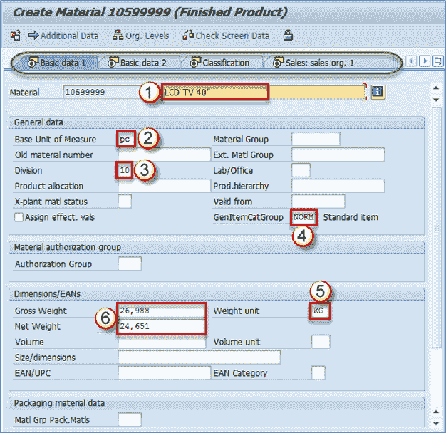

基本数据-可选字段

**物料组** –您可以在此处输入物料组**产品层次结构** –此字段用于销售和分销，并在“销售组织 1”视图中维护。 **EAN / UPC** –物料 EAN 代码，除了在条形码中使用外，还特别在仓库管理中用作物料和包装组合的唯一标识符。 一种材料可以具有多个条形码。 一种为基本计量单位。 每个替代的度量单位也可以使用 EAN，但这不是必需条件，而是一种选择。 其他字段是可选的。 **注意：**在上部（以绿色标记），您可以看到可以为当前材料保留的视图。 您可以通过单击适当的视图名称进行导航。

## 分类视图

可以对材料进行分类，以便以后按其类别，批次特性等进行查找。假设我们有许多电视机具有不同的尺寸颜色等。您可以创建两个类别：尺寸和颜色。 稍后，您可以使用它查找所有黑色电视机或某个尺寸的电视机。

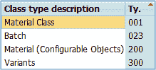

标准 SAP 中可用的类类型

通过选择“材料类别– 001”，您可以扩展该类别类型的材料。 现在，我们必须添加一个我们要用于材质的类。 称为**通用**的类可能包含两个**特性**：*颜色*和*尺寸*，或者在对材料进行分类或搜索时可能需要的任何内容 在 MM 模块或其他模块中。 在为材料分配了类之后，您可以维护该类包含的特征。 在我们的案例中，我们有一个名为 ***General*** 的类，其中包含特征 ***颜色*** 和 ***尺寸* [** 。 我们可以填充适当的字段。

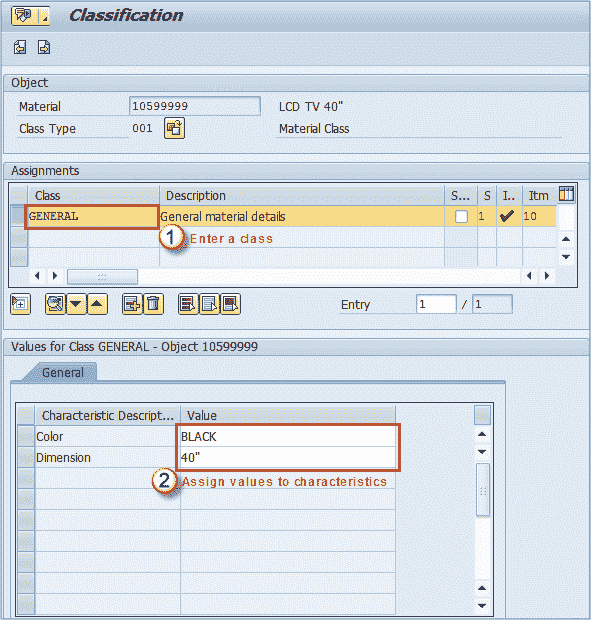

分配类别并保持特征值

最好在材料说明中包含产品的颜色； 对其他用户来说非常有用。 例如，在 SD 中创建销售订单时，用于仓库管理，采购部门，生产计划等中的拣配和上架流程。您现在可以保存更改。

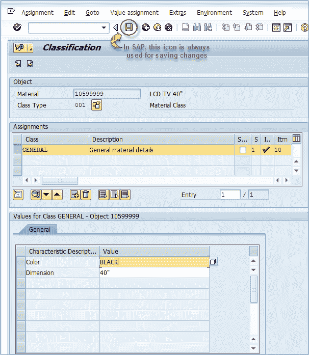

保存分类视图

## 销售组织数据 1

选择此视图时，将显示一个带有组织级别的屏幕。 在这里，您可以选择要扩展物料的工厂，销售组织和分销渠道。

[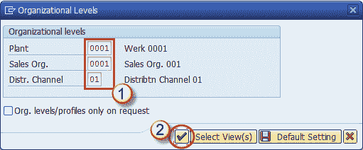](/images/sap/2013/05/051513_0942_5.png)

确认组织级别后，将显示一个屏幕，其中包含有关销售活动的数据。 唯一的必填字段是交货单位。 其他是可选的，但可能需要它们才能使用某些高级功能。 例如，如果要使用动态舍入配置文件（必须由 SD 顾问自定义），则必须维护字段*舍入配置文件*。 让我们找出销售视图中最重要的字段。 销售视图最关键的是它们是开放的。 当我们这样做时，来自 SD 模块的人员可以通过该销售组织/渠道出售我们的材料。 因此，从本质上讲，您仅需填充交货单位字段并保存数据，即可立即使用物料。 为了更好地了解销售组织，可以将其视为销售产品的办公室。 在此办公室中，您有一些在您自己的国家/地区销售产品的人员-他们使用分销渠道 01，您可以有一些在国外销售的人员（出口部门是 02 渠道）。在以下屏幕上，您可以看到所有字段 来自销售组织 1 视图。

[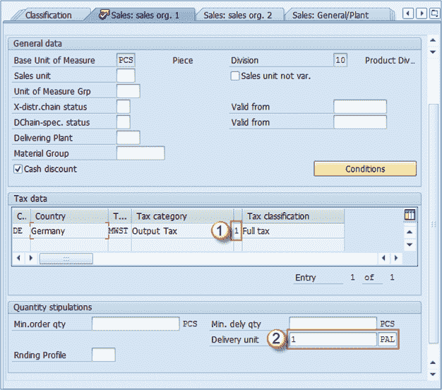](/images/sap/2013/05/051513_0942_6.png)

**税种/指标**：对于内部销售，由于该税适用于国内销售，因此我们必须定义完整的税项指标。 对于出口（例如，使用 02 分部），我们将其设置为 0 –不收税。 这实际上取决于您所在国家的税收政策，但是我提到的大多数国家都有这种做法。 **交付单位**：在大多数情况下，它是第一个替代计量单位（盒子，货盘或其他）。 您可以看到，在这里我们将定义 1 个 PAL –托盘作为交付单位，但这并不意味着我们只能出售整个托盘。 我们还将能够出售一件这种材料，并且系统将向销售人员指示该材料打算以 12 件的形式在货盘上交付。 **基本计量单位**：该字段为灰色字段，因为它已在“基本数据”视图 1 中定义，并且之后无法更改。 **部门**：这是我们刚在当前级别之前在组织级别屏幕中选择的部门。 **销售单位**：如果该字段不包含输入，则系统将假定计量单位是基本计量单位。 如果您不想将零件用作默认的销售计量单位，则可以在此字段中输入适当的计量单位。 它将以这种方式反映销售单据：-未定义销售单位。 销售人员在不指定计量单位的情况下输入数量 4。 系统将假定所需数量为 4 件-销售单位定义为托盘。 系统将假定所需数量为 4 个货盘**销售单位不变**：如果我们要求在销售单位中仅出售**物料**，则使用此复选框。 如果将销售单位设置为 PAL，并选中此框，则销售人员将只能使用 PAL 替代计量单位来销售此物料。 这很少使用。 **度量单位组**：主要与动态舍入轮廓结合使用，这是一个指标，代表可用于该材料的一组度量单位。 **物料组**：我们在“基本数据”视图中讨论的物料组。 **最小订购数量：**这是该物料可接受的最小订购数量。 **最低要求。 数量：**这是该物料可接受的最小交货数量。 **取整轮廓**：在这里，您可以为物料选择特定的取整轮廓。 SD 顾问必须创建概要文件，以显示为该字段中的可能条目。

## 销售组织数据 2

在相同的组织级别下，我们可以创建销售组织数据 2 查看并维护其数据。 大多数情况下，统计数据和分组数据都是该视图的主题。

[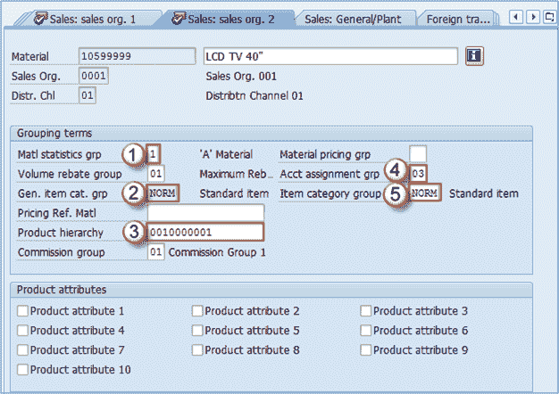](/images/sap/2013/05/051513_0942_7.png)

**重要销售组织数据 2 视图字段**

*   **物料统计组**：这是一个指标，用于指定是否将该物料包括在 SD 模块 **MCSI** 的统计事务中。 在大多数系统中，最常用于将此指标设置为 1。
*   **常规项目类别组**：根据物料类型设置，此物料的默认项目类别组。 您无法更改。
*   **产品层次结构**：此层次结构用于报告目的，以便销售管理可以基于此层次结构分析销售数据。 它包含两个级别。 例如，第一级等级可以是 LCD 电视。 在第一层中，我们可以找到一个以上的第二层，在本例中，我们在第一层中可以有 40 英寸液晶电视，32 英寸液晶电视，26 英寸液晶电视，也就是液晶电视。 等离子电视。在这第一个级别中，我们可以维护等离子电视 22“，等离子 TC 32”，等离子电视 40“。 每个第一级层次结构都包含唯一的第二级层次结构。
*   **帐户分配组**：此字段表示物料的[会计](/accounting.html)要求。 通常，不同类型的物料需要不同的会计要求（制成品，贸易货物，服务的会计方式不同）。 这是与 FI / CO 模块集成的一点。
*   **项目类别组**：它是从 2-常规项目 cat.grp 字段复制的，但这是分配给特定分销渠道的类别组。 可以更改该字段，而不是第二个字段。在此字段中，您可以管理如何将相同的物料用于不同渠道的销售中。 例如，您可能希望物料在国外销售活动中具有与默认物料不同的物料类别。 主要根据 SD 团队的指令对其进行更改。 **产品层次结构–从预定义的列表中选择适当的层次结构：**您可能已经考虑过如何难以维护产品层次结构。 您只会看到一堆数字。 很难知道哪些数字适合特定材料。 除了这是销售&分销团队应提供给您的信息外，还有一种浏览所有层次结构的简便方法。 当您按下显示您可能输入某个字段的按钮时，您将进入以下屏幕：

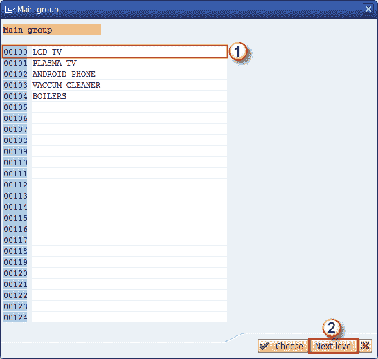

第一层级

选择适当的第一级后，您应单击上一级按钮，就像上面的屏幕一样。 您将进入屏幕，其中包含第二级层次结构的可能条目。 正如您在屏幕标题中所看到的，表明第二级层次结构是针对第一级 00100 – LCD TV：

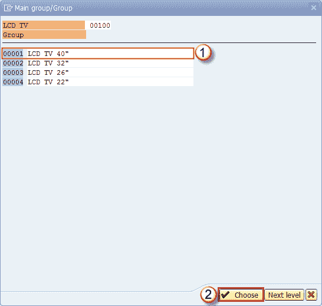

第二层级

最终结果如下图所示：

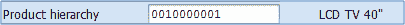

销售组织数据 2 视图上的产品层次结构

**销售组织数据 2 中的其他字段** **批量返利组：用于返利结算的**组，可以设置为最大返利，低返利，取决于 SD 模块中的设置，此信息为 应该由 SD 团队提供。 **定价参考物料**：物料主记录，应将其用作定价目的的参考。 **佣金组**：您可以将相同的佣金组分配给更多物料，只要两者的佣金相同即可（例如 5％）。 **物料定价组**：用于按相同的定价程序对物料进行分组。 除了标准记录（产品层次结构）外，稍后可以根据此字段创建 SD 条件记录。 您可以将物料定价组与客户编号组合以创建条件。 **产品属性**：您可以为物料分配各种产品属性，并检查客户是否接受此产品属性。

## 销售总监/工厂视图

该视图包含有关物料的一般销售特征的信息。 它保持在工厂级别。

[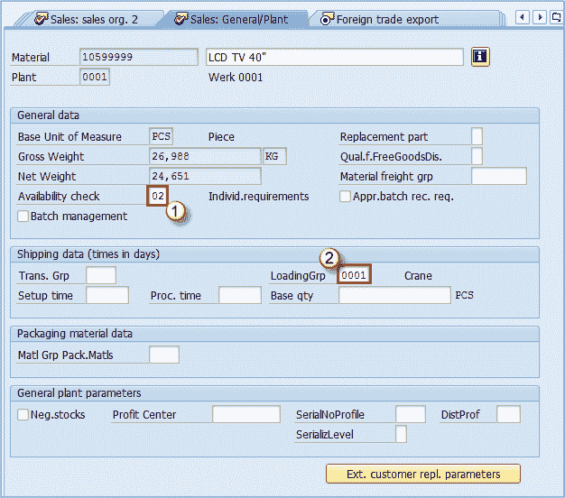](/images/sap/2013/05/051513_0942_11.png)

## 必须填写

*   **可用性检查**：非常重要的属性，用于定义库存可用性检查方法。 这些方法由定制团队定义，可以包括存储位置上的库存，还可以设置为包括流程和生产订单上的数量，计划订单，向正在处理销售的工厂的转移中的数量等。
*   **装载组**：非常重要的字段，因为它用于装运点确定。 **销售-常规/工厂视图中的可选字段** **替换零件**：定义此物料是否为替换零件。 **物料货运组**：用于对物料进行分组，以便根据货运代码和类别进行分类。 **批次管理**：指示是否按批次管理物料。 **必需的批处理记录**：确定是否必须先提交批处理批准，然后才能从限制库存转为非限制库存。 **运输组**：一种将具有相同运输需求的物料分组的方法。 它在 SD 模块中用于销售订单和交货中的路线计划。 例如：当您需要易碎的物料需要小心运输时，其他物料则不需要。 **设置时间，处理时间，基本数量**：这三个字段用于计算运输物料所花费的时间，第一个是要设置运输设备的时间，第二个是每个基本数量的处理时间 （第三）。 **物料组-包装物料**：此字段用于将具有相似包装物料要求的物料分组。 **负库存**：如果选中此框，则将允许该工厂中该物料的负库存。 这还需要您的 MM 顾问在存储位置级别上进行设置（自定义）。 **利润中心**：为物料分配适当的利润中心，以控制模块。 这意味着从该物料获得的利润将分配到该字段中设置的利润中心。 例如，如果这是一种可以通过销售获利的成品，则可能要选择销售收入的利润中心。 这也取决于管理决策。 管理层可能更喜欢将其他密钥用于利润中心会计。 **序列号配置文件**和**序列化级别**：这些控制产品的序列化（如果您处于活动状态），用于序列号的配置文件以及可以通过物料编号等的序列化级别等 。**分发配置文件**：表示传入（采购）商品将在我们工厂中分发的位置。

## 外贸/出口视图

此视图包含有关运费，外贸和物料出口的信息。

[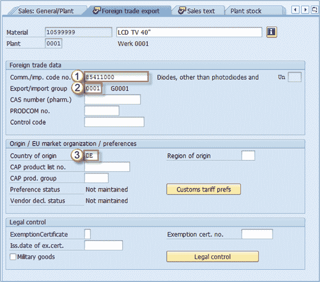](/images/sap/2013/05/051513_0942_12.png)

此视图中的必填字段为：

1.  **外贸的商品代码/进口代码编号**：此字段包含商品代码或关税编号。 它是特定类型商品的唯一标准化编码值。
2.  **导出导入组**：系统可以使用导出/导入组为 SAP 中的导出/导入过程建议导出过程。
3.  **原产国**：代表该材料的生产国。 如果是内部生产的成品，则在此处输入您的国家代码（在我们的示例中为 DE-德国）。 **其他字段**所有销售视图的特征都应该由销售部门提供（销售，货运），物料主专家/用户的作用只是准确地维护它们。 您的销售部门可以提供一些其他信息，以保留在物料主数据中： **CAS 号**：此字段仅用于药品。 **PRODCOM 否**。 –仅在欧盟国家中出于生产目的用于统计目的。 **控制代码**：外贸中的消费税控制代码。 **原产地**：除了国家/地区之外，您还可以在该国家/地区中定义一个区域（例如巴伐利亚，黑森等）。 **CAP 产品列表编号**。 –这是欧盟市场产品组列表中的物料编号–如果适用。 **CAP 产品组**：表示 CAP 产品列表中的产品组。 **豁免证书**：表明该材料是否已签发证书，说明该材料不需要出口许可证。 **豁免证书。 编号**：豁免证书的编号。 **exempt.cert 的颁发日期。** –豁免证书的签发日期。 **军用物品**：一个复选框，指示材料是否主要用于军事目的。

## 销售文字检视

您可以为此物料定义销售项目文本，以用于销售文档中使用的各种语言。 这可能是对材料的一些一般性解释，也可能是在分销渠道层面上保持的解释。 如果您保留此文本，它将显示在所有销售单据的项目级别以及销售单据的打印版本中。

[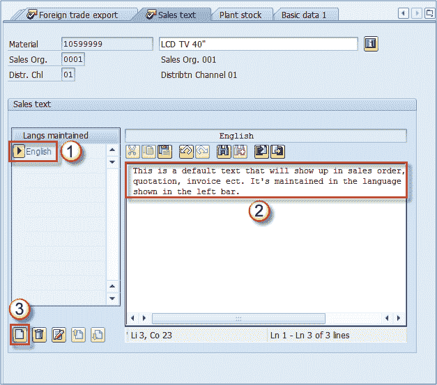](/images/sap/2013/05/051513_0942_13.png)

## MRP 视图 1

维护 MRP 视图主要是出于生产目的。 此信息由适当的 MRP 控制人员或生产计划团队的其他人员提供。 MRP 1 视图中唯一的必填字段是计划类型。 我们将更详细地介绍生产环境中使用的最重要的领域。

[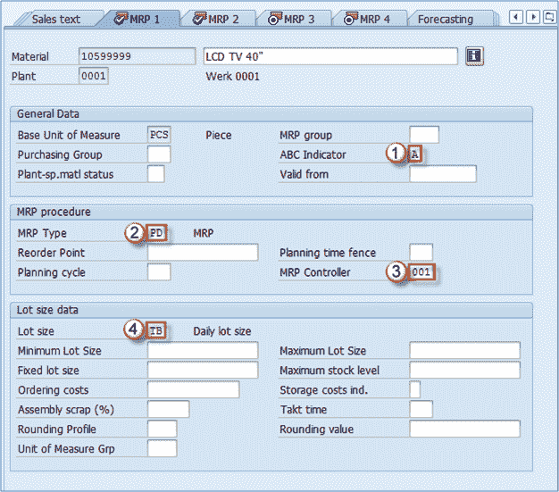](/images/sap/2013/05/051513_0942_14.png)

**采购组**：此字段用于指示哪个采购组是采购此物料的默认采购组。 由于它是我们公司的成品，因此我们尚未对其进行维护，因此我们不需要随时购买它。 我们将为需要购买的其他物料设置此字段。

*   **ABC 指标**：这是一个指标，显示库存中材料的重要性。 大多数公司使用多个 ABC 值，但最常见的是： **A** –最重要的材料，每当客户要求时，它们都可用于销售； **B** –更少 通常应该提供的重要材料，但是这种材料的缺乏会发生并被允许。 **C** –最不重要的材料。 也可能还有其他几类， **N** –尚未在市场上测试过的新材料，因此我们实际上不知道它会是 A，B 还是 C。 **S** –仅根据客户要求生产的材料， **D** –与 S 相同，不同之处在于，如果有人在生产中尽快需要，则库存中有一定数量的库存 计划将其称为物料安全库存。
*   **MRP 类型**：可以使用各种类型的 MRP。 在这种情况下，我们的 MRP 控制器发出信号表明它应该是 PD –大多数 SAP 安装的默认 MRP。
*   **MRP 控制器**：负责生产此物料的 MRP 控制器，他管理这些 MRP 视图中的所有数据，以及 MRP 结果本身，该物料的生产计划等。通常，MRP 控制器提供 MRP 视图的数据，甚至在某些组织结构中，MRP 控制器都自行维护这些视图。
*   **批量**：定义系统用于计算物料的采购或生产数量的过程。 **此视图中的其他字段** MRP 组：此设置用于对具有相同 MRP 控制参数（例如，策略组，消耗模式等）的物料进行分组。如果不保留此字段，则 系统在执行 MRP 时将使用基本数据 1 中的物料组。 **特定于工厂的物料状态：**如果设置，则表示物料在特殊功能中的可用性，例如，物料可以用于[测试](/software-testing.html)或将要停产，因此 MRP 在运行时不考虑它。 此设置可能会限制特定功能中材料的使用。 **再订货点**：指示 MRP 应该在哪个库存级别创建新订单（采购或生产订单）。 **计划周期：**计划周期，它是在自定义中定义并分配给物料的，它可以表示执行计划的日期。 **最小和最大手数，固定手数**：用于指示手数大小的边界，或要使用的固定数量。 **订购成本**：以公司代码货币表示的每笔订单的固定成本，用于计算最佳手数。 **舍入概要文件和计量单位组：**与销售视图中的字段一样，这些字段都是您可以使用四舍五入类型填充到采购或生产的相同字段（如果适用）。 **舍入值**：在采购中用于将采购数量舍入为此处输入数字的倍数的值。

## MRP 视图 2

MRP 视图 2 包含有关采购，计划和净需求计算的数据。

[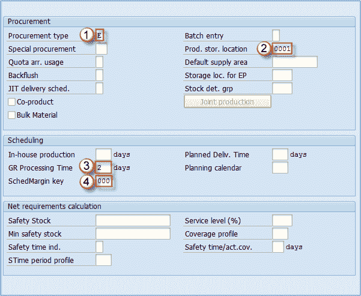](/images/sap/2013/05/051513_0942_15.png)

*   **采购类型**：在这里，您可以选择物料是内部生产（我们的情况），外部采购还是两种采购类型都可以。 它也可能根本没有采购。
*   **生产存储位置**：此处将保留在整个生产文档中复制的存储位置。 如果这是生产组件，则标记发货的发布地点，或者如果它是生产物料，则会注释物料收货的发布地点。
*   **以天为单位的收货处理时间**：您可以设置此值，以天为单位，以天为单位检查货物并将其放置在适当的存储位置。
*   **计划保证金键**：表示用于确定计划订单所需的流通量的键。 它是在自定义中定义的，由您的 MRP 控制人员或 PP 管理员提供。 **此视图中的其他字段** **特殊采购**：用于覆盖采购类型。 **批次条目**：指示何时应执行批次确定。 **默认供应区域**：如果定义此区域，将是物料的建议供应区域，主要用于看板类型的物料。 **反冲：**确定是否在生产订单中设置反冲指示器。 **外部采购的存储地点**：在采购申请中建议的存储地点。 **库存确定组**：此指标与库存确定规则一起创建库存确定策略的密钥**联产品：**如果选中，表示该物料也可以用作物料 -产品。 **散装物料**：这将物料清单物料标识为散装物料。 这很重要，因为散装材料的要求与 MRP 无关。 **安全库存**：基本 UOM 中用作安全库存的数量。 **最小安全库存**：切勿将安全库存降至该值以下。

## MRP 视图 3

MRP 视图 3 包含几个有价值的字段，这些字段通常由计划功能使用。

[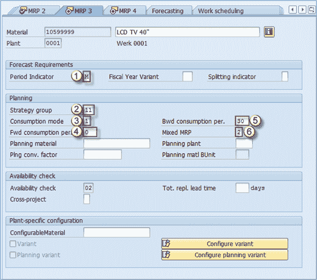](/images/sap/2013/05/051513_0942_16.png)

*   **期间指示器**：指示是否每月，每周，每年，每天等计划/预测物料。在大多数情况下，将其设置为每月。
*   **策略组**：用于对计划策略进行分组，例如，可以将其设置为“按订单生产”，“按库存生产”等。有许多选项，并且必须由生产计划管理定义 。 在大多数情况下，物料类型和/或物料 ABC 分类会影响应分配哪种策略组物料的决策。
*   **消耗模式**：这控制系统消耗需求的方式。 在向后模式销售中，订单，从属需求或物料预订消耗计划内的独立需求，该需求位于需求日期之前，而在向前模式下，它们所消费的计划独立需求位于**需求日期之后。**
*   **前向消耗时间**：在前向消耗模式下用作消耗阈值的天数。 可以设置为 1 至 999 天，但通常不超过几天。 我们正在使用 0，因为我们正在使用这种材料的反向消耗模式。
*   **后向消耗时段**：与前一个相同，但用于后向消耗模式。
*   **混合 MRP** ：定义物料是否可用于子装配计划和总需求计划。

**MRP 3 中的其他字段** **计划物料**：仅与计划策略“使用计划物料进行计划”一起使用。

## MRP 4 视图

这是在工厂/存储地点组织级别维护的唯一 MRP 视图。 它没有包含以前那么多有价值的字段，但是可以使用三个方便的指示器来优化某些模块中的流程。

[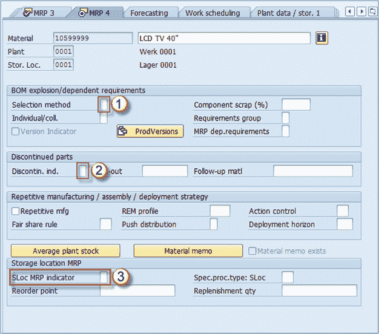](/images/sap/2013/05/051513_0942_17.png)

*   **选择方法**：如果您的生产使用 BOM 表（物料清单），则可以在此字段中选择替代 BOM 表。 您可以按订单数量，生产版本，爆炸日期设置选择类型。
*   **停产的指示器**：您可以根据需要选择停产零件的指示器。
*   **SLoc MRP 指示器**：这是该视图上最强大的指示器。 它告诉我们我们的存储位置（在组织级别屏幕中使用的存储位置–在此示例中为 0001 –较大的 0001）是否与 MRP 相关。 这非常重要，因为它不仅可以反映 MRP，而且可以反映 ATP（可承诺）数量。 例如，如果我们使用默认值（空字段），则意味着在我们的 MRP 运行中考虑了我们的存储位置。 ATP 中也将其考虑在内，因此销售部门可以查看此位置上可用于销售活动的库存。 另一方面，如果您选择指标 1 – MRP 中不包括的库存地点库存，则 MRP 运行将不考虑该库存，也无法向客户承诺（ATP），因此 它无法出售。 如果选择指标 2-单独管理存储位置，则意味着您要与工厂库存分开管理此位置库存（在极少数情况下很有用）。 使用此功能最明显的示例是拒绝存储位置。 当我们的 40 英寸液晶电视从生产线中退出时，它可能已经完全可用，或者可能有缺陷。如果准备销售，我们将把它转移到我们的 0001 地点，销售部门将看到可以出售的数量。 假设我们生产了 3000 台电视机，其中有 10 台电视机有问题，我们的质量控制部门选择这些电视机不能出售，因此将它们发送到我们的位置 0003 进行剔除。在 MRP 4 视图中，我们 由于我们不希望销售部门看到可用库存，因此必须为拒收地点 0003 保持指标 1，我们只希望 0001 位置上的其他 2900 件可用，为此，我们为此指标保留空白字段 （包括在 MRP / ATP 中）。

## 工作计划视图

生产使用此视图来控制生产和流程订单的计划。 生产计划确定在计划运行期间如何计算所有物料的产能需求。 在这里，如果要分批处理物料（某些数量的特性略有不同的物料），您还可以激活批次管理。 可以在其他几个视图中激活批次管理。

[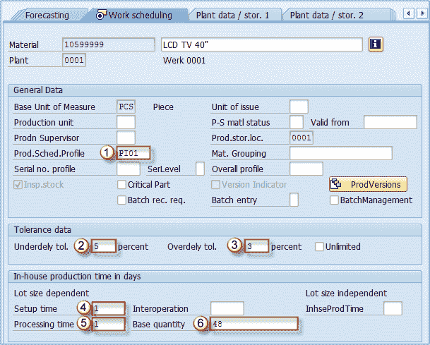](/images/sap/2013/05/051513_0942_18.png)

*   **生产进度配置文件**：定义流程在 PP 或 PP-PI 中的流向，一些有关自动收货的附加控件等。由 PP 顾问定制。
*   **交付不足公差**：定义允许交付的数量百分比。
*   **超额交付公差**：生产或流程订单中超出数量的允许百分比。 对于超额投放，您可以选中无限量框-在这种情况下，我们允许无限量超额投放。
*   **设置时间**：设置和拆卸工作中心资源所需的时间（与批次大小无关）。
*   **处理时间**：基本数量的处理时间。
*   **基本数量**：用于加工和内部生产时间。 在我们的情况下，处理时间是处理 48 件材料所需的时间。

## 工厂数据–存储 1 视图

仓库管理团队应提供用于维护此视图的数据。 这些大多数是在工厂级别有效的存储数据。 让我们浏览该视图的所有必不可少的字段。

[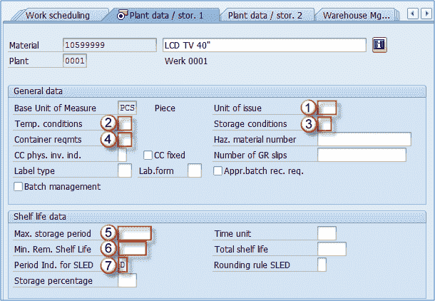](/images/sap/2013/05/051513_0942_19.png)

*   **发出单位**：这是从工厂内任何存储地点发出物料的单位（除了仓库管理的地点，其设置会覆盖此字段值）。
*   **温度条件**：必须在其中存储材料的温度（和大气）条件。
*   **储存条件**：物料所需的储存条件。
*   **容器要求**：运输材料的容器的类型和条件。
*   **最大存储时间**：可以存储材料的最大时间。
*   **最小剩余货架寿命**：允许存储的物料的最小剩余时间（如果剩余时间短于最小时间–系统将拒绝收货）。
*   **SLED 的周期指示器**：用作最小剩余外壳寿命的时间单位。 如果此字段包含 D，则将以天为单位保持最小剩余货架寿命。 指标 M 持续数月等。

## 工厂数据–存储 2 视图

这些字段是从“基本”视图 1（“重量/体积”部分）和“销售-常规”（“常规工厂参数”部分）重复的，我们在介绍这些视图时已对其进行了描述。

[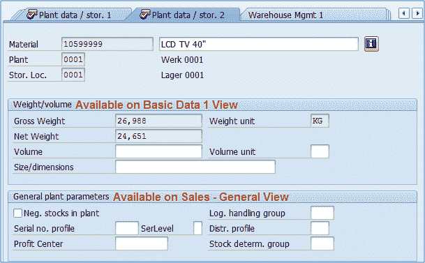](/images/sap/2013/05/051513_0942_20.png)

## 仓库管理 1 视图

在工厂/仓库编号组织级别可以维护此视图。 仓库编号是 SAP 仓库管理中的最高层次结构级别。 您可以在下图中看到位置 1 & 2，它们代表我们正在为其扩展物料的工厂和仓库编号。 维持此视图的信息应由仓库管理管理团队提供。

[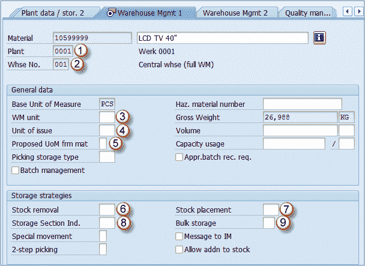](/images/sap/2013/05/051513_0942_21.png)

*   **工厂**：组织级别
*   **仓库编号**：组织级别
*   **WM 单位**：在整个仓库管理中使用的单位。 无论原始文档 UOM 是什么，WM 中的每个文档都使用此度量单位。 例如，如果您为 12 台 LCD TV 40“创建交货，并且我们在仓库管理视图中将 WM 单位定义为 PAL，则在转储单（用于库存管理的 WM 文档）中将显示 1 PAL，而不是 12 PCS。 原始凭证（交货）项目已创建。
*   **发货单位**：它已在工厂数据–存储 1 视图中涵盖。
*   **物料**的建议计量单位：此指标确定在仓库管理中应与 WM 单​​位一起使用的计量单位。 可以将此指标设置为使用发货单位（在物料主数据中在此处定义），订单单位（创建原始凭证的单位-销售订单，交货，保留等），WM 计量单位，基本计量单位， 以及一些附加的条件可能性（例如，如果未指定其他单位，请使用基本计量单位）。
*   **切削策略**：要使用，必须在定制中定义适合此物料的切削策略。 例如，我们材料的策略可能是：首先尝试从高架存储中取出库存，如果没有库存，则尝试从大容量存储区域中进行拣配。 当我们必须为客户（交货）或预订选择一些数量时使用。
*   **库存放置策略**：与上述相同，但方向相反，当我们要将生产中的库存放置到仓库中时，我们希望系统搜索不同的存储类型（区域）以放置在仓库中。 我们希望系统以正确的顺序搜索该材料，以便我们可以设置适当的策略。
*   **储存区指示器**：在使用指示器进行库存清算和放置时，我们可能会遇到一个问题，即在相同的存储类型中，我们的存储箱可能比平时小，并且我们的物料无法放置在该处。 那就是我们可以使用存储区指示器的地方，指示系统不要将我们的物料放置在特定区域的存储箱（较小的箱）中。
*   **大容量存储指示器**：用于指示用尽大容量存储类型容量的特殊情况。 *其他字段包括一些特殊指示器，例如特殊移动指示器，两步拣选，允许添加到已经包含该物料的存储箱中的现有库存中。

**这些设置非常复杂，需要更深入的仓库管理知识。**

## **仓库管理 2 视图**

该视图比以前的视图可维护的级别更高。 这是第一部分中的货盘化数据（物料的数量和所用货盘的类型），该数据未在存储类型级别上维护，但与之前在仓库编号级别上的视图一样。 屏幕下部显示了几个与存储类型相关的设置的字段。

[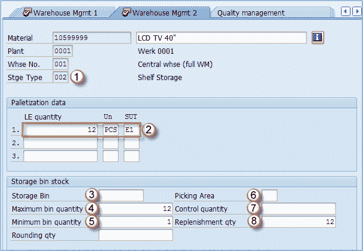](/images/sap/2013/05/051513_0942_22.png)

*   **存储类型**：我们要为其扩展/维护我们的材料的存储类型。 在这种情况下，我们希望将 LCD 电视存储在架子存储中（我们已经在 WM 1 View 中选择了此策略）。
*   **码垛数据**：这是有关如何将我们的物料包装到不同存储单元类型上的信息。 例如，我们的材料用 1m 高的欧洲托盘包装 12 件（在我们的系统中定义为 E1）。
*   **储物箱**：如果我们想将物料存储在预定义的储物箱中，我们将维护此字段。 在这种情况下，我们希望系统在每次执行上架时都为物料建议一个料箱。
*   **最大纸箱数量**：这通常是码垛数据中保持的数字，在我们的情况下为 12 PCS。 在放置股票时用于检查，系统不允许在一个箱中存储超过 12 个 PCS。 仓库管理 2 在物料主数据中查看
*   **最小仓位数量**：仅当激活存储类型的补货时才应保持此数量（主要用于固定仓位存储类型）。 在我们的情况下，如果储藏库中的存货跌至 1 以下（储藏库中无电视），系统将要求补货，以用另一个托盘填充储藏库。 这是一个非常复杂的主题，需要对 SAP 中的仓库管理系统有更深入的了解。
*   **拣配区域**：就像存储区一样，在上架过程中将垃圾箱分组在一起，拣选区域将存储箱分组以进行拣选过程。
*   **控制量**：对于存储类型级别上使用的某些策略（最小/最大数量），该数量指示系统，如果请求的拣配数量高于此字段中定义的数量，则系统应跳过 这种存储类型，然后移至我们的库存清除策略中的下一个存储类型。 如果我们要从一种存储类型中选择少量物料，而从另一种存储类型中选择大量物料，则使用此方法。
*   **补充数量**：当系统确定需要补充我们的箱时，它将在此字段中补充数量。 我们定义了当库存下降到零时我们要补货，并且我们希望通过整个托盘（12 件）来补货。

## 质量管理观

该视图用于质量管理模块中质量检查过程的物料设置。 该模块的管理员负责提供维护该视图的信息。

*   **检查设置**：这表示是否已设置至少一种检查类型。 在设置本身中，您可以选择要用于此物料的检验类型。 安装类型必须由 QM 顾问预定义。 步骤 **A** ：单击检查设置按钮； 步骤 **B** ：选择质量管理团队预定义的适当检验类型； 步骤 **C** ：确认更改。

[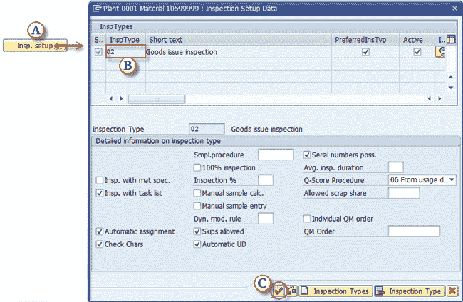](/images/sap/2013/05/051513_0942_23.png)

在质量管理视图的子屏幕上选择检验类型

*   **过帐到检验库存**：指定物料是否经过质量检验。 如果选中此选项，则将为分配的检验类型创建检验批。
*   **物料授权组**：您可以基于授权组为 QM 用户定义授权，例如，如果您希望某些用户检查某些物料，而其他用户则检查其他物料。
*   **检查间隔（以天为单位）：**同一批次重复检查之间的间隔。
*   **采购中的质量管理处于活动状态**：激活采购过程中物料的质量管理。
*   **QM 控制键**：用于定义采购质量检验的条件。 您可以设置交货冻结，发票冻结和其他类型的冻结，直到完成物料检查为止。 可能的条目是由顾问定制时预定义的。
*   **证书类型：**质量证书类型（可能的条目是在 QM 顾问定制中预定义的）。
*   **目标质量管理系统**：供应商所需的质量管理系统。 我们指定供应商是否需要实施和认证 ISO 9001 或其他类型的 QM 系统。

[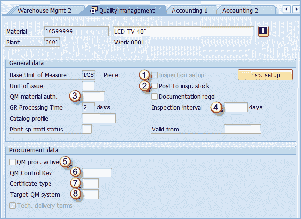](/images/sap/2013/05/051513_0942_24.png)

# 会计 1 视图

在此视图中输入的数据决定了该物料处理会计的方式。 数据由您的 FI / CO 团队提供，背景由 FI / CO 顾问自定义。

[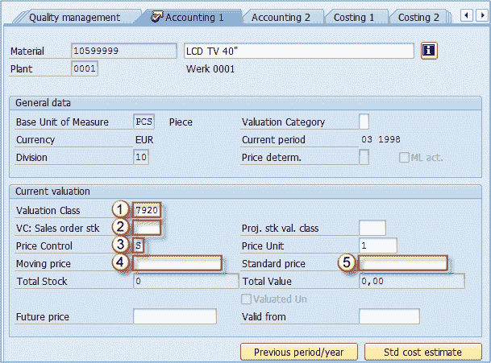](/images/sap/2013/05/051513_0942_25.png)

*   **评估等级**：取决于您的系统设置，但是评估等级在大多数情况下受物料类型影响，因此您将拥有成品的评估等级和贸易商品的评估等级。 在我们的评估类别中，7920 是 SAP 成品的默认类别。 对于 HALB，此类默认为 7900，对于 ROH，我们可以使用 3000。
*   **销售订单库存的评估类别**：您可以为销售订单库存分配评估类别，以覆盖在字段 1-评估类别中定义的默认评估类别。 不建议。
*   **价格控制**：这表明物料将使用哪种内部价格类型。 可以将其设置为 S –标准成本或 V 移动平均价格（可变价格）。 在大多数情况下， **S** 用于制成品，而 V 用于交易商品，但是设置取决于您的 SD / FI / CO 团队偏好。
*   **移动价格**：如果价格控制设置为 V，则可以填充此字段。
*   **标准价格**：如果将价格控制设置为 S，则可以填充此字段。您的控制团队可以使用交易基于生产订单，采购订单中包含的信息来生成这些价格，从而使这些价格不会 不必为每种物料手动输入。 我们还可以维护**评估类别**字段，该字段确定物料的库存是一起评估还是单独评估。

## 会计 2 视图

此视图在生产环境中很少使用，此视图最常见的设置是将所有字段留空。 基本上，它由“会计”中的特殊税收信息组成，这些信息几乎不相关。 确定物料的最低价值，通过物料的状态（移动，缓慢移动）对物料进行贬值等。如果您的财务会计部门正在使用此视图，则部门应为您提供维护此视图的信息。

[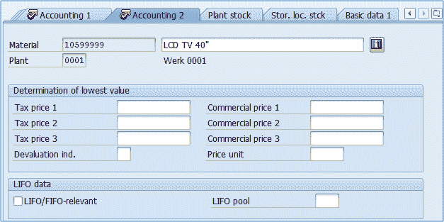](/images/sap/2013/05/051513_0942_26.png)

## 成本核算 1 视图

成本核算视图用于确定产品成本。 它可以接受各种输入，但对于生产而言，最重要的是成本计算批量。 这意味着可以在此处设置用于产品成本估算的最佳手数。 产品可以按 100 件或 3700 件的批量生产； 因此，这两种情况的成本是不同的。 那是因为有一些固定费用（安装合适的工具，机械工作的时间。在第一种情况下，我们的产品成本可能高达 126 美元/个，而在另一种情况下，则可能是 111 美元，这是 显着不同，因此生产必须设法计划工厂中所有材料的活动和库存水平，以使我们的生产批量大小变化不大且尽可能接近我们的最佳批量。

*   **不计算成本**：不估算成本。 既无法创建物料成本也无法创建销售订单成本，就像无法创建替代采购一样。 如果您完全想要成本核算，请将该字段留空。
*   **具有数量结构**：指示是否要使用数量结构数据进行成本估算（批次大小和其他数量信息）。
*   **物料来源**：指示是否应将物料编号分配给 CO 模块中的成本要素项目。
*   **差异键**：确定如何计算成本差异。
*   **成本计算批量**：仅在选中“具有数量结构”复选框时有用。 它确定用于成本估算计算的批次数量。

## 成本核算 2 视图

在图 1 –评估数据中，我们可以看到以前视图（会计 1 视图）中已经涵盖的字段。 除此之外，还有其他字段可以维护计划价格（如果检查并创建了标准成本估算，则标准成本估算将复制到计划价格中）。

[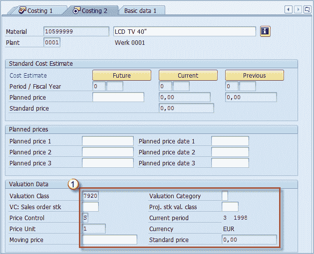](/images/sap/2013/05/051513_0942_28.png)

## 采购视图

在采购视图中，我们可以找到先前涵盖的视图中已经存在的几个字段，例如货运组，工厂特殊物料状态等。我们也只有采购视图提供了几个新字段。

[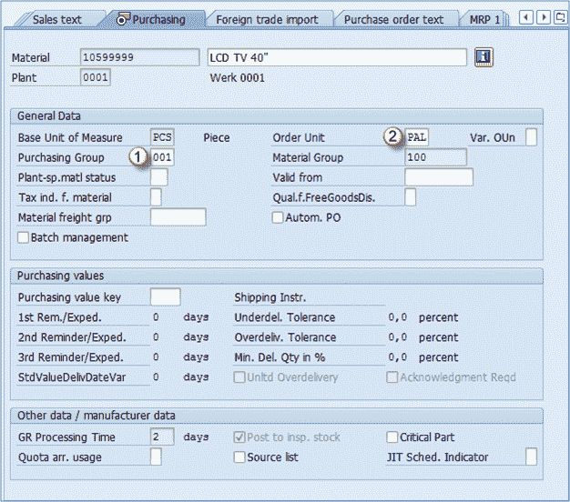](/images/sap/2013/05/051513_0942_29.png)

*   **采购组**：您可以定义各种采购组，例如原材料采购，贸易货物采购，服务采购等。此值将是在采购凭证中输入的所有项目的默认值。
*   **订购单位**：用于订购此物料的默认单位。 我们默认使用托盘，因此，如果输入数量 10，则意味着我们需要 10 个托盘的材料（在这种情况下为 120 件）。 您可以在此视图中看到**购买值**部分。 您必须填写的唯一字段是**购买值键**，该键在自定义中维护，包括在本节中看到的所有值（交付不足公差，交付过度公差）。 在自定义中定义键时，键中的值将传输到此部分的所有字段中。

## 外贸进口视图

与外贸出口视图完全相同。

[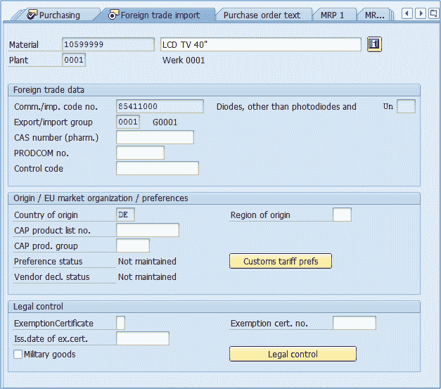](/images/sap/2013/05/051513_0942_30.png)

## 采购订单文字视图

与销售订单文本视图完全相同的视图。

[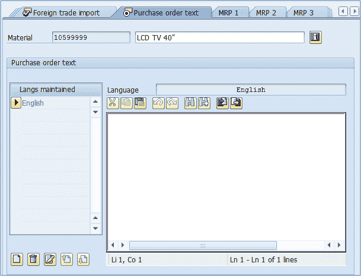](/images/sap/2013/05/051513_0942_31.png)

## 附加数据

除了物料主视图之外，我们在 MM01 事务中还有另一个维护级别。 它也没有涉及组织级别。 在物料主数据的任何视图中，您可以选择按钮附加数据：

[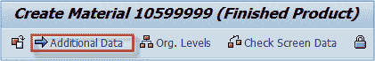](/images/sap/2013/05/051513_0942_32.png)

用于切换到其他数据维护的按钮

选择之后，您可以看到我们可以通过单击“主要数据”按钮返回到 MM 视图。

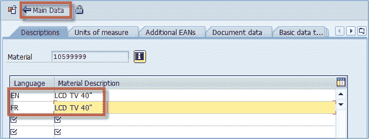

附加数据中各种语言的产品描述

附加数据中的第一个选项卡与材料描述有关。 您已经看到我们已经在 Basic View 1 上维护了材料描述，但是我们仅定义了默认语言（此会话中用户的登录语言）的描述。 在其他数据中，我们可以定义所需的任何其他语言的描述。 例如，我为法语创建了描述。 在我们的案例中，两种语言的材料描述都是相同的（在其他情况下，您可能需要翻译描述）。 这一点很重要，因为如果您有一个来自法国的客户，并且他们仅接受法国产品名称，则必须在此处进行定义，并将该客户的通信语言设置为法语（这是在 SD 模块中完成的， 使用 MM 和 SD）。 第二个选项卡中使用了替代计量单位的维护。 您会看到有一个 1 PCS 的记录，等于 1 PCS，这是我们基本 UOM 的记录。 另一个是 1 PAL 等于 12 PCS –这意味着我们公司将 40 英寸的 LDC 电视机在托盘上包装为 12 片。您可以随意添加任意数量的 UOM，也可以使用以下方式删除它们： “删除行”按钮。在这里，您还可以维护所有度量单位的所有 EAN 代码。在 SD 模块中，您可以通过物料主数据中维护的任何度量单位创建销售订单。实际上，创建 12 件的销售订单是相同的， 或 1 个托盘。

[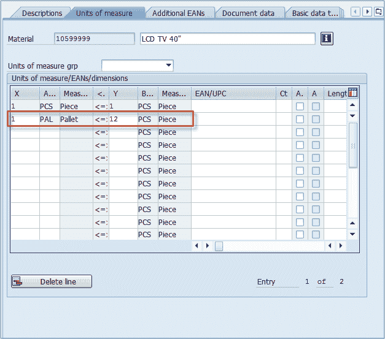](/images/sap/2013/05/051513_0942_34.png)