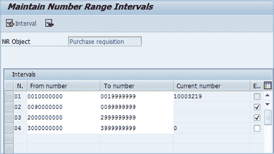
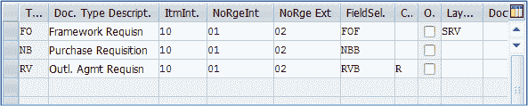
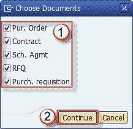
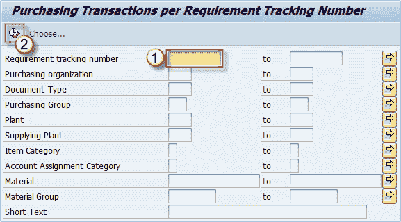
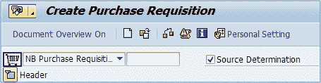
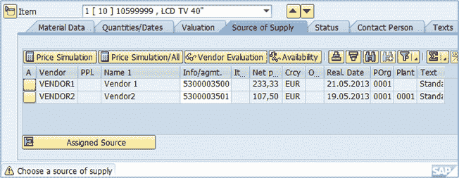

# SAP 中的采购&采购申请简介

> 原文： [https://www.guru99.com/introduction-to-purchasing-and-purhase-requisition.html](https://www.guru99.com/introduction-to-purchasing-and-purhase-requisition.html)

采购是 SAP MM 模块的组成部分，其过程可大致如下图所示。

MRP（物料资源计划）创建采购建议，然后转换为采购申请。 下一步是将源分配给采购申请，并下达采购申请。 PR 被转换为采购订单，并且在收货后可以开具发票收据以完成购买过程。 另外，还处理了付款（在 FI 模块中）。

采购不必从物料需求计划开始，它可以通过基于消耗的计划或直接创建 PR 或 PO 来启动。

*MRP 是一项系统功能，可确定物料和物料清单级别的物料要求。 BoM（物料清单）是由单个物料组成的组件和子组件的列表。*

SAP 采购中仅有的基本文件之一就是采购申请。

## 采购申请

采购申请可以通过系统自动创建或手动创建。 它们可以转换为采购订单，但只有在下达（采购申请批准）后才能转换。

我们将在本教程中介绍几个主题，这些主题可以帮助理解和创建采购申请。

就像其他凭证中一样，采购申请中的编号范围也是必需的，目的是将凭证编号分配给新创建的凭证。

后来，这些编号范围被分配给我们可以定义用于购买申请处理中的不同凭证类型。

我们还将介绍需求跟踪编号，它基本上是一个数字/字母组合，可以唯一地分配给多个文档以跟踪某些重要需求。

您将了解货源确定的工作原理以及其用途，以及如何将货源分配给我们的采购凭证。

最后，您将了解如何处理采购申请，从创建申请到将其转换为采购订单。

### 采购申请的编号范围

分配采购申请的编号范围取决于凭证类型。 可以创建几个不同的编号范围，然后将其分配给特定的采购申请类型。

这是在定制中完成的。 申请单据类型可以分配两个数字范围。 每个文档类型分配一个内部范围和一个外部范围。 内部号码范围由系统自动增加，而外部号码则手动分配。

下面的屏幕显示了采购申请编号范围的列表。

“从数字”是范围内的第一个数字，“从数字”是最后一个可用数字，而当前数字是为文档分配的最后一个数字。

此外，还有一个复选框指示这是否是外部号码范围。

例如，内部编号范围可以定义为从 20000000 到 30000000 的范围，在这种情况下，将从 20000001 开始对分配了该间隔的文档类型的文档进行编号，并且为每个创建的新文档将其递增 1。 此间隔的最后一个可用数字为 30000000，如果您的文档填满了整个数字范围，则必须对其进行扩展。 这种情况很少发生，因为这意味着您将拥有 1000 万个采购申请文件。

## 文件类型定义

文档类型定义是为采购申请定义不同文档类型的操作。 在对采购申请进行分组并更详细地指定其用途时很有用。 例如，我们可以有标准的 PR，分包和库存转移。 每种文档类型都满足特殊需要，并配置为以这种方式使用。

在文档类型定义中，您可以定义许多选项。 编号间隔（内部和外部），项目间隔，字段选择键，控制指示器，总体释放指示器（定义 PR 中的所有项目是同时释放还是单独释放）。

SAP 中的“标准采购申请”文档类型在所有安装中均定义为 NB。

## 需求跟踪号

此数字用于跟踪特定需求。 可以在创建采购申请的过程中输入它，并将其复制到采购订单文档中。 它保持在项目级别，可以在 **MELB** 等多个报告中通过此编号选择项目。

*   执行 **MELB** 事务。
*   单击**选择**按钮。

当您单击**继续**时，您将返回到初始选择屏幕。您还具有多种选择选项，应选择最合适的选项来缩小搜索范围。

*   输入需求跟踪号。
*   执行。

您将看到包含跟踪编号的文档列表。

## 来源确定

货源确定有助于找到最适合需求的货源，例如，它可以建议在给定的时间使用哪个概要协议，哪个内部采购货源（工厂）或哪个供应商来订购特定物料。

源确定将各种数据作为实际确定过程的参数。 这些包括大纲协议，采购信息记录，我们公司的工厂，配额安排，来源清单。

在确定需求的最佳来源时会考虑所有这些因素。

首先通过**配额安排**进行检查，系统将确定是否存在具有物料相关配额安排的合适货源，如果找到了合适的货源，则将其选中，并中止对货源的其他搜索。

如果不是，系统将考虑**来源列表**并在那里搜索有效的来源。 源列表由固定记录和阻止记录组成。 **固定记录**适用于固定供应商，其特定材料在一定时期内有效。 **被阻止的记录**处于此状态时，不能用作源。

最后，系统查找**轮廓协议**和**信息记录**的可信来源，并将其分配给他们。 您在上一课中已经看到了什么是购买信息记录，大纲协议是计划协议或合同，在来源确定过程中也用作输入信息。

要使用来源确定，您需要在请购初始屏幕上的“确定来源”复选框上打勾。

## 来源分配

系统可执行后台或前台源分配。

如果搜索是在前台模式下完成的，并且找到了多个有效来源，则会出现一个选择列表，用户应从中选择合适的来源。 如果仅找到一个合适的来源，则会自动分配。

如果搜索是在后台完成的，则必须确定单个源，并且要实现该系统将在查找中执行各种功能。

例如，大纲协议优先于购买信息记录源，如果发生冲突，则选择大纲协议源。

如果在概要协议中找到多个有效来源，则唯一有效来源将是常规供应商的唯一来源，并且如果两个记录都不是常规卖方的，则必须手动确定来源。

您可以看到系统如何提供两个来源，我们必须从中手动选择更好的来源。

