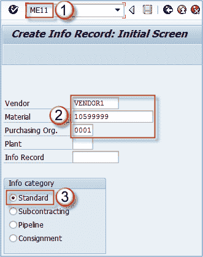
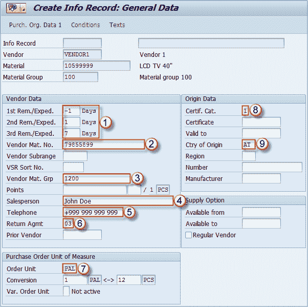
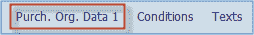
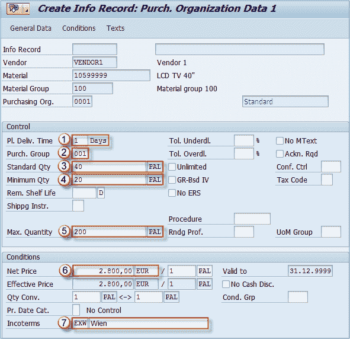
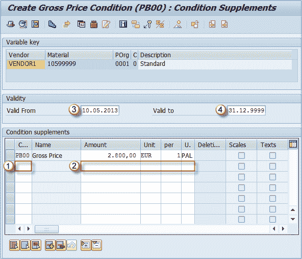
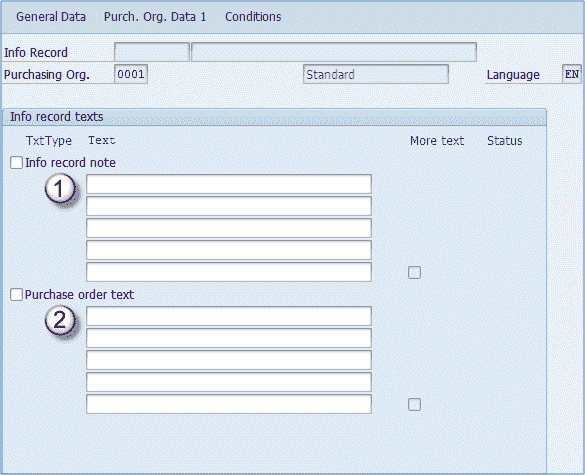

# ME11：如何在 SAP 中创建购买信息记录

> 原文： [https://www.guru99.com/how-to-create-a-purchase-info-record.html](https://www.guru99.com/how-to-create-a-purchase-info-record.html)

## 购买信息记录

购买信息记录是有关从供应商处购买特定物料的条款的信息。 它们由供应商/物料组合维护，并且可以包含价格和条件，超额交付和不足交付限制，计划交付日期，可用期限的数据。

## 信息记录中的采购类型

1.  ### 标准

    标准信息记录包含有关标准采购订单的信息。 可以创建带有或不带有主记录的物料和服务的信息记录。
2.  ### 分包

    分包商信息记录包含分包商订单的订购信息。 例如，如果您分包组件的装配，则分包商信息记录将包括供应商（分包商）的装配价格。
3.  ### 管道

    管道信息记录包含有关通过一条或多条管道（例如，石油或水）或通过类似方式（例如，通过干线的电力）供应的卖方商品的信息。 信息记录包含卖方对买方使用此类商品的价格（“管道提款”）。 您可以在不同的有效期内保留提款/使用价格。
4.  ### 寄售

    寄售信息记录包含有关材料的信息，供卖方自费保留在订购者所在地。 信息记录包含卖方订购者从寄售存货中提取的价格。 与管道信息记录一样，您可以将价格保持在不同的有效期内。

## 如何创建购买信息记录

可以为每种采购类型创建采购信息记录，并使用交易代码 **ME11** 处理该信息。

**步骤 1）**

1.  在命令提示符下输入事务 ME11。
2.  创建信息记录的关键是供应商/物料组合。 您可以输入采购组织和/或工厂。
3.  您必须为所需的采购类型选择一个信息类别。 按 **ENTER** 进入下一个屏幕。

**步骤 2）**在此提供有关**信息记录常规数据的信息。** 将为所有采购类型维护此信息（仅对所有采购类型维护一次：标准，分包，管道，寄售），并且存在最相关的字段：

1.  **提醒 1、2、3** ：这三个字段指示要发给供应商的剩余物。 负值表示卖方应早于报价或交货日期。
2.  **供应商垫。 否**：供应商用于此物料的物料编号。
3.  **供应商物料组**：供应商用于此物料的物料组。
4.  **销售人员**：联系人的姓名。
5.  **电话**：联系人或供应商的电话号码
6.  **退货协议**：这可以指示是否可以退货，以及是否可以退款。
7.  **订购单位**：供应商订购此物料的单位。
8.  **证书类别**：供应商发布的适用于此材料的证书类型。
9.  **原产国**：生产该材料的国家。

输入所有所需数据后，我们可以单击“购买”按钮。 单位 将数据 1 传送到用于输入采购组织相关信息的屏幕。

**步骤 3）**此视图对于每种采购类型都是单独维护的。 我们选择了标准采购类型，我们可以在此处填充几个相关字段。

1.  **计划的交付时间**：计划物料交付的默认时间（天）。
2.  **采购组**：材料主课程中提到的采购组。
3.  **标准数量**：物料的标准购买数量。
4.  **最小数量**：不允许采购数量少于此处所述的数量。
5.  **最大数量**：我们不想一次购买多于此数量的产品。
6.  **净价**：每个采购单位的物料净价。
7.  **贸易术语**：交易和交货条款。

**步骤 4）**按下条件按钮。

** 

下一个屏幕用于维护定价条件，如您所见，上一个屏幕上输入的价格已转移到该屏幕。

1.  **条件类型**：您可以在此字段中输入条件类型。
2.  **每单位金额**：您可以在这 4 个字段中输入金额和金额单位（例如 2.800 EUR）以及该金额有效的数量（1 PAL）。
3.  **有效期自。**
4.  **有效。** 字段 3 和 4 表示条件的有效期。 这表示此条件自 10.05.2013 起有效。 直到 31.12.9999。 （无限的未来有效期）。

**步骤 5）**可以在采购信息记录的“文本”视图中定义此物料/供应商组合的标准文本。

1.  您可以在这五行中输入信息记录便笺，并且仅当选中信息记录便笺复选框时，该记录才处于活动状态。
2.  与前一逻辑相同，除了这是将复制到采购订单物料的标准物料文本。

输入有关我们的物料/供应商组合的所有所需信息后，您可以保存交易数据，并且将显示有关分配给我们的信息记录的采购信息记录号的信息。 我们可以将其用作将来的参考来编辑或显示我们的记录。

现在，我们可以设置其他三个采购类型信息记录，您只需要在“采购组织数据 1”屏幕中进行维护。