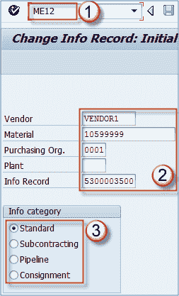
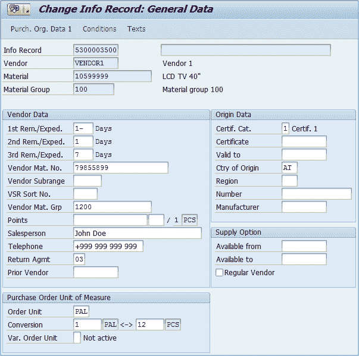
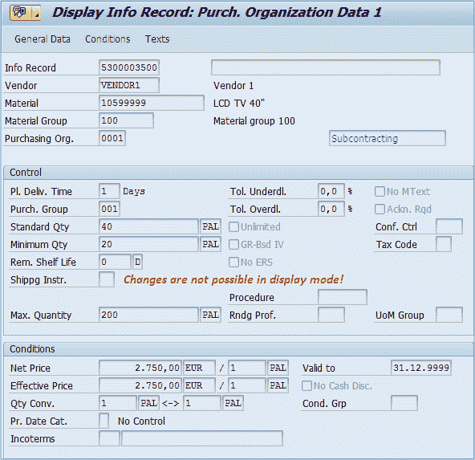

# 如何更改采购信息记录：SAP 中的 ME12

> 原文： [https://www.guru99.com/how-to-change-a-purchase-info-record.html](https://www.guru99.com/how-to-change-a-purchase-info-record.html)

我们说过用于创建信息记录的交易是代码 **ME11** 。 当我们需要更改信息记录时，可以使用代码 **ME12** t-code，并且仅用于显示时，我们应该使用代码 **ME13** ，就像 SAP 标准一样。

**步骤 1）**

1.  交易代码以更改信息记录。
2.  **供应商，物料，采购组织，工厂，信息记录号数据**：我们用它来标识我们在会话中确切需要更改的内容。 如果我们填写所有字段，我们将能够更改所有现有视图和这些视图中的数据。 例如，如果我们未指定采购组织，则将无法编辑采购组织数据 1 视图。
3.  **信息类别**（购买类型）。 我们正在更改此信息类别的数据（仅适用于依赖于信息类别的视图）。

**步骤 2）**按下 **ENTER** 按钮。 将显示以下屏幕。

进行所需的更改，然后单击  保存按钮。

**注：**在代码 ME13 中，可用于查看记录。 无法编辑或保存记录。

