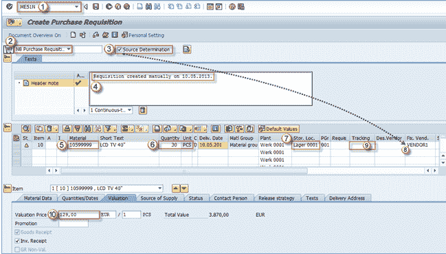

# 如何在 SAP 中创建采购申请：ME51N

> 原文： [https://www.guru99.com/how-to-create-a-purchase-requisition.html](https://www.guru99.com/how-to-create-a-purchase-requisition.html)

采购申请的创建可以用 t 代码 **ME51N** （或较旧的版本 ME51 –不推荐）完成，这是一个直接的过程。

**ME51N**

**Purchase requisition document type**

**Source determination**

**Header note**

**Material**

**Quantity and UoM**

**Storage location**

**Vendor**

**3.**

******** 

9\. **跟踪号：先前主题中涉及的**，可以手动输入所需的值。

10\. **评估价格：如果从此处保存，则从物料主数据复制**，如果不需要，则必须手动输入（如果此字段未设置为可选）。在字段中输入所需信息后，我们可以保存交易 数据。

********