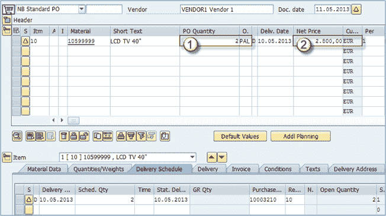

# 如何在 SAP 中将采购申请转换为采购订单

> 原文： [https://www.guru99.com/how-to-convert-purchase-requistion-to-purchase-order.html](https://www.guru99.com/how-to-convert-purchase-requistion-to-purchase-order.html)

发布后，采购申请可以转换为采购订单。 这可以在交易代码 **ME21N** 中完成。将 PR 转换为 PO 的过程很简单，执行步骤如下：

**步骤 1）**

1.  **执行**事务代码 **ME21N** 。
2.  **选择适当的采购订单类型**：在我们的示例中 NB –标准 PO。
3.  **组织级别**：根据需要输入。
4.  **采购申请**：输入上一课中发布的采购申请编号。

按下 ENTER 键。 您可能必须多次按 ENTER 键才能看到几条警告消息。

**步骤 2）**

1.  **采购订单数量**：您可以看到采购订单数量向下舍入为 2 PAL。 那是因为我们在 PR 上输入了 30 个，并且在我们的信息记录中将我们的订购单位设置为 PAL，因此我们必须在托盘中订购，然后系统对其进行四舍五入。
2.  **净价**：正在从购买信息记录中填充净价字段。

保存采购订单，然后完成将采购申请转换为采购订单的操作。