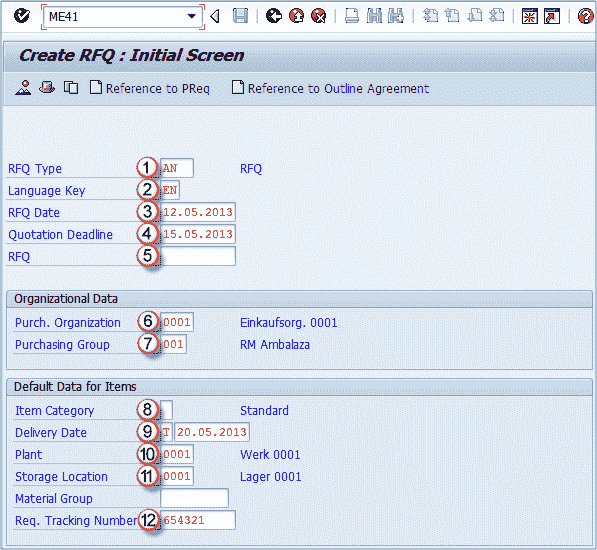
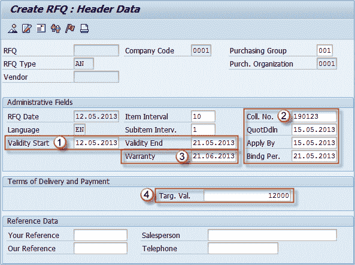
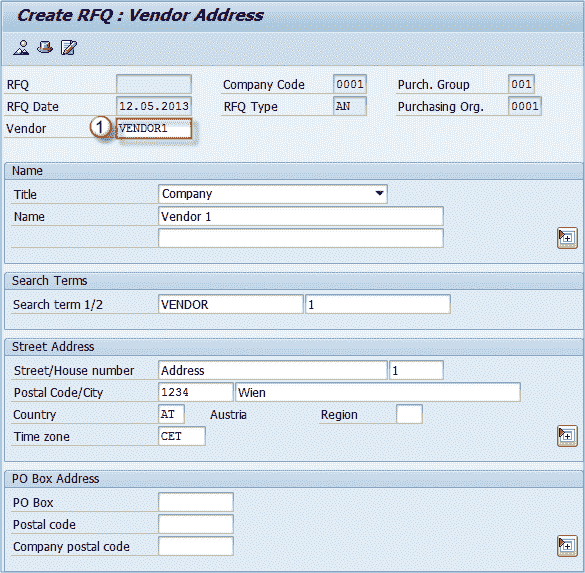
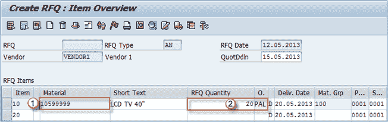
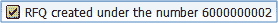

# ME41：如何在 SAP 中创建 RFQ（报价请求）

> 原文： [https://www.guru99.com/overview-of-quotations-how-to-create-rfq.html](https://www.guru99.com/overview-of-quotations-how-to-create-rfq.html)

## 报价单

报价是要求供应商向我们提供有关其最佳价格，条款和条件，交货时间表以及其他信息的信息，以便为我们的采购需求选择最佳来源。

*您可以在下面看到在 SAP MM 模块中进行采购的报价流程。*

报价过程始于创建报价请求，然后维护报价以输入从可能的供应商处收到的所有信息。 然后我们要比较报价并选择最合适的报价拒绝其他报价。在 SAP 中，流程中使用了几笔交易。

## 如何创建报价请求

首先，我们需要创建一个报价请求。 询价可以通过事务 **ME41** 创建。 我们可以从头开始创建新的询价，也可以参考现有的采购申请或概述协议来创建询价。 如果要使用参考文档创建询价，则只需单击相应的按钮，然后输入参考文档编号。 在这种情况下，我们将创建一个没有参考文件的新 RFQ。 **步骤 1）**在事务 ME41 中，输入：

1.  **RFQ 类型**：报价类型（A-标准 RFQ）。
2.  **语言键**：引号中使用的语言（EN-英文）。
3.  **询价数据**：今天的日期。
4.  **报价截止日期**：此日期必须早于交货日期。
5.  **询价编号**：输入要分配给报价单的编号（如果要在内部分配，请将此字段留空）。
6.  **购买。 组织：**购买组织（例如 0001）。
7.  **采购组**：采购组（例如 001）。
8.  **项目类别**：默认为空白–标准项目。
9.  **交付日期**：请求的交付日期。
10.  **植物**。
11.  **存放位置**：用于收货的位置。
12.  **需求跟踪号**。

按 **ENTER** ，您将位于标题数据屏幕上。

**步骤 2）**

1.  **有效期范围**：输入有效期的范围。其他信息，例如**集体编号**（多个文档的集体管理），**投标截止日期**，**结束申请的日期**和报价的**绑定期**。
2.  **集合编号– Coll.no** 是一个非常重要的字段，因为您以后可以根据此信息比较报价，或使用该编号查找询价单。
3.  您可以输入保修日期（如果适用）。
4.  **目标值**：在创建合同下达订单期间警告消息的阈值。

您应该检查工具栏，以查看可以使用图标调用哪些屏幕。

**步骤 3）**在工具栏的图标中，您会找到  “供应商地址”按钮，在这里您可以：

1.  选择适当的供应商。 如果是一次性供应商，则在输入供应商编号后，需要指定供应商地址。

**步骤 4）**在工具栏中，您还将找到概述按钮，该按钮调用项目概述屏幕。

项目概览屏幕是您可以输入项目信息，物料，数量的地方。

1.  **物料编号**：插入要采购的物料。
2.  **询价数量**：输入所需的数量和计量单位。您可以从工具栏检查更多屏幕并保存文档。

您始终可以使用 t 代码 **ME42** 返回编辑报价请求，或者使用 **ME43** 显示报价信息。 重复上述过程，将询价发送给您要报价的所有供应商。

如果您在报价中维护了集体编号（我们使用了 190123），则可以使用交易代码 **ME4N** 查看该集体编号的所有报价。