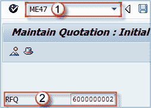
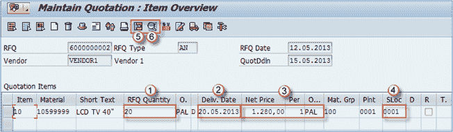
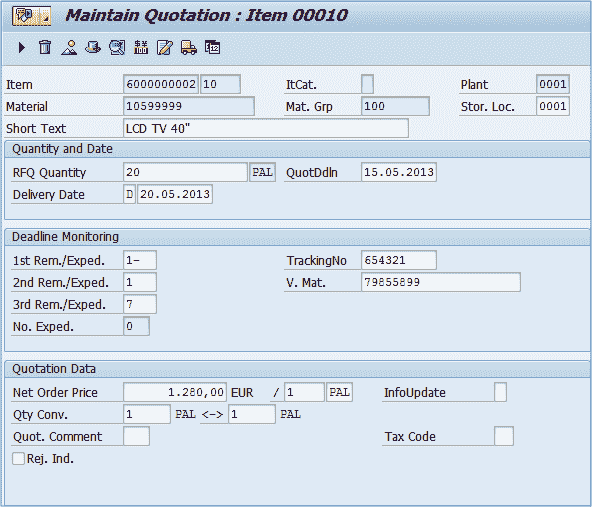
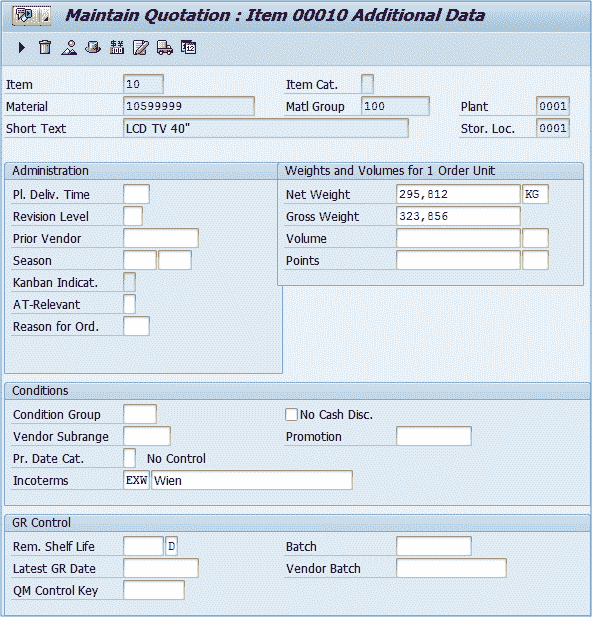
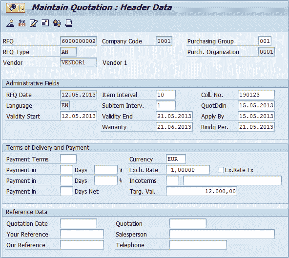

# ME47：如何在 SAP MM 中创建报价

> 原文： [https://www.guru99.com/how-to-create-quotations.html](https://www.guru99.com/how-to-create-quotations.html)

使用交易代码 **ME47** ，我们可以基于报价请求创建报价。

**步骤 1）**

1.  **用于维护报价的交易代码** – **ME47** 。
2.  **询价**：询价，我们将其用作参考文件。
3.  按 **ENTER** 。

**步骤 2）**

1.  询价数量
2.  邮寄日期
3.  计量单位净价
4.  存储位置

5.  项目详细信息将在以下屏幕上显示。您可以根据需要更改详细信息

6.  其他数据，您可以访问项目级别的一些其他信息。

7.  If you want to change general header data click on the "Hat" icon.

    

8.  如果选择物料条件图标/按钮，则可以维护当前所选物料的定价条件。 在这里，您可以输入附加费，运费，折扣等条件。

完成后，您可以保存数据。 如果需要更改报价，可以使用相同的 t 代码（ **ME47** ）进行更改，也可以使用 **ME48** 显示其数据。

您可以重复此过程为所有询价创建报价。 如果某些供应商没有回答您的报价请求，那么您将不会为该供应商创建报价。