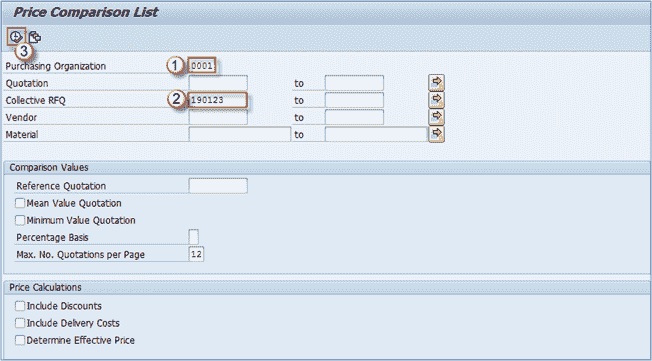
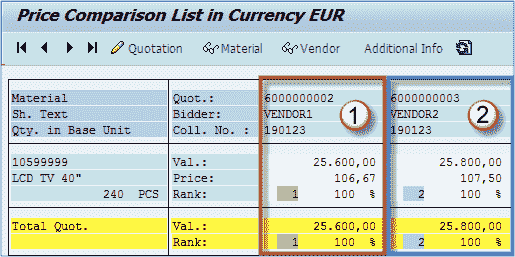
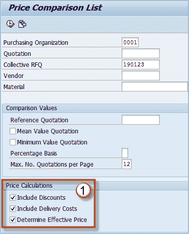
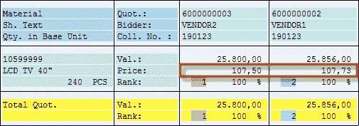
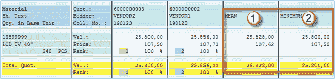

# 如何比较不同报价的价格：SAP ME49

> 原文： [https://www.guru99.com/how-to-compare-price-for-different-quotations.html](https://www.guru99.com/how-to-compare-price-for-different-quotations.html)

输入报价后，您可以比较它们以选择当前最佳报价。 我们可以比较交易代码 **ME49** 中的报价。

我们可以使用之前处理过的集合号来选择要比较的报价，这是在询价单（或直接在报价单）上维护的重要字段。

如果忘记输入集体编号，则必须在选择字段“报价”中提供所有报价编号。

**步骤 1）**在交易中 **ME49，**输入

1.  **采购组织**（例如 0001）。
2.  **集合 RFQ** （我们已使用 190123）。
3.  执行交易。

比较列表如下所示：

** 

从清单中可以看出，Vendor1 提出了更好的价格。

我们需要做的是检查**有效价格**（包括折扣，运费和其他条件）。我们将返回到选择屏幕，并勾选三个复选框。

**步骤 2）**

1.  选中价格计算部分中的所有复选框。
2.  执行交易。

我们的结果发生了很大变化。

现在 Vendor2 的价格更好，由于运费，Vendor1 的价格上涨了 256 欧元。

现在我们可以得出结论，我们的 Vendor2 价格最优惠，我们可以继续进行此过程。

如果在前一个屏幕上选择“均值报价”和“最小值报价”，则会得到结果，因为 y 如下图所示。

1.  所有报价的平均价格。
2.  所有报价的最低价格。

比较价格/条件后，您可以决定接受哪些报价和拒绝哪些报价。