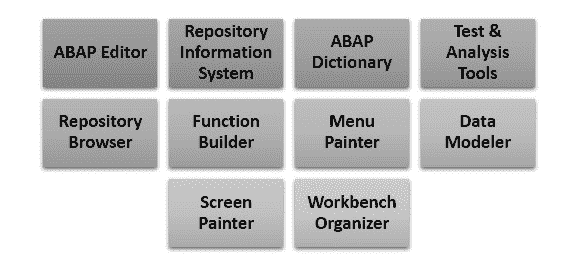

# 什么是 ABAP？ 完整的形式，含义，历史

> 原文： [https://www.guru99.com/what-is-abap.html](https://www.guru99.com/what-is-abap.html)

## 什么是 ABAP？

**ABAP** 是 SAP 创建的一种高级编程语言，可帮助大公司自定义 SAP ERP。 ABAP 可以帮助定制财务会计，物料管理，资产管理以及 SAP 所有其他模块的工作流。 SAP 当前的开发平台 NetWeaver 还支持 ABAP 和 Java。 ABAP 的完整形式是高级业务应用程序。

在此 SAP ABAP 教程中，您将学习，

*   [为什么选择 ABAP？](#2)
*   [SAP ABAP 的历史](#3)
*   [ABAP 运行时环境](#4)
*   [ABAP 程序的类型](#5)
*   [ABAP 工作台](#6)
*   [SAP Java 与 SAP ABAP](#7)

## 为什么选择 ABAP？

这是使用 SAP ABAP 的原因：

*   开发人员使用 SAP ABAP 开发 SAP R3 平台。
*   这是一种简单的语言，在编程时很容易学习。
*   它使您可以从过程和面向对象的编程中进行选择。
*   它还可以帮助 SAP 客户改进其基于 SAP 的应用程序。
*   它允许您创建自定义报告和界面。
*   ABAP 语言对于程序员来说非常容易。 但是，它不是非程序员可以使用的正确工具。

## SAP ABAP 的历史记录

这是 ABAP 历史上的重要地标

*   ABAP 是 1980 年代开发的 4 / GL（第四代）语言。
*   ABAP 成为一种用于开发客户端服务器程序的语言，该程序于 1992 年首次发布。
*   在 1999 年，SAP 引入了称为 ABAP Objects 的面向对象的扩展
*   2006 年，发布了 7.0 版本，该版本具有切换框架功能
*   在 2012 年中，具有表表达式功能的版本已发布
*   2015 年，7.5 版开始支持 Open SQL 表达式。
*   在 2017 年的 7.52 版中，引入了内部表功能的虚拟排序。

## ABAP 运行时环境

所有 ABAP 程序都存储在 SAP 数据库中。 但是，它们永远不会存储在 C ++和 Java 程序等外部文件中。

在数据库中，所有代码均以 ABAP 编写，以两种不同的形式出现：

可以使用 ABAP Workbench 工具查看和编辑的源代码以及生成的代码。 它是一种二进制表示形式，与 Java 字节码非常相似。

ABAP 程序允许您控制运行时系统，该系统是 SAP 内核的一部分。 运行时系统还允许处理 ABAP 语句。 它控制屏幕的逻辑并响应用户事件，例如用户单击或鼠标悬停。

## ABAP 程序的类型

SAP ABAP 程序可以是可执行单元，也可以是可重用代码的库。 但是，它不能单独执行。

ABAP 可执行程序分为两种类型：

*   报告书
*   模块池

#### 不可执行程序类型为：

*   包含模块
*   子例程池
*   功能组
*   对象类
*   接口类型池

## ABAP 工作台

ABAP 工作台是 ABAP 系统的重要组成部分，可通过 SAP GUI 进行访问。 它包含各种用于编辑程序的工具。

<figure>

<figcaption style="display: table;">ABAP WorkBench</figcaption>

</figure>

SAP 广泛使用它来开发标准定制应用程序。 ABAP 工作台还用于创建字典对象。

SAP ABAP 具有以下组件：

*   ABAP 编辑器：它主要用于维护程序。
*   ABAP 词典：用于维护词典对象。
*   资源库浏览器用于显示包中组件的层次结构。
*   Menu Painter：用于开发 GUI，包括菜单栏和工具栏。
*   Screen Painter：用于维护在线程序的屏幕组件。
*   资源库信息系统：存储有关开发和运行时对象的信息，例如数据模型，表结构，程序和函数。
*   功能构建器：此组件可帮助您创建和维护功能组和功能模块。
*   测试和分析工具，例如语法检查和调试器。
*   Data Modeler：此工具支持图形建模。
*   Workbench Organizer：它可以帮助您维护开发人员管理的多个开发项目，以进行分发。

## SAP Java 与 SAP ABAP

这是 SAP Java 和 SAP ABAP 之间的重要区别

| SAP JAVA | SAP ABAP |
| Java 在 IT 社区中被广泛使用，并且在许多开源计划中发挥着重要作用 | ABAP 是 SAP 的默认编程语言，用于按需和本地业务应用程序。 |
| ABAP 用于运行基于 ABAP 的应用程序或服务。 | Java 通常用于运行基于 Java 的应用程序或服务。 |
| SAP 将 Java 用于集成主题，门户和集成解决方案，协作方案和产品。 | ABAP 为大型企业的 IT 环境提供高度可扩展且可靠的生命周期管理。 |
| Java Stack 用于 SAP Portal，它可以托管用 JSP / EJB 编写的基于 Internet / Web 的应用程序。 Java Stack 使用 Java 线程来运行应用程序。 Java 堆栈包含 IR，SLD，ID，RWB 和 AE。 | ABAP 堆栈可帮助您运行 ERP 应用程序，主要是 MM，SD，FICO 等。ABAP 堆栈包括 IE 和 BPE。 |

#### 摘要

*   ABAP 代表高级业务应用程序编程
*   这是一种简单的语言，在编程时很容易学习。
*   ABAP 成为一种用于开发客户端服务器程序的语言，该程序于 1992 年首次发布。
*   在数据库中，所有代码均以 ABAP 编写，以两种不同的形式出现：
*   源代码，可以使用 ABAP Workbench 工具查看和编辑源代码，以及
*   生成的代码。
*   ABAP 可执行程序分为两种类型：
*   报告和 2）模块池
*   Java 在 IT 社区中被广泛使用，并且在许多开源计划中发挥着重要作用。 相比之下，ABAP 是 SAP 的默认编程语言，用于按需和本地业务应用程序。