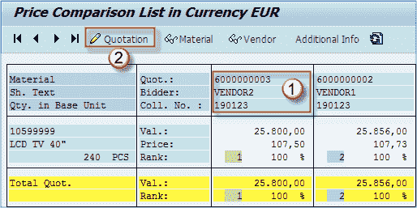
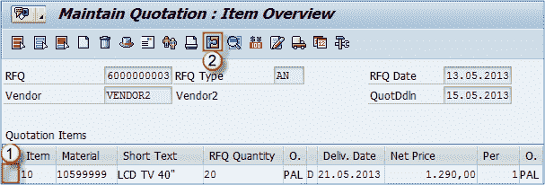
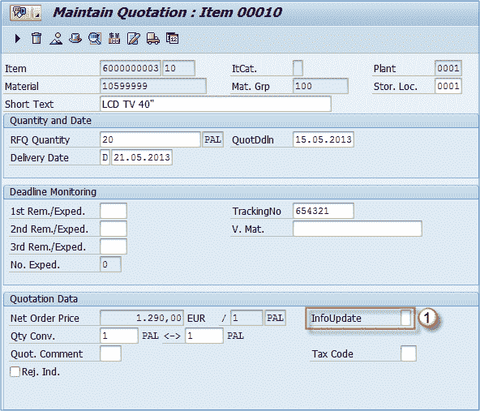
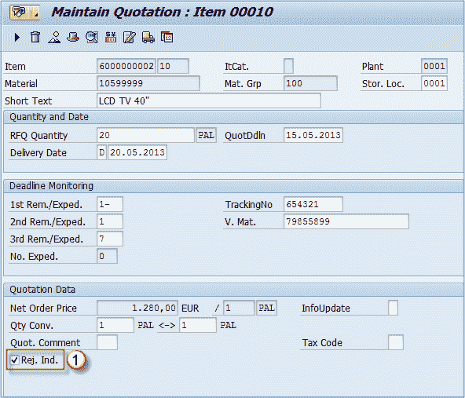

# 如何选择或拒绝报价：SAP ME47

> 原文： [https://www.guru99.com/how-to-select-or-reject-a-quotation.html](https://www.guru99.com/how-to-select-or-reject-a-quotation.html)

以下教程将带您完成在 SAP MM 中维护报价的步骤

**步骤 1）**

1.  选择合适的报价（由于条件最好，您需要对其进行进一步处理）。
2.  选择工具栏上的“编辑报价”按钮。

**步骤 2）**现在您处于 **ME47** 交易中。 您可以在此处选择项目并转到项目详细信息屏幕。

1.  选择项目。
2.  单击项目详细信息图标。

**步骤 3）**

1.  在报价数据部分的 **InfoUpdate** 字段中输入（或从可用值列表中选择） **B** 或 **C** 以更新信息记录。 在此字段中，您还可以找到用于拒绝报价项目的拒绝指示器。 我们将使用它拒绝其他报价。

**InfoUpdate** 字段用于通过多种方式更新信息记录：

*   ''（空白）信息记录未更新。
*   ' **A** '如果工厂级别存在信息记录，则会对其进行更新。 否则，将更新采购组织级别的信息记录。
*   ' **B** '如果工厂允许使用工厂条件，则会更新工厂级别的信息记录。
*   ' **C** '如果工厂不需要工厂条件，则将更新采购组织级别的信息记录。

2.  保存数据。

## 拒绝报价

您应该返回报告屏幕。 到达那里后，您可以选择其他报价（我们希望其被拒绝），并重复该过程，直到您进入项目详细信息屏幕。 您不会在 InfoUpdate 字段中输入信息，但会勾选“ Rej。Ind”。 复选框。 这样，您将拒绝报价项目。

**Step 1)**

1.  **拒绝指示器。**

系统将提示您打印被拒绝​​项目的拒绝消息，以便将其要约状态通知给卖方。您可以对所有被拒绝的卖方和项目重复此过程。 现在，我们为该项目保留了一个开放的报价。