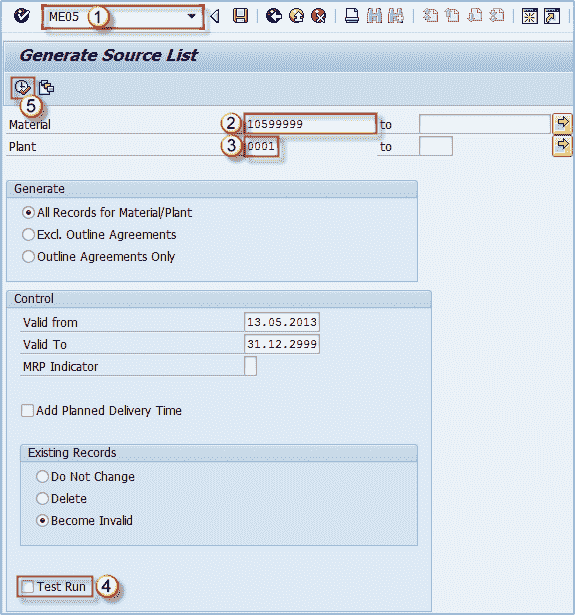

# 如何创建来源清单确定：SAP ME05

> 原文： [https://www.guru99.com/how-to-create-a-source-list.html](https://www.guru99.com/how-to-create-a-source-list.html)

您可以在 **ME05** 事务中创建源列表。 来源列表是材料的可能来源列表。 如果物料存在货源清单要求，则必须创建货源清单以继续订购。

1.  执行 t 代码 **ME05** 。
2.  输入材料或材料列表/范围。
3.  输入工厂。
4.  取消选中“测试运行”复选框以执行事务，而不使用测试模式。
5.  执行交易。

在结果屏幕上，选择适当的订单项，然后点击保存按钮。 您已创建源列表。