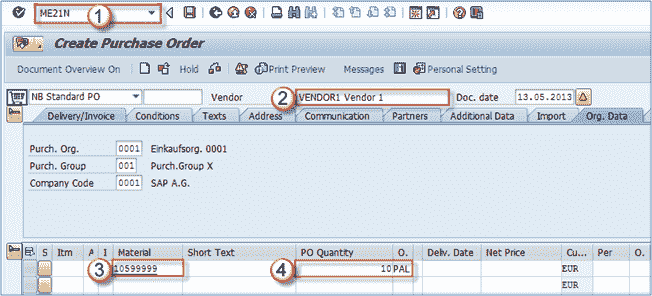
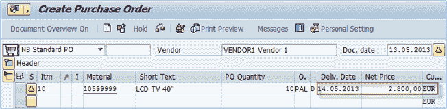
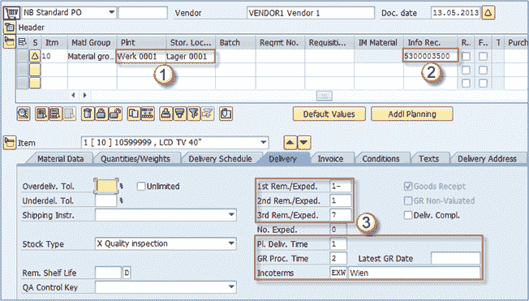
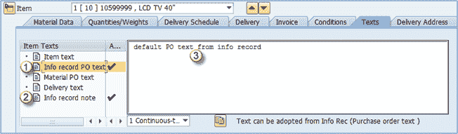
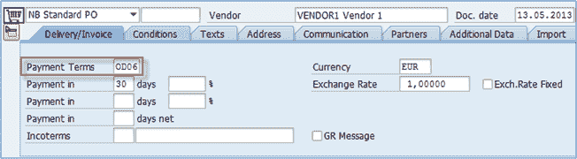
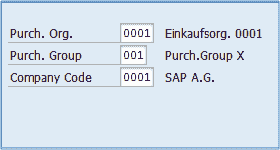
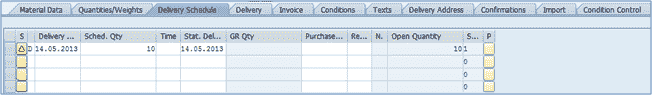
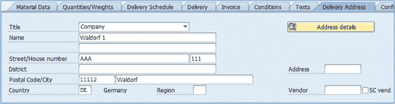
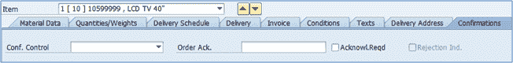
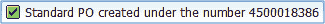

# 如何在 SAP 中创建采购订单 ME21N

> 原文： [https://www.guru99.com/how-to-create-a-purchase-order.html](https://www.guru99.com/how-to-create-a-purchase-order.html)

采购订单用于采购中的许多流程。 它们可用于内部采购（从一个工厂到另一个工厂），外部采购的货物（直接消费或库存）和服务。 它也可以用于分包，第三方和寄售流程。 下图显示了采购订单处理。 可以参考采购申请，询价，报价，另一个采购订单，合同，销售订单来创建采购订单。

## 如何创建采购订单

通过使用标准交易 **ME21N** （或 **ME21** –交易的旧实例）创建采购订单。

**步骤 1）**

1.  输入交易代码 **ME21N** 。
2.  输入供应商。
3.  输入需要采购的物料编号。
4.  输入数量和计量单位（可选-系统使用采购信息记录中的计量单位）。
5.  按 **ENTER** 确认输入的数据。

**现在，使用来自采购信息记录和物料主数据的信息以及供应商主数据填充采购订单项目。 这可以在接下来的几个屏幕上看到。**

从主数据中提供的信息填充交货日期和净价。

在下面的屏幕快照中，从采购信息记录中填充了块 **1** 和 **2** ，而从供应商主数据中填充了 **3** 。

通过购买信息记录主数据填充的默认文本。

1.  **信息记录 PO 文本** –从信息记录主记录中填充的文本。
2.  **信息记录注释** –从信息记录主记录中填充。
3.  此字段中的文本与我们的信息记录中的文本相同。

**步骤 2）**

1.  您可以看到采购订单在页眉级别包含几个选项卡。在“状态”选项卡上，您可以找到有关采购订单状态的一些信息。
2.  在此块中，您可以找到常规状态（有效）以及采购订单确认（未发送），交货状态和发票状态。
3.  这是有关数量和价值，订购的数量和价值，已交付的数量和价值，仍要交付的数量和价值，已开具发票的数量和价值以及最终预付款信息的信息。

其他选项卡包含有关组织数据，导入，其他数据，合作伙伴，通讯，地址，文本，条件，交付/发票信息的信息。

**步骤 3）**

“交付/发票”选项卡包含有关付款条件和交易条件的数据。 您可以在此处插入付款条件（例如= D06 –交货后 30 天付款），交易条件（在两个 incoterms 字段中，例如 EXW Wien）。

**步骤 4）**

组织数据包含有关采购组织，采购组和公司代码的信息。 如果需要，您可以选择另一个采购组。

**其他标签**

*   在**条件**选项卡中，您可以在抬头级别找到有关价格和条件的数据。
*   **文本**选项卡用于维护标题级别的文本。
*   **地址**选项卡保存供应商地址数据。
*   在**附加数据**选项卡中，您可以找到供应商的集体编号和增值税注册号。 【HTG2】

**在物料级别的采购订单中包含有关物料的其他信息**

*   在**交货时间表**选项卡上，我们可以输入所需的交货时间表和要在特定日期交货的数量。

*   **物料数据**选项卡包含有关供应商物料编号，批次，供应商批次，EAN 代码等的信息。一些数据是从采购信息记录中填充的。
*   在**交付选项卡的**上，可以设置交付公差百分比（超出交付和不足交付），设置交付状态，剩余交付设置以及其他信息。
*   **发票**标签包含有关发票相关数据的信息，并在适用的情况下填写字段“税”（在我们的情况下，这两个项目的税码均为 **V1** ）。
*   **条件**选项卡用于指定项目级别的条件。
*   **交货地址**-我们的公司地址，如果我们希望将物料运送到其他地方，则可以更改。

*   **确认**选项卡保存特定于项目确认控制和拒绝指示器的数据。

当所有数据都经过仔细检查并正确输入后，我们可以保存采购订单。

