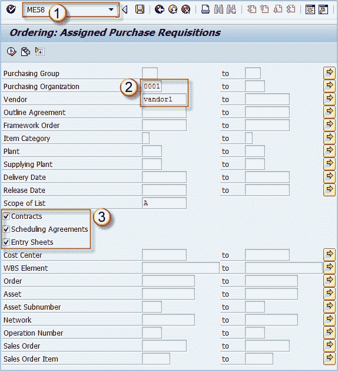
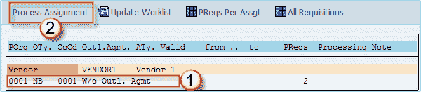
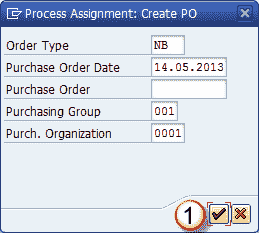
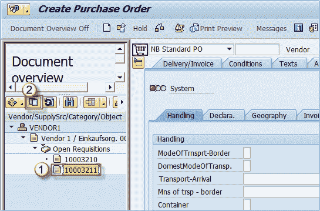
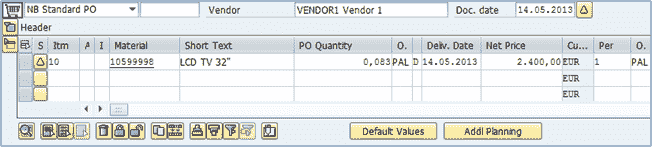
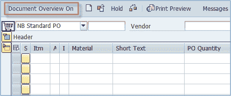
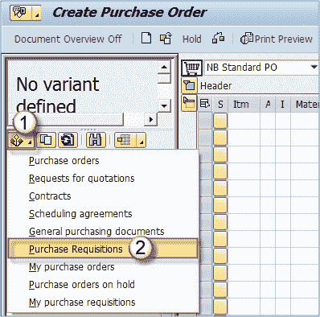
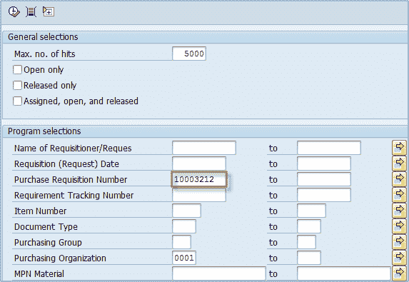
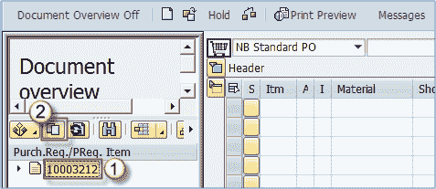

# 如何使用参考 ME58 创建采购订单 SAP 中的 ME21N

> 原文： [https://www.guru99.com/how-to-create-purchase-order-with-reference.html](https://www.guru99.com/how-to-create-purchase-order-with-reference.html)

## 采购订单参考

可以参考采购申请，询价，报价，另一个采购订单，合同，销售订单等来创建采购订单。要将 PO 引用到以前的文档，可以使用适当的功能。 您可以通过两种方式创建引用先前文档的采购订单

1.  使用 ME58
2.  使用 ME21N

## 通过 ME58 引用

在本例中，如果我们想为采购申请创建采购订单，则可以使用交易代码 **ME58** 。 我将演示从称为 ME21N 的 ME58 开始的过程，您可以看到实际上我们还是在 ME21N 中创建了一个 PO。

**步骤 1）**

1.  输入 t 代码 **ME58** 。
2.  选择供应商和采购组织，然后
3.  选择文档类型。
4.  执行。

**步骤 2）**

1.  选择供应商的行。
2.  选择流程分配。

**步骤 3）**确保在下一个屏幕上选择的订单类型为 **NB** （或您现在要使用的其他适当类型）。 在单击检查按钮**之前，还需要检查日期，采购组和组织。**

**步骤 4）**系统将您重定向到事务 **ME21N** ，您可以在其中选择要用作采购订单参考凭证的请购单。

1.  选择要用作参考文档的 PR 号。
2.  选择**采用**按钮。

**步骤 5）**您可以看到我们的商品已经转移到新的采购订单中。 您现在可以保存它，并且将为其分配一个文档编号。

## 通过 ME21N 引用

直接从 **ME21N** 引用任何合适的文档创建 PO 是最快且最简单的方法。 如果要跳过 ME58 或任何其他不需要的步骤，则可以直接使用 ME21N 创建 PO。 这主要由 MM 用户使用，其过程如下所述-

**Step 1)**

1.  输入事务 **ME21N** 。
2.  选择“打开文档概览”（如果尚未打开文档概览）。

**步骤 2）**在文档概述屏幕中，您可以选择用于参考目的的文档。

1.  选择选择变式按钮。
2.  选择要引用其采购订单的凭证类型。

**步骤 3）**

在选择屏幕上，输入您的 PR 名称（或通过其他任何数据（例如供应商，物料编号）找到它）。

执行搜索。

**步骤 4）**将显示一个屏幕，其中包含与搜索相关的文档。

1.  单击要用作参考文档的文档编号。
2.  选择通过文档。

完成后，现在您可以保存采购订单或进行其他更改。 **对于任何其他参考文档类型，参考过程相同。 除了在步骤 2 中选择适当的文档类型外，只需执行上述步骤即可。**