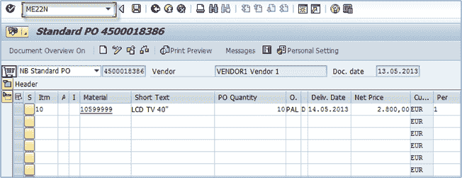
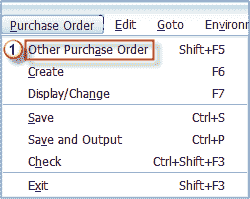
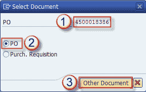
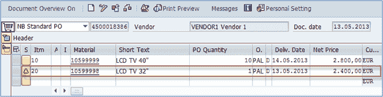

# ME22N：如何在 SAP 中更改采购订单

> 原文： [https://www.guru99.com/how-to-change-a-purchase-order.html](https://www.guru99.com/how-to-change-a-purchase-order.html)

在本教程中，我们将学习如何更改采购订单

**步骤 1）**要更改现有的采购订单，您可以使用交易代码 **ME22N** （或 **ME22** -旧版本）。

** 

*执行交易代码后，系统会立即将您带到您创建，更改或查看的最新采购订单。 如果您需要更改其他采购订单，则可以使用菜单*中显示的选项

****采购订单**** ***= >*** ***其他采购订单**。*

**步骤 2）**

将显示一个屏幕，以输入您要处理的文档。

我们可以添加另一个项目并保存我们的采购订单。

保存后，系统将通知我们已保存更改的采购订单。 注意：可以通过 t 代码 **ME23N** （或 **ME23** –旧版本）显示采购订单。 除了数据不可更改，所有内容的外观和工作方式均与更改模式相同，但只能显示数据。