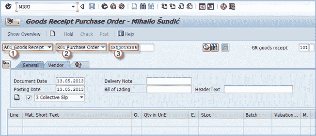
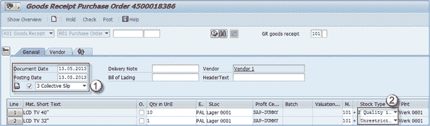
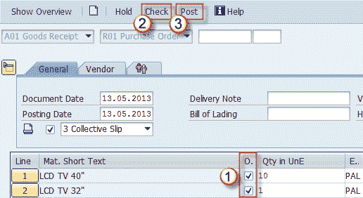

# 如何过帐收货：SAP MIGO

> 原文： [https://www.guru99.com/how-to-post-goods-receipt.html](https://www.guru99.com/how-to-post-goods-receipt.html)

在本教程中，我们将学习过帐收货

**步骤 1）**您可以使用交易代码 **MIGO** 过帐采购订单的收货。 *假设我们要为采购订单 *4500018386* 做收货。*

1.  选择 **A01-收货**。
2.  选择 **R01** -**采购订单**。
3.  输入您的采购订单号。
4.  按 **ENTER** 。

**步骤 2）**您可以看到采购订单中的项目已转移到屏幕上。

1.  您可以在此处输入文档数据，过帐日期并选择适当的打印消息类型。
2.  如果您查看这两个项目的库存类型，您会看到第一个项目过帐到质量检验，第二个项目直接过帐到非限制库存，因此可以在质量检查之前使用它。 物料主数据在 MM 模块中进行进一步处理。 这归因于“采购视图”复选框“过帐到检验库存”，对于 LCD TV 40”已选中该复选框，但对于 LCD TV 32”则未选中。

**步骤 3）**现在我们可以检查项目是否正常，然后过帐收货（PGR）。

1.  这些复选框用于确认项目正常，否则您将无法执行 PGR。
2.  勾选复选框后，检查文档是否准备好过帐。 如果有警告或错误，系统将在弹出屏幕中显示它们。 在我们的情况下，所有内容都可以发布了。
3.  发布文档。

保存文档并为其分配编号。

