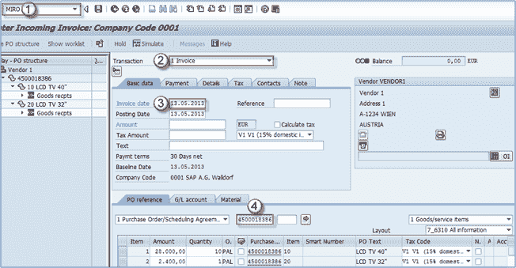
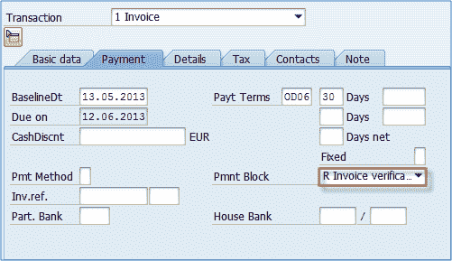
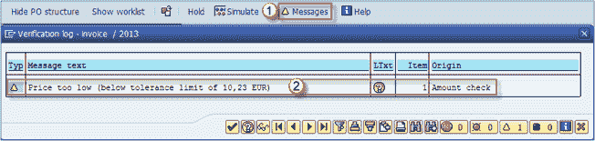
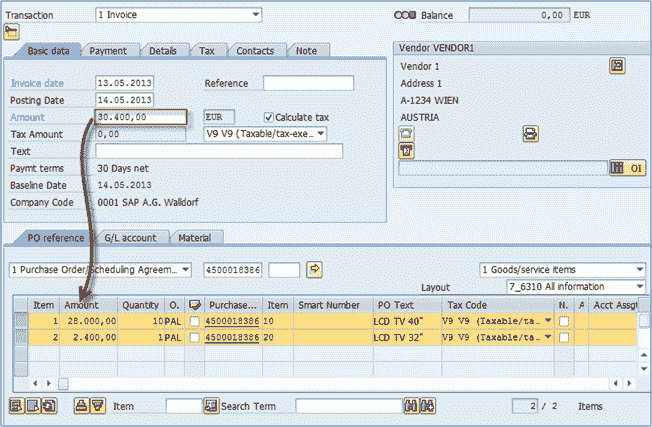
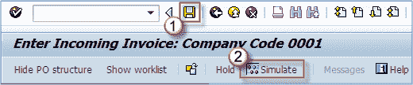
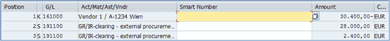
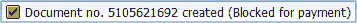

# MIRO：如何在 SAP 中执行发票验证

> 原文： [https://www.guru99.com/how-to-perform-invoice-verification.html](https://www.guru99.com/how-to-perform-invoice-verification.html)

发票验证是通过 **MIRO** 交易完成的。

**步骤 1）**

1.  输入交易代码 MIRO。
2.  选择发票作为交易类型。
3.  输入发票日期。
4.  输入采购订单编号。
5.  点击 **ENTER** 。

**步骤 2）**

在付款标签上，选择 **R 发票验证**。

您可以随时检查文档是否有问题。

1.  单击**消息**按钮。
2.  查看消息并解决问题（如果有）。

如下面的屏幕所示，我收到一条警告消息，说我的价格太低，低于公差极限。 这只是警告消息，不会阻止我进行进一步处理。此消息仅供参考，因为我将项目 1 的价格从 28.000 手动更改为 22.000！ 错误，只是为了向您显示消息。

当我将商品 1 的价格改回 28.000 时，我的信息就会消失。 请注意，输入的金额为 30.4 =（项目 1 为 28.000 +项目 2 为 2.400）

我们可以通过单击按钮编号**模拟**来模拟发票。

模拟结果显示在下面的屏幕上。

保存成功。

