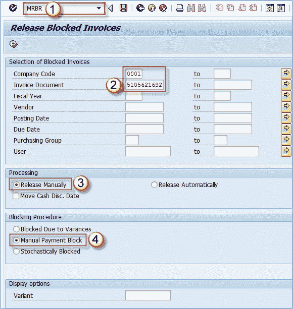
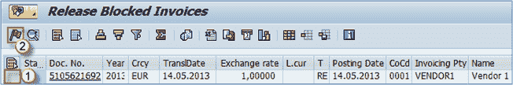
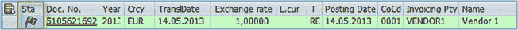

# MRBR：在 SAP 中发布冻结的发票

> 原文： [https://www.guru99.com/how-to-release-an-invoice.html](https://www.guru99.com/how-to-release-an-invoice.html)

发票请求将被阻止付款，直到其手动下达为止。 您可以使用 t 代码 **MRBR** 下达发票。

**步骤 1）**

1.  执行 t 码 MRBR。
2.  在初始屏幕上，输入公司代码和发票编号。
3.  检查释放方法（如果要在第二个屏幕中进行处理，则手动释放）。 这可以通过选择“自动”来完成（请注意，与 MIRO 事务中的自动释放被阻止和 t 代码 MRBR 中的自动释放不同，因为这是两个不同的事物）。
4.  我们的文档中有一个手动付款栏，因此我们将选择该选项。 执行。

**步骤 2）**

1.  选择您要下达的发票。
2.  单击标记图标-释放。

您可以看到，现在发票的“状态”字段中充满绿色标记-这意味着已将其发布到 FI。

财务部门现在应该可以看到要付款的发票。