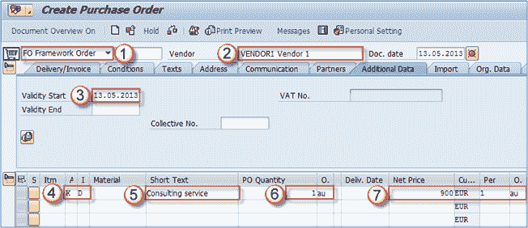
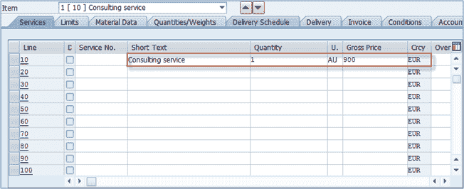
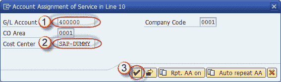
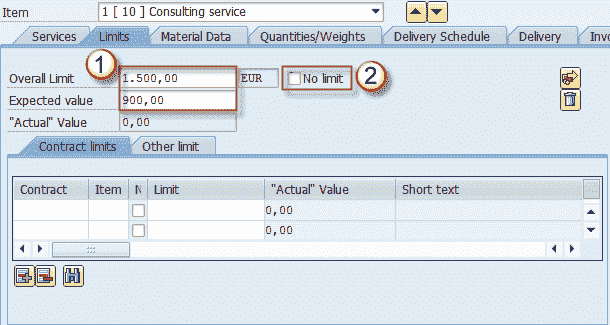
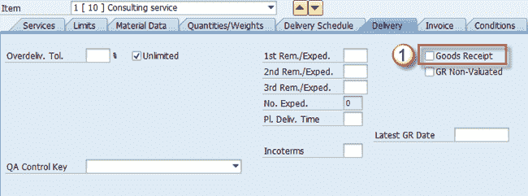
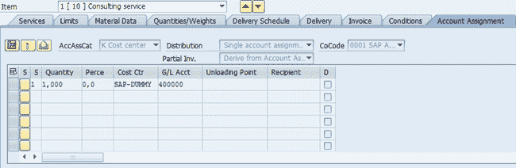
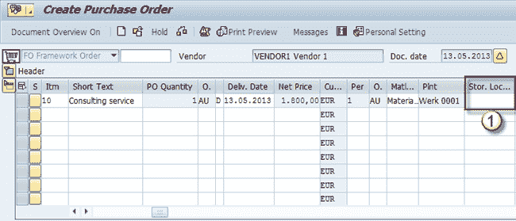

# SAP 中的服务采购订单：ME23N

> 原文： [https://www.guru99.com/service-purchase-order.html](https://www.guru99.com/service-purchase-order.html)

### 什么是服务采购订单？

为内部或外部采购的服务输入服务采购订单。 这些采购订单与标准订单不同，因为它们没有库存，因此不需要收货。 除此之外，PO 创建中还有一些小差异。 首先是这些订单的凭证类型。 应该是 FO –框架订单。 要直接为成本中心购买服务，我们将遵循以下过程。

**步骤 1）**转到事务 **ME21N** 。

1.  选择凭证类型 FO –框架订单。
2.  选择供应商。
3.  选择采购订单的有效期开始。
4.  选择科目分配类别- **K** 和项目类别- **D** 。
5.  输入服务说明。
6.  输入数量和计量单位。
7.  输入服务价格（例如，每 1 AU 900 欧元-活动单位）。

**步骤 2）**在项目级别，需要维护几个字段才能创建有效的服务订单。 在“服务”选项卡上，输入有关服务，数量和价格的信息。

可能会提示您输入帐户分配信息。

**步骤 3）**在这里，您可以输入总账科目（在大多数情况下会建议使用）和要分配服务成本的成本中心。

1.  总账科目。
2.  Cost Center.

    

**步骤 4）**在“限制”选项卡上，您可以输入计划外服务的限制。 服务的期望值不应超过。

**步骤 5）**现在选择“交货”选项卡，然后取消选中“收货”复选框。 服务没有收货，因为它们与库存管理无关（它们没有库存）。

**步骤 6）**帐户分配选项卡显示在弹出窗口中要求我们输入的信息。 如果不要求您通过弹出窗口输入，则可以在此处输入信息。

**步骤 7）**我们不需要存储该物品的位置，因为它与库存无关。

您可以保存更改并获取文档编号。

通过与标准采购订单 **ME22N** 和 **ME23N** 相同的事务访问更改和显示模式。