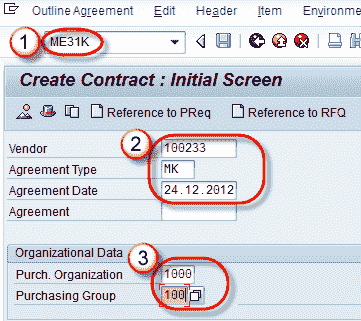
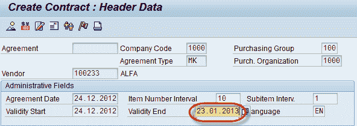
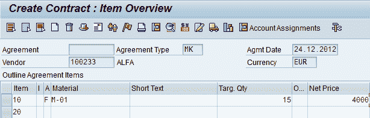
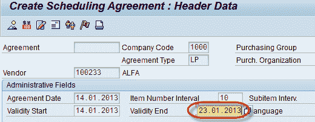
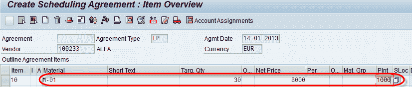
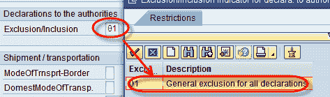

# SAP 中的大纲协议：合同&计划协议 ME31

> 原文： [https://www.guru99.com/all-about-outline-agreement.html](https://www.guru99.com/all-about-outline-agreement.html)

### 什么是大纲协议？

概要协议是卖方与客户之间的长期购买协议。 大纲协议有两种类型：

1.  合同
2.  计划协议

**合同**合同是协议草案，不包括物料的交货日期。 合同有两种：

1.  **数量合同**：当公司根据合同提供了约定的材料总量时，该合同被视为已履行。
2.  **价值合同**：当公司根据合同提供了约定的材料总价值时，该合同即已履行。

## 创建数量合同

**步骤 1**

1.  在命令字段中输入 T 代码 ME31K。
2.  输入供应商/协议类型（MK-数量合同）/协议日期。
3.  在组织数据中输入``采购组织''，``采购组''。

**步骤 2** 在抬头数据屏幕中输入合同的有效终止日期。

**步骤 3**

*   输入物料，目标数量（为其创建数量合同的数量）和净价
*   单击保存按钮。

显示为  的消息。

## 创建计划协议

计划协议是与供应商的长期购买协议，其中供应商必须根据预定条件提供材料。 以交货时间表的形式向供应商传达了交货日期和数量的详细信息。

**Step-1**

1.  在命令字段中输入 T 代码 ME31。
2.  输入供应商/协议类型（LP 计划协议）/协议日期。
3.  输入采购。 组织/采购组。

**步骤 2** 在标题屏幕中输入有效结束日期。

**步骤 3** 在项目总览屏幕中输入物料/目标数量/净价/工厂。

**步骤 4** 在下一个屏幕中输入排除。

**步骤 5** 返回上一个屏幕项目概述，然后单击保存按钮。 一条消息如下-

