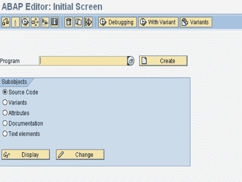

# ABAP 简介：数据类型，运算符&编辑器-教程

> 原文： [https://www.guru99.com/introduction-to-abap.html](https://www.guru99.com/introduction-to-abap.html)

ABAP 代表-高级业务应用程序编程，它是一种用于为 SAP R / 3 系统开发应用程序的编程语言。

ABAP 的最新版本称为 ABAP 对象，并支持面向对象的编程。 SAP 将运行使用早期 ABAP 版本 ABAP / 4 编写的应用程序，以及使用 ABAP 对象的应用程序。

无需进一步了解，就让我们深入 ABAP。

请注意，本教程不会深入介绍 ABAP 语言构造（阅读起来会很无聊），而是快速介绍一些关键概念以帮助您入门，这样您就可以将注意力集中在更重要的主题上。

## 资料类型

在 ABAP 中声明变量的语法-

```
DATA Variable_Name Type Variable_Type
```

例：

```
DATA employee_number Type I.
```

以下是 ABAP 支持的数据类型的列表

| **数据类型** | **初始字段长度** | **有效字段长度** | **初始值** | **含义** |
| ***数值类型*** |
| 一世 | 4 | 4 | 0 | 整数（整数） |
| F | 8 | 8 | 0 | 浮点数 |
| P | 8 | 1 - 16 | 0 | 装箱数 |
| ***字符类型*** |
| C | 1 | 1 - 65535 | '... ' | 文字栏位（英数字元） |
| d | 8 | 8 | '00000000' | 日期字段（格式：YYYYMMDD） |
| ñ | 1 | 1 - 65535 | '0 ... 0' | 数字文本字段（数字字符） |
| Ť | 6 | 6 | '000000' | 时间字段（格式：HHMMSS） |
| ***十六进制类型*** |
| X | 1 | 1 - 65535 | X'0 ... 0' | 十六进制字段 |

**处理数据** **-**分配值

```
a=16.

move 16 to a.

write a to b.
```

-算术运算

```
compute a = a*100.
```

## 控制语句

可以使用以下控制语句--If ... EndIf 循环

```
if [not] exp [ and / or [not] exp ].
........
[elseif exp.
.......]
[else.
.......]
Endif.
```

-案例陈述

```
Case variable.
when value1.
.........
when value2.
.........
[ when others.
.........]
Endcase.
Do.
```

-同时循环

```
While <logical expression>.
.....
.....
Endwhile.

```

-做循环

```
Do <n> times.
.....
.....
Enddo.

```

## 逻辑运算符

逻辑运算符列表

*   GE 或> =
*   GT 或>
*   LE 或< =
*   LT 或<
*   均衡或
*   NE 或< >

## ABAP / 4 编辑器

最后，在这里您将花费大部分时间作为开发人员来创建/修改程序。 交易 **SE38**

****