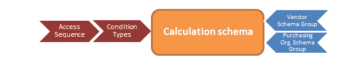
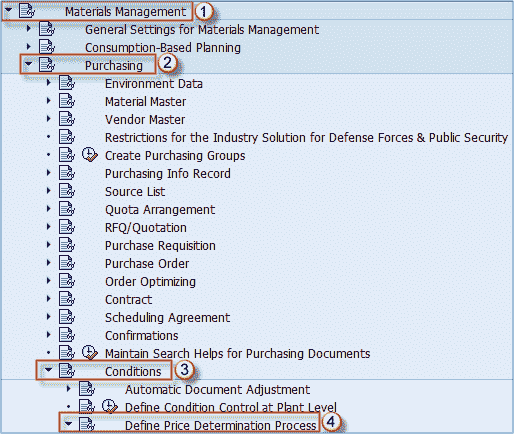

# SAP 中的定价过程总览

> 原文： [https://www.guru99.com/overview-of-pricing-procedure.html](https://www.guru99.com/overview-of-pricing-procedure.html)

### 什么是定价程序？

MM 模块中的定价过程是确定采购凭证中价格的一种方法。 它为我们提供了为不同需求分配不同计算类型的功能。 可以通过创建访问顺序并将其分配给条件类型来定义定价过程。 访问顺序告诉系统在哪里查找条件值。 它可以根据我们的设置搜索多个条件表。 表具有不同的优先级和不同的关键字段。 确定定价程序实际上是将计算方案分配给卖方方案组和采购组织方案组的组合。 因此，您需要在供应商主数据上输入供应商模式组，并将模式组分配给采购组织，以使系统找到要在文档中使用的计算模式。

为了在采购单据中设置定价程序，您需要访问定制功能。

IMG 可用功能的路径：

**交易 SPRO = >物料管理= >采购= >条件** = > **定义价格确定过程**

以下功能可用于维护定价程序。 关于定价程序，还有更多设置，但我们将介绍最常用的设置。

