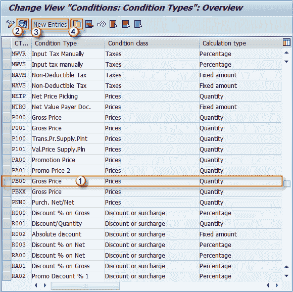
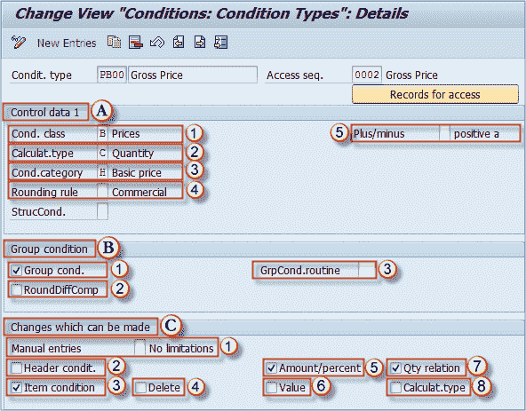
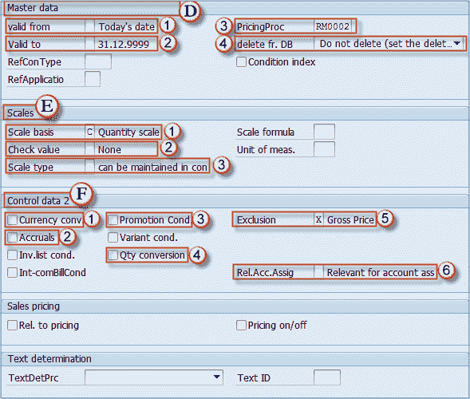

# 如何在 SAP 中定义条件类型

> 原文： [https://www.guru99.com/how-to-define-condition-types.html](https://www.guru99.com/how-to-define-condition-types.html)

条件类型的定义可以通过几个简单的步骤完成。

**步骤 1）**

在 IMG 中，单击“定义条件类型”选项。

 

**步骤 2）**

选择定义条件类型选项。

**步骤 3）**

您可以找到条件类型的所有现有条目。

1.  单击您想要更改的所需条件。
2.  单击此图标以选择所选条件并进入更改模式。
3.  如果要创建新条目，请单击“新条目”。 在这种情况下，您不必选择任何现有条目。
4.  如果要通过复制现有条件类型来创建新的条件类型（它将继承您可以更改的设置，就像在上一个主题中复制条件表一样），则可以选择此图标-复制条件类型。

您还可以使用其他一些操作：删除，选择所有条件类型，取消选择所有条件类型。

如果选择了多种条件类型，则可以通过在以下屏幕中浏览它们来进行全部编辑（左右箭头或 F7 和 F8）。

此屏幕为条件类型提供了许多设置，让我们回顾一下最重要的设置。

**步骤 4）**

屏幕的第一部分包含条件类型 PB00，描述和用于条件确定的访问顺序。

**A）控制数据 1** 部分包含以下内容：

1.  **条件类别**（例如价格，折扣，税金）
2.  **计算类型**（例如数量，百分比，固定数量，公式）
3.  **条件类别**（例如基本价格，进项税）
4.  **取整规则**（例如，商业，向上取整，向下取整）
5.  **正负**（指示条件是阳性，阴性还是两者同时存在）

**B）组条件**部分：

1.  **分组条件**（指示条件是否按文档中一项以上的条件计算其值）
2.  **RoundDiffComp** （舍入差异比较）
3.  **组条件例程**（计算值的例程）

**C）可以进行的更改** 部分：

1.  ****手动输入**** （例如，没有限制，不可能，手动输入具有优先权）
2.  ****标头条件**** （指示是否可以在标头级别使用条件）
3.  ****项目条件**** （指示是否可以在项目级别使用条件）
4.  ****删除**** （指示是否可以删除条件）
5.  ****数量/百分比**** （可以更改数量/百分比）
6.  ****值**** （可以更改值）
7.  ****数量。 关系**** （在处理过程中可以更改 UoM 之间的转换因子）
8.  ****计算。 类型**** （可以在处理期间更改计算类型）

[ 

**步骤 5）**

同一屏幕下端的另一部分是：

**D）主数据** 部分：

1.  ****对**** 有效（默认使用日期）
2.  ****定价程序。**** （用于此条件类型的定价程序）
3.  **删除 fr。 DB** （此条件类型的删除过程）

****E）标度**部分**：****

1.  **比例基础**（例如数量比例，价值比例）
2.  **检查值**（默认为空白）
3.  **标尺类型**（控制值/数量的有效性）

***F）控制数据 2** 部分**：***

1.  **货币转换** （指示是否允许货币兑换）
2.  **应计**（如果选中此框，则表明它是统计条件）
3.  **促销条件**（此条件仅与促销有关）
4.  **数量转换**（控制如何处理数量转换）
5.  **排除项**（条件排除项指标-例如，总价，税码，交货成本）
6.  **Rel.Acc.Assig** （确定条件类型是否与科目分配相关）

完成创建，更改或复制条件类型后，可以保存更改。