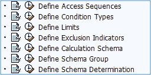
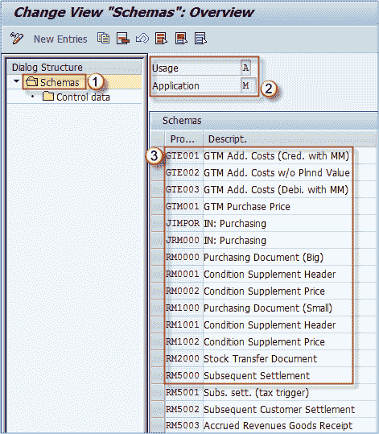
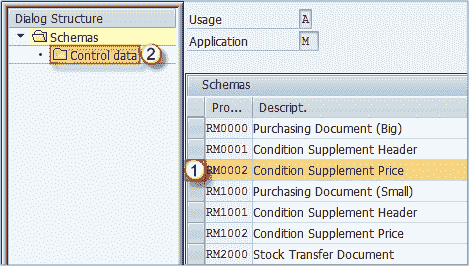
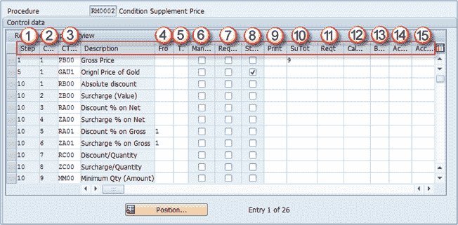

# 如何在 SAP 中定义计算架构

> 原文： [https://www.guru99.com/how-to-define-calculation-schema.html](https://www.guru99.com/how-to-define-calculation-schema.html)

如您在上一个主题中所见，条件类型被分配了一个计算模式。 它是在定制中定义的。

**步骤 1）**

在 IMG 中，选择“定义计算架构”选项。

**步骤 2）**

1.  您可以看到初始屏幕包含一个以 Schemas 为顶层的对话框结构。此外，您还可以下拉至 Control 数据。
2.  屏幕右侧显示使用情况和应用程序数据。我们可以看到使用情况是 **A –定价**，应用程序设置为 **M –购买**。
3.  包含模式列表及其简短描述

**步骤 3）**

1.  单击您要更改的架构
2.  双击“控制数据”节点。

**步骤 4）**

下表中的条件类型（参考步骤）用于此计算模式。 可以为此计算模式设置多种条件类型的选项（可以为其他计算模式中的同一条件类型设置不同的设置）。 *简短描述的可能选项列表：*

1.  **步骤**（指示过程的顺序）
2.  **计数器**（计算一个步骤中的条件数）
3.  **条件类型**（已定义的条件类型之一-上一主题）
4.  **来自**（用作计算百分比条件的基础的参考步骤）
5.  **至**（应该将条件用作计算百分比条件的基础）
6.  **手动**（允许手动输入）
7.  **必填**（必填条件）
8.  **统计信息**（仅统计条件）
9.  **打印**（条件的打印控制）
10.  **小计**（如何计算小计）
11.  **需求**（需求的自定义例程）
12.  **CalType** （计算例程-如果需要自定义例程）
13.  **BasType** （基本条件值的自定义例程）
14.  **AccKey** （总帐科目密钥）
15.  **AccrualAccKey** （应计或准备金的总帐科目密钥）

将正确的设置应用于过程中的所有条件之后，您可以保存交易数据。