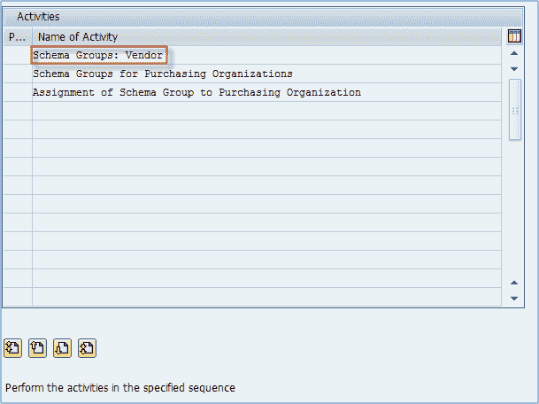
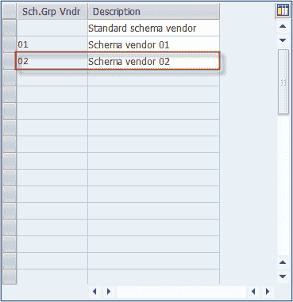
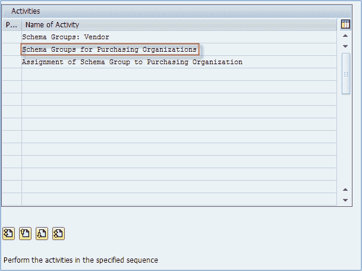
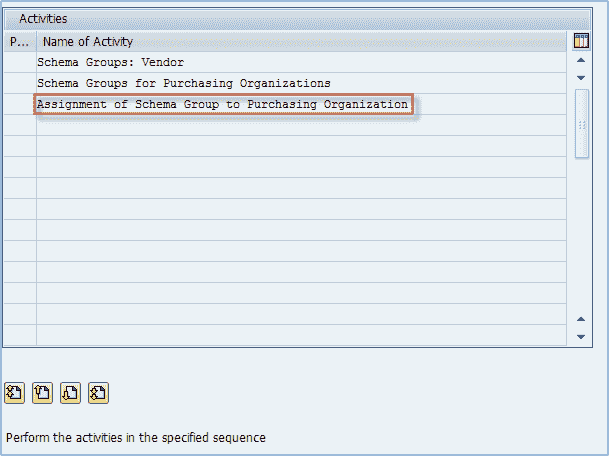
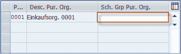
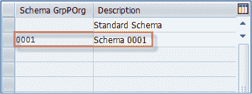
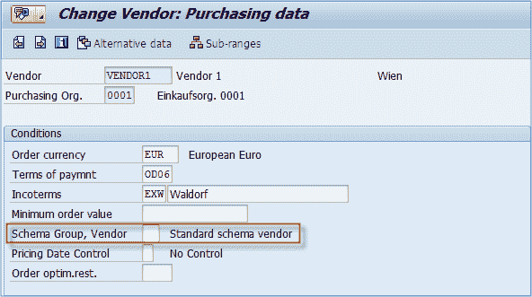
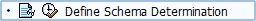
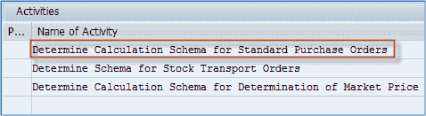
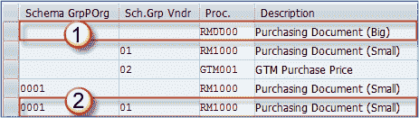

# 如何在 SAP 中定义架构组&确定

> 原文： [https://www.guru99.com/how-to-define-schema-group.html](https://www.guru99.com/how-to-define-schema-group.html)

在本教程中，我们将学习

*   如何定义架构组
*   如何定义架构确定

## 如何定义架构组

我们可以为采购组织或供应商创建架构组。

然后将架构组分配给定制中的采购组织和供应商主记录中的供应商。 它们用于根据供应商或购买组织来映射定价确定过程。

**步骤 1）**

1.  像前面的主题一样，从 SPRO IMG 路径中选择 Define Schema Group。
2.  从下面的菜单中，选择**模式组：供应商**。

**步骤 2）**

在下一个屏幕上，您可以定义供卖方主文件&使用的架构组，维护对卖方架构组的描述。

您仅定义架构组编号和描述。 没有设置，因为它曾经被分配给供应商主记录。

例如，我们可能需要创建一个新组 02 –模式供应商 02。

**步骤 3）**

接下来，从主模式组菜单中为采购组织选择**模式组。**

根据您的需求定义模式组。 您仅定义架构组编号和描述。 也没有设置，只是分配给采购组织的指标。

**步骤 4）**

从架构组菜单中选择**架构组对采购组织**的分配。

Assign desired schema group to purchasing organization. As you can see on the below screen, the field on the right is left blank, that is because **if you leave it blank, it means that the default purchase organization schema should be used**.

如果要为组组织使用标准架构，请将上一个屏幕中的字段保留为空白，如果要选择架构 0001，请在上方屏幕中标记的字段中输入 0001。 在上一步中可以找到带有分配给采购组织的可用模式的屏幕（与下面的屏幕相同）。

**步骤 5）**

在供应商主文件中分配架构组。

转到采购数据视图。 您将看到**模式组，供应商**字段。 您可以选择适合该供应商的任何架构组，对于标准架构供应商，默认为空白。

您会看到此字段在采购组织的组织级别（0001）维护，因此，与该采购组织的架构组结合使用，如果我们检查表，则所选的计算架构将为 **RM0000 –采购凭证（大）， 在下一个主题中将看到**。

## 如何定义架构确定

确定计算方案是一项定制活动。

您必须将定价过程分配给架构组采购组织/架构组供应商组合。

设置位于“定义架构确定”选项中。

**Step 1)**

选择标准采购订单的确定计算方案。

**Step 2)**

*   选择采购组织的架构组。
*   选择供应商的架构组。
*   选择要分配给 purch.org/vendor 模式组组合的计算模式。

让我们在此屏幕上分析两条记录。

1.  在情况 1 中，我们为采购组织选择了默认架构组（第一个字段为空），为供应商选择了默认架构组（第二个字段为空），对于这两个默认架构组的组合，我们分配了 RM0000（采购文档） -大）计算架构。
2.  在情况 2 中，我们为采购组织选择了架构组为 0001，为供应商选择了架构组为 01，并为该组合分配了 RM1000 计算架构。

**它是如何工作的？**

假设我们有一个为其分配了**空白**（默认）方案组的采购组织 **0001** ，以及一个具有方案组 **0001 的采购组织 **0002** 为其分配了**（不是默认值）。

我们还有**供应商 1** ，其分配的架构组为**空白**（默认），还有**供应商 2** ，其架构组定义为 **01** （ 不是默认值）。

*   如果我们通过供应商 1 的采购组 0001 创建采购订单，则我们的计算架构将确定为 RM0000。
*   如果我们通过采购组织 0001 为卖方 2 创建采购订单，则将确定计算模式 RM1000。
*   如果我们正在为采购组织 0002 中的两个供应商中的任何一个创建 PO，则在两种情况下都将确定计算模式 RM1000。

下表阐明了计算方案的确定。

<colgroup><col style="width: 78px;"> <col style="width: 217px;"> <col style="width: 113px;"> <col style="width: 104px;"> <col style="width: 151px;"></colgroup> 
| 供应商 | 供应商 SCH.GRP。 |   |   |   |
| 供应商 1 | **默认（空白）** | RM0000 | RM1000 |   |
| 供应商 2 | **01** | RM1000 | RM1000 |   |
|   |   | **默认（空白）** | **0001** | PURCH.ORG.SCH.GRP。 |
|   |   | 采购组织 0001 | 采购组织 0002 | 采购组织 |

大功告成 您的定价程序现已完全正常运行。

您可以使用一些高级功能，例如条件排除，复制控制，定义条件类型的限制等。