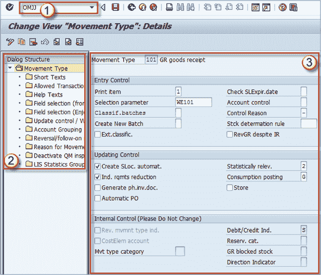

# SAP 库存管理教程：移动类型{OMJJ}

> 原文： [https://www.guru99.com/overview-of-inventory-management.html](https://www.guru99.com/overview-of-inventory-management.html)

库存管理用于管理商品的库存。 它基于几个关键过程。 机芯类型，预订，发货和收货的定义。

我们已经在采购订单主题中完成了基本的收货过程，将其引用到 PO。

库存管理流程中使用了许多功能和交易，我们将在本教程中介绍最重要的功能和交易。

## 机芯类型

移动类型用作指示货物移动目的的指标（例如，从存储地点到存储地点，从采购订单中接收，从发货中发出，从生产中接收）。

移动类型在标准 SAP 系统中具有其预定义设置，可以根据您的需要进行自定义。

另外，如果正确使用**运动指示器**，则可以将相同的运动类型用于不同的过程。 例如，将带有移动指示器 **B** 的移动类型 **101** 用于采购订单的收货。 带有运动指示器 **F** 的相同运动类型 **101** 用于生产订单收货。

您可以在下一个屏幕上查看机芯类型维护屏幕的外观。

大量选项可用于正确设置移动类型，并且可以通过 **OMJJ** 事务代码进行访问。

1.  执行 **OMJJ** 事务，然后在初始屏幕上选择**移动类型**，在下一个屏幕上输入要编辑的移动类型范围。将显示一个类似于下一个屏幕 屏幕。
2.  您可以在左侧看到对话框结构。 这些选项用于根据需要设置我们的运动类型。
3.  选择任何选项时，右侧的详细信息屏幕将使用该节点的设置进行更新。

这不在本教程的讨论范围内，因为配置移动类型需要对 MM 模块（库存管理组件）中的流程非常深入的了解。

您现在只需要了解运动类型和运动指示器代表什么。

随意浏览 OMJJ 事务，以更深入地了解可以在移动类型和移动类型/移动指示器级别上进行的实际设置。

总而言之，使用移动类型来区分如何在我们的库存中移动货物。

例如，

*   我们将设置移动类型 **101** 以用于收货。
*   将移动类型 **311** 用于一个步骤中从一个存储地点到另一个存储地点的库存转移。
*   发货外向交货的移动类型 **601**

要知道的另一件事是，每个运动类型都需要定义一个反转运动类型（如果我们需要取消 **311** ，我们必须将 **312** 定义为反转运动类型 **101** = > **102** ， **601** = > **602** ）。 **物料凭证**物料凭证是 SAP 中的一个凭证，其中包含有关货物移动（收货，发货，转移）处理的信息。

创建物料凭证时，实际上是按照移动类型定义的某种方式移动库存数量。

如果在物料凭证中指定了移动类型 311，则物料将从一个位置转移到另一位置（转移过程）。 如果为 101，则物料凭证将没有源存储位置，但将有目的地（收货过程）。 如果移动类型为 601，则物料凭证将仅具有源存储位置，而没有目的地（颁发过程）。

## 收货场景

正如我在上一个主题中所说的，收货可以参考采购订单，生产订单，内向交货完成，也可以不参考其他类型的收货流程。

我们可以根据运动指标设置运动类型行为。

我在上一个主题中提到过，可以使用多个指示符来指定引用文档类型，并为每个参数创建与移动类型组合的设置。

*   **B** -采购订单
*   **F** –生产订单
*   **L** –收货
*   **空白** –无参考

**其他** –目前意义不大