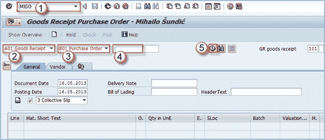
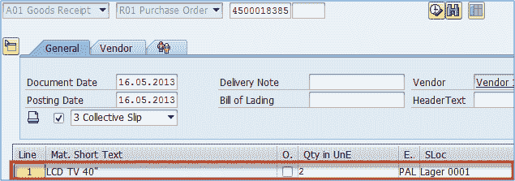
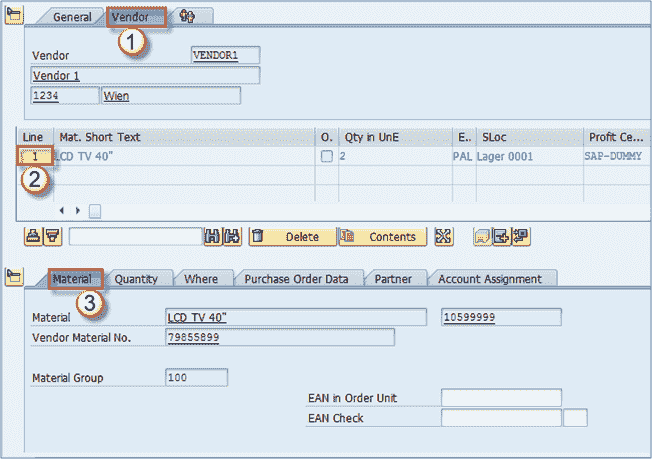
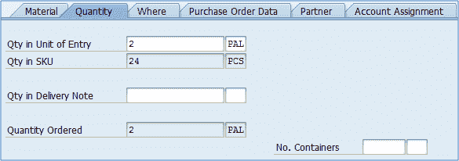
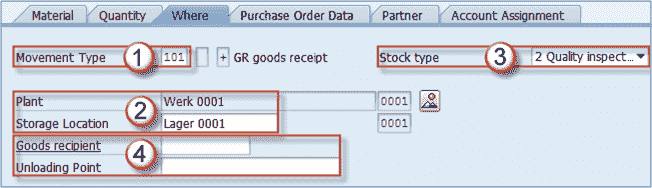
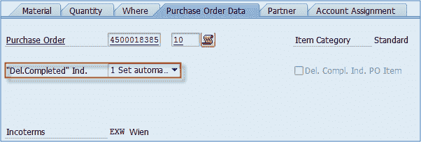
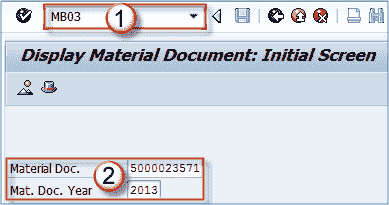
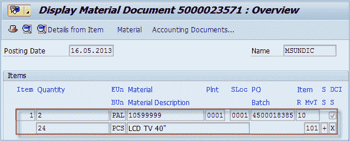
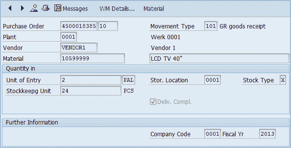

# 如何在 SAP 中创建收货：MIGO，MB1C，MB03

> 原文： [https://www.guru99.com/how-to-create-goods-receipt.html](https://www.guru99.com/how-to-create-goods-receipt.html)

To create  goods receipt, you can use **MIGO** or **MB1C** transaction.

Mostly people use MIGO as it's designed to have all the options for all of the movement scenarios.

**Step 1)**

1.  执行 **MIGO** 事务。
2.  选择 **A1 –收货**流程。
3.  选择 **R01 –采购订单**。
4.  在此处输入您的采购订单号。
5.  点击执行按钮。

**Step 2)**

我们的物料已转移到物料概述部分。

选择过帐和凭证日期（建议不要像今天一样保留在今天）。

**步骤 3）**

1.  您可以在标题级别上选择–供应商选项卡以查看供应商信息。
2.  如果单击行项目编号，则会在屏幕底部看到几个选项卡，您可以选择其中任何一个来查看有关该项目的某些特定信息。
3.  如果选择“物料”选项卡，则将看到常规物料数据。

**步骤 4）**

检查此选项卡中的数量信息。 如果更改收货，您可以收货的金额小于初始值。 您仍将在屏幕底部看到订购的数量。

**步骤 5）**

下一个选项卡包含有关货物目的地的信息。

1.  您可以看到用于收据处理的移动类型，
2.  目的地工厂和存储位置，
3.  以及收到的库存类型。 我们可以看到该物料将过帐到质量检验（此指标在物料主数据中设置，并且在先前的主题中已被引用），因此只有在确认质量合格后才能使用。
4.  还有关于收货人和卸货点的信息。

如果您需要更改存储位置或覆盖库存过帐类型，则可以在此处进行。

**步骤 6）**

您可以在此选项卡中找到与采购订单相关的数据。

1.  您可以更改交货完成指示器的更新类型（在采购订单上）。 它设置为在发布时自动更新，但是如果您的过程需要其他方法，则可以更改它。

2.  查看所有选项卡之后，并确保数据正确无误后，可以将项目标记为“确定”。 现在您可以发布该文档。

发布后，您将看到已生成物料凭证。

现在，您可以使用交易代码 **MB03** 来检查物料凭证。

1.  执行事务 **MB03** 。
2.  输入物料凭证和凭证年份。
3.  按 ENTER。

您可以查看有关文档和项目的一些基本信息。

双击该项目。

在项目详细信息上，您可以看到一些其他项目信息。

您过帐收货已完成。 生产订单和内向交货的过程相同。