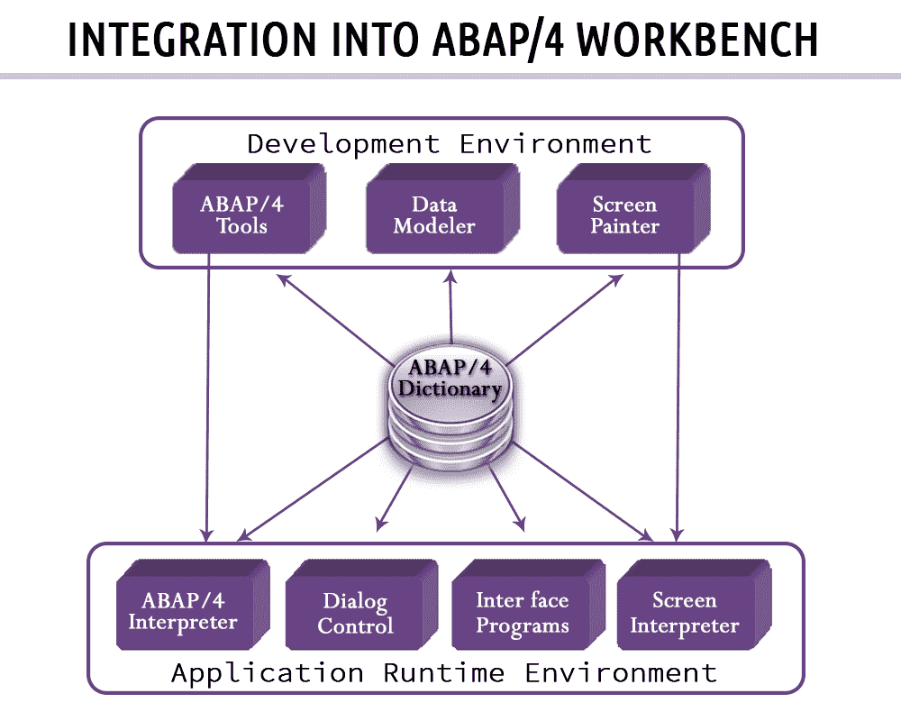
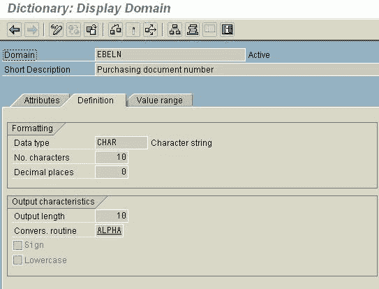
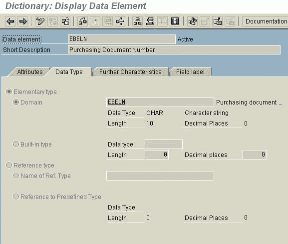
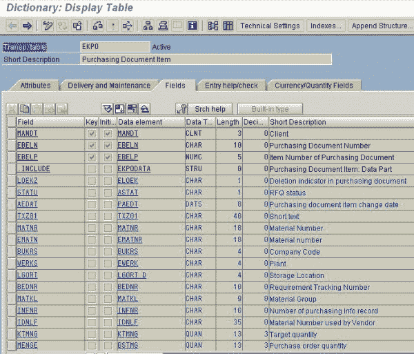
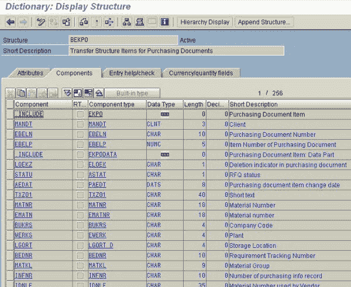
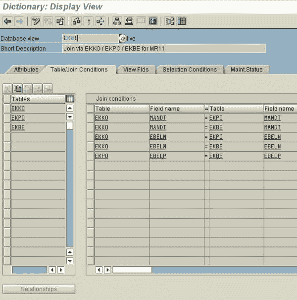
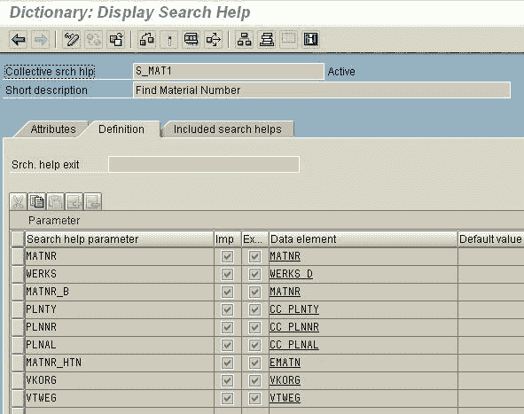
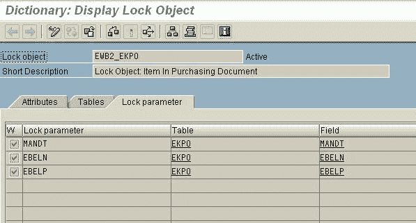

# ABAP 数据字典教程 SE11：表，锁对象，视图&结构

> 原文： [https://www.guru99.com/abap-data-dictionary-tutorial.html](https://www.guru99.com/abap-data-dictionary-tutorial.html)

### 什么是数据字典？

数据字典是信息管理系统中数据的中央信息源。 它的主要功能是支持数据定义（或“元数据”）的创建和管理。

## ABAP 字典 3 级

ABAP 词典中的对象位于支持其可重用性的三个级别上。 这些级别是：

1.  桌子和结构
2.  资料元素
3.  域

让我们详细研究一下-

## 域

*   描述表字段的技术特征
*   指定一个值范围，该范围描述字段的允许数据值
*   当更改域时，引用同一域的字段（通过分配给它们的数据元素）将更改
*   确保一致性

例如 采购凭证编号（EBELN）

## 数据元素

*   描述领域在技术环境中扮演的角色
*   具有相同语义含义的字段可以引用相同的数据元素
*   包含字段信息

Ex. Purchasing document number (EBELN)

## 桌子

*   表示实际存在数据的数据库表。
*   可以在 ABAP 词典中独立于数据库定义表。
*   该表的字段是使用其（独立于数据库的）SAP ABAP 数据类型和长度定义的。

## 结构体

*   是与数据库表不对应的记录声明。
*   就像用户定义的数据类型一样。
*   定义为表格，然后可以从 ABAP 程序进行寻址。
*   结构仅在程序运行时包含数据。

## ABAP 字典的汇总对象

聚集的意思是由几个部分组成。 在 ABAP 词典中，聚合对象是来自几个不同的透明表的对象。

1.  观看次数
2.  寻找帮助（求助
3.  锁定物件

让我们详细研究一下

## 观看次数

*   SAP _ ABAP 中的视图用于汇总分布在多个表中的数据
*   视图的数据实际上并未物理存储。 一个视图的数据取自一个或多个其他表
*   它是针对特定应用程序的需求量身定制的

## 寻找帮助（求助

*   搜索帮助是一种可帮助您在系统中搜索数据记录的工具
*   高效且用户友好的搜索可在记录关键字未知的情况下为用户提供帮助

## 锁定物件

*   SAP 系统中两个用户对同一数据记录的同时访问通过锁定机制进行同步。
*   通过调用某些功能模块来设置和释放锁。 这些功能模块是根据 ABAP / 4 词典中所谓的锁定对象的定义自动生成的

**功能模块**：Enqueue_ < obj 名称>-锁定表 dequeue_ < obj 名称>-释放锁定

**重要交易**

*   SE11：数据字典初始屏幕（仅 SE12 显示）
*   SE13：ABAP 词典：技术设置
*   SE14：数据库实用程序
*   SE15：存储库信息系统
*   SE16：数据浏览器
*   SE17：常规表格显示
*   SE55：表格视图维护
*   SM30：表格维护